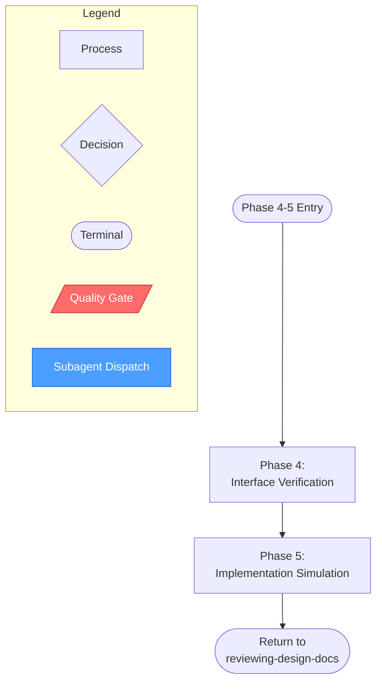
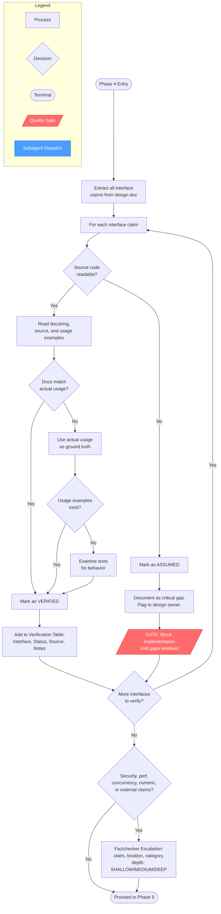
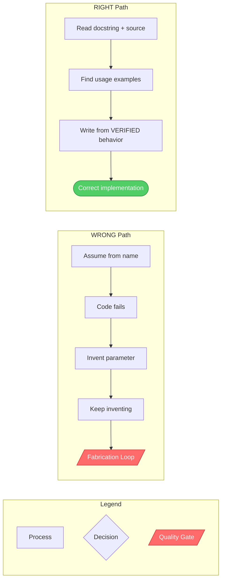
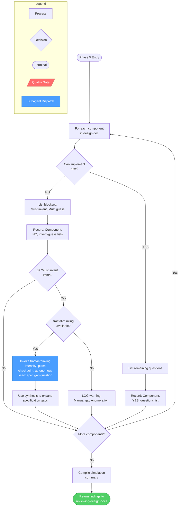

<!-- diagram-meta: {"source": "commands/review-design-verify.md","source_hash": "sha256:2547e3701a05d2936474627e9c3c1da08709239eaf07057d6ca1a9b7668031c6","generator": "stamp"} -->
# review-design-verify Diagram

Phases 4-5 of reviewing-design-docs: Interface Verification + Implementation Simulation.

## Overview

```mermaid
flowchart TD
    subgraph Legend
        L1[Process]
        L2{Decision}
        L3([Terminal])
        L4[/"Quality Gate"/]:::gate
        L5[Subagent Dispatch]:::subagent
    end

    Start([Phase 4-5 Entry]) --> P4[Phase 4:<br>Interface Verification]
    P4 --> P5[Phase 5:<br>Implementation Simulation]
    P5 --> End([Return to<br>reviewing-design-docs])

    classDef gate fill:#ff6b6b,stroke:#c92a2a,color:#fff
    classDef subagent fill:#4a9eff,stroke:#1971c2,color:#fff
    classDef success fill:#51cf66,stroke:#2b8a3e,color:#fff
```

## Phase 4: Interface Verification

```mermaid
flowchart TD
    subgraph Legend
        L1[Process]
        L2{Decision}
        L3([Terminal])
        L4[/"Quality Gate"/]:::gate
        L5[Subagent Dispatch]:::subagent
    end

    Start([Phase 4 Entry]) --> Extract[Extract all interface<br>claims from design doc]
    Extract --> ForEach[For each interface claim]

    ForEach --> ReadSource{Source code<br>readable?}
    ReadSource -->|Yes| ReadIt[Read docstring,<br>source, and usage examples]
    ReadSource -->|No| MarkAssumed[Mark as ASSUMED]

    ReadIt --> CheckDocs{Docs match<br>actual usage?}
    CheckDocs -->|Yes| MarkVerified[Mark as VERIFIED]
    CheckDocs -->|No| UsageGround[Use actual usage<br>as ground truth]
    UsageGround --> CheckTests{Usage examples<br>exist?}
    CheckTests -->|Yes| MarkVerified
    CheckTests -->|No| ExamineTests[Examine tests<br>for behavior]
    ExamineTests --> MarkVerified

    MarkAssumed --> GapDoc[Document as critical gap.<br>Flag to design owner.]
    GapDoc --> GapGate[/"GATE: Block implementation<br>until gaps resolved"/]:::gate

    MarkVerified --> PopulateTable[Add to Verification Table:<br>Interface, Status, Source, Notes]

    PopulateTable --> MoreInterfaces{More interfaces<br>to verify?}
    GapGate --> MoreInterfaces
    MoreInterfaces -->|Yes| ForEach
    MoreInterfaces -->|No| CheckClaims{Security, perf,<br>concurrency, numeric,<br>or external claims?}

    CheckClaims -->|Yes| Escalate[Factchecker Escalation:<br>claim, location, category,<br>depth: SHALLOW/MEDIUM/DEEP]
    CheckClaims -->|No| Continue([Proceed to Phase 5])

    Escalate --> Continue

    classDef gate fill:#ff6b6b,stroke:#c92a2a,color:#fff
    classDef subagent fill:#4a9eff,stroke:#1971c2,color:#fff
    classDef success fill:#51cf66,stroke:#2b8a3e,color:#fff
```

### Fabrication Anti-Pattern Reference

```mermaid
flowchart LR
    subgraph Legend
        L1[Process]
        L2{Decision}
        L4[/"Quality Gate"/]:::gate
    end

    subgraph "WRONG Path"
        direction TB
        W1[Assume from name] --> W2[Code fails]
        W2 --> W3[Invent parameter]
        W3 --> W4[Keep inventing]
        W4 --> W5[/"Fabrication Loop"/]:::gate
    end

    subgraph "RIGHT Path"
        direction TB
        R1[Read docstring + source] --> R2[Find usage examples]
        R2 --> R3[Write from VERIFIED behavior]
        R3 --> R4([Correct implementation]):::success
    end

    classDef gate fill:#ff6b6b,stroke:#c92a2a,color:#fff
    classDef success fill:#51cf66,stroke:#2b8a3e,color:#fff
```

### Invariant Principles

| # | Principle | Implication |
|---|-----------|-------------|
| 1 | Read source before accepting any interface claim | Assumed behavior from method names causes fabrication loops |
| 2 | Every interface marked VERIFIED or ASSUMED | No unmarked entries; distinction drives risk assessment |
| 3 | Usage examples trump documentation | When docs and usage diverge, actual usage is ground truth |

## Phase 5: Implementation Simulation

```mermaid
flowchart TD
    subgraph Legend
        L1[Process]
        L2{Decision}
        L3([Terminal])
        L4[/"Quality Gate"/]:::gate
        L5[Subagent Dispatch]:::subagent
    end

    Start([Phase 5 Entry]) --> ForComp[For each component<br>in design doc]

    ForComp --> Assess{Can implement<br>now?}

    Assess -->|YES| ListQ[List remaining questions]
    Assess -->|NO| ListBlockers[List blockers:<br>Must invent, Must guess]

    ListQ --> RecordYes[Record: Component,<br>YES, questions list]
    ListBlockers --> RecordNo[Record: Component,<br>NO, invent/guess lists]

    RecordNo --> CountInvent{3+ 'Must invent'<br>items?}

    CountInvent -->|Yes| FractalAvail{fractal-thinking<br>available?}
    CountInvent -->|No| MoreComp

    FractalAvail -->|Yes| FractalDispatch[Invoke fractal-thinking<br>intensity: pulse<br>checkpoint: autonomous<br>seed: spec gap question]:::subagent
    FractalAvail -->|No| ManualEnum[LOG warning.<br>Manual gap enumeration.]

    FractalDispatch --> UseSynthesis[Use synthesis to expand<br>specification gaps]
    UseSynthesis --> MoreComp
    ManualEnum --> MoreComp

    RecordYes --> MoreComp{More components?}

    MoreComp -->|Yes| ForComp
    MoreComp -->|No| Summary[Compile simulation<br>summary]
    Summary --> End([Return findings to<br>reviewing-design-docs]):::success

    classDef gate fill:#ff6b6b,stroke:#c92a2a,color:#fff
    classDef subagent fill:#4a9eff,stroke:#1971c2,color:#fff
    classDef success fill:#51cf66,stroke:#2b8a3e,color:#fff
```

## Cross-Reference Table

| Overview Node | Detail Diagram | Key Elements |
|---------------|----------------|--------------|
| Phase 4: Interface Verification | Phase 4 diagram | Source reading, VERIFIED/ASSUMED marking, verification table, factchecker escalation |
| Phase 5: Implementation Simulation | Phase 5 diagram | Component assessment, must-invent/must-guess analysis, fractal-thinking dispatch |
| Fabrication Anti-Pattern | Anti-Pattern diagram | Wrong vs right path for interface verification |
