<!-- diagram-meta: {"source": "commands/review-plan-behavior.md", "source_hash": "sha256:38d97cc5aa51f4ab12e5d664204f53f233cbbfbb36db50842d416f1b3ca2fe8a", "generated_at": "2026-02-19T00:00:00Z", "generator": "generate_diagrams.py"} -->
# Diagram: review-plan-behavior

Phase 3 of reviewing-impl-plans: audits every code reference in the plan to ensure behaviors are verified from source rather than assumed from method names, flags the fabrication anti-pattern, and detects trial-and-error loop indicators.

```mermaid
flowchart TD
    Start([Start Phase 3]) --> CollectRefs[Collect Code References]

    CollectRefs --> PickRef[Pick Next Reference]
    PickRef --> HasCitation{Has file:line Citation?}

    HasCitation -->|Yes| ReadSrc[Read Actual Source]
    HasCitation -->|No| FlagNoCite[Flag Missing Citation]

    ReadSrc --> MatchBehavior{Behavior Matches Claim?}

    MatchBehavior -->|Yes| LogVerified[Log as VERIFIED]
    MatchBehavior -->|No| LogAssumed[Log as ASSUMED - Critical]

    FlagNoCite --> LogAssumed

    LogVerified --> CheckPatterns[Check Dangerous Patterns]
    LogAssumed --> CheckPatterns

    CheckPatterns --> ConvParam{Assumes Convenience Params?}
    ConvParam -->|Yes| FlagConv[Flag Unverified Param]
    ConvParam -->|No| FlexBehavior{Assumes Flexible Behavior?}

    FlagConv --> FlexBehavior
    FlexBehavior -->|Yes| FlagFlex[Flag Unverified Flexibility]
    FlexBehavior -->|No| LibAssume{Assumes Library Behavior?}

    FlagFlex --> LibAssume
    LibAssume -->|Yes| FlagLib[Flag Unverified Library]
    LibAssume -->|No| TestUtil{Assumes Test Utility?}

    FlagLib --> TestUtil
    TestUtil -->|Yes| FlagTest[Flag Unverified Utility]
    TestUtil -->|No| MoreRefs{More References?}

    FlagTest --> MoreRefs

    MoreRefs -->|Yes| PickRef
    MoreRefs -->|No| LoopDetect[Loop Detection Scan]

    LoopDetect --> HasLoops{Trial-and-Error Found?}

    HasLoops -->|Yes| FlagLoop[RED FLAG: No Verification]
    HasLoops -->|No| GateAll{All Refs Audited?}

    FlagLoop --> GateAll

    GateAll -->|Yes| Deliver[Deliver Behavior Audit]
    GateAll -->|No| PickRef

    Deliver --> Done([Phase 3 Complete])

    style Start fill:#2196F3,color:#fff
    style Done fill:#2196F3,color:#fff
    style CollectRefs fill:#2196F3,color:#fff
    style PickRef fill:#2196F3,color:#fff
    style ReadSrc fill:#2196F3,color:#fff
    style FlagNoCite fill:#f44336,color:#fff
    style LogVerified fill:#2196F3,color:#fff
    style LogAssumed fill:#f44336,color:#fff
    style CheckPatterns fill:#2196F3,color:#fff
    style FlagConv fill:#2196F3,color:#fff
    style FlagFlex fill:#2196F3,color:#fff
    style FlagLib fill:#2196F3,color:#fff
    style FlagTest fill:#2196F3,color:#fff
    style LoopDetect fill:#2196F3,color:#fff
    style FlagLoop fill:#f44336,color:#fff
    style Deliver fill:#2196F3,color:#fff
    style HasCitation fill:#FF9800,color:#fff
    style MatchBehavior fill:#FF9800,color:#fff
    style ConvParam fill:#FF9800,color:#fff
    style FlexBehavior fill:#FF9800,color:#fff
    style LibAssume fill:#FF9800,color:#fff
    style TestUtil fill:#FF9800,color:#fff
    style MoreRefs fill:#FF9800,color:#fff
    style HasLoops fill:#FF9800,color:#fff
    style GateAll fill:#f44336,color:#fff
```

## Legend

| Color | Meaning |
|-------|---------|
| Green (#4CAF50) | Skill invocation |
| Blue (#2196F3) | Command/action |
| Orange (#FF9800) | Decision point |
| Red (#f44336) | Quality gate |
