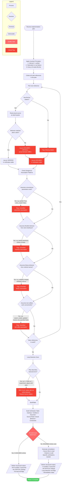

<!-- diagram-meta: {"source": "commands/review-plan-behavior.md","source_hash": "sha256:a5b30d62cf4fb092fa851aeb74d5b167928ab99bdd9c37745d3c8241fd7ed661","generated_at": "2026-03-19T00:00:00Z","generator": "generating-diagrams skill"} -->
# Diagram: review-plan-behavior

Phase 3 of reviewing-impl-plans: Behavior Verification Audit. Audits every code reference in an implementation plan to ensure behaviors are verified from source (file:line) rather than assumed from method names. Flags the fabrication anti-pattern, detects dangerous assumption patterns, and identifies trial-and-error loop indicators.

## Process Flow


```mermaid
flowchart TD
    subgraph Legend
        direction LR
        L1[Process]
        L2{Decision}
        L3([Terminal])
        L4[/"Deliverable"/]
        L5[Quality Gate]:::gate
        L6[Critical Flag]:::critical
    end

    Start([Receive implementation plan]) --> Principles[Apply Invariant Principles:<br>1. Inferred != verified<br>2. Fabrication is root failure<br>3. Every ref needs file:line]

    Principles --> CollectRefs[Collect all code references<br>in the plan]

    CollectRefs --> PickRef[Pick next reference]

    PickRef --> HasCitation{Has file:line<br>citation?}

    HasCitation -->|Yes| ReadSrc[Read actual source<br>at cited location]
    HasCitation -->|No| FlagNoCite[Flag: Missing citation]:::critical

    ReadSrc --> MatchBehavior{Behavior matches<br>plan's claim?}

    MatchBehavior -->|Yes| LogVerified[Log as VERIFIED<br>in verification table]
    MatchBehavior -->|No| LogMismatch[Log as ASSUMED - CRITICAL:<br>actual behavior differs]:::critical

    FlagNoCite --> LogAssumed[Log as ASSUMED<br>in verification table]:::critical
    LogMismatch --> LogAssumed

    LogVerified --> CheckPatterns[Check Dangerous<br>Assumption Patterns]
    LogAssumed --> CheckPatterns

    CheckPatterns --> P1{Assumes convenience<br>parameters exist?}
    P1 -->|"Yes: e.g. partial=True,<br>strict_mode=False"| FlagP1[Flag: Unverified<br>parameter assumption]:::critical
    P1 -->|No| P2

    FlagP1 --> P2{Assumes flexible behavior<br>from strict interfaces?}
    P2 -->|"Yes: e.g. partial assertions,<br>subset of fields"| FlagP2[Flag: Unverified<br>interface assumption]:::critical
    P2 -->|No| P3

    FlagP2 --> P3{Assumes library behavior<br>from method names?}
    P3 -->|"Yes: e.g. update() merges,<br>validate() returns"| FlagP3[Flag: Unverified<br>library assumption]:::critical
    P3 -->|No| P4

    FlagP3 --> P4{Assumes test utilities<br>work conveniently?}
    P4 -->|"Yes: e.g. assert_model_updated<br>checks only specified fields"| FlagP4[Flag: Unverified<br>test utility assumption]:::critical
    P4 -->|No| MoreRefs

    FlagP4 --> MoreRefs{More references<br>to audit?}

    MoreRefs -->|Yes| PickRef
    MoreRefs -->|No| LoopDetect[Loop Detection Scan]

    LoopDetect --> HasLoops{Plan describes<br>trial-and-error?}
    HasLoops -->|"Yes: try X, if fails try Y,<br>experiment, adjust until pass"| FlagLoop[RED FLAG: Author did not<br>verify behavior.<br>Require source citation.]:::critical
    HasLoops -->|No| BuildTable

    FlagLoop --> BuildTable

    BuildTable --> BuildVerifTable[Build Verification Table:<br>Interface / Verified or Assumed /<br>Source Read / Actual Behavior /<br>Constraints]

    BuildVerifTable --> GateCheck{All references<br>VERIFIED?}:::gate

    GateCheck -->|"Yes: 0 ASSUMED entries"| DeliverClean[/"Deliver structured output:<br>- All D verified, 0 assumed<br>- No CRITICAL findings<br>- No loop red flags"/]
    GateCheck -->|"No: ASSUMED entries exist"| Remediate[Generate remediation:<br>- Source files to read<br>- Citations to add<br>- Specific verifications needed]

    Remediate --> DeliverFindings[/"Deliver structured output:<br>- D verified, E assumed<br>- All CRITICAL findings<br>- Loop detection red flags<br>- Remediation steps"/]

    DeliverClean --> Done([Phase 3 Complete]):::success
    DeliverFindings --> Done

    classDef gate fill:#ff6b6b,stroke:#cc5555,color:#fff
    classDef critical fill:#f44336,stroke:#c62828,color:#fff
    classDef success fill:#51cf66,stroke:#40a854,color:#fff
```

## Key Decision Points

| Decision | Branches | Outcome |
|----------|----------|---------|
| Has file:line citation? | Yes / No | Proceed to source verification vs flag missing citation |
| Behavior matches plan's claim? | Yes / No | VERIFIED vs ASSUMED (CRITICAL) |
| Assumes convenience parameters? | Yes / No | Flag unverified parameter assumption |
| Assumes flexible behavior from strict interfaces? | Yes / No | Flag unverified interface assumption |
| Assumes library behavior from method names? | Yes / No | Flag unverified library assumption |
| Assumes test utilities work conveniently? | Yes / No | Flag unverified test utility assumption |
| More references to audit? | Yes / No | Loop back or proceed to loop detection |
| Plan describes trial-and-error? | Yes / No | RED FLAG requiring source citation |
| All references VERIFIED? | Yes (0 assumed) / No (assumed exist) | Clean delivery vs delivery with remediation |

## Fabrication Anti-Pattern (flagged by this audit)

```
Plan assumes method does X based on name
  -> Agent writes code, fails (method does Y)
    -> Agent INVENTS parameter (partial=True)
      -> Fails (parameter doesn't exist)
        -> Debugging loop, never reads source
          -> Hours wasted on fabricated solutions
```

The audit breaks this chain by requiring verified source citations before implementation begins.
