<!-- diagram-meta: {"source": "commands/review-plan-completeness.md", "source_hash": "sha256:6793ece9e6ed68215c7dbb295e08f545736c88793d666e55fa87d7e440df2ed7", "generated_at": "2026-02-19T00:00:00Z", "generator": "generate_diagrams.py"} -->
# Diagram: review-plan-completeness

Phases 4-5 of reviewing-impl-plans: verifies definitions of done, risk assessments, QA checkpoints, agent responsibility matrices, and dependency graphs for completeness, then escalates unverifiable claims to the fact-checking skill.

```mermaid
flowchart TD
    Start([Start Phase 4-5]) --> PickWI[Pick Work Item]

    PickWI --> HasDoD{Definition of Done?}

    HasDoD -->|Yes| VerifyDoD[Verify Testable Criteria]
    HasDoD -->|No| FlagDoD[Flag Missing DoD]
    HasDoD -->|Partial| FlagPartial[Flag Partial DoD]

    VerifyDoD --> Testable{Measurable & Pass/Fail?}
    Testable -->|Yes| DoDOK[DoD Acceptable]
    Testable -->|No| FlagSubjective[Flag Subjective Criteria]

    FlagDoD --> MoreWI{More Work Items?}
    FlagPartial --> MoreWI
    DoDOK --> MoreWI
    FlagSubjective --> MoreWI

    MoreWI -->|Yes| PickWI
    MoreWI -->|No| RiskPhase[Risk Assessment Audit]

    RiskPhase --> PickPhase[Pick Phase]
    PickPhase --> HasRisk{Risks Documented?}

    HasRisk -->|Yes| CheckMit[Check Mitigations]
    HasRisk -->|No| FlagRisk[Flag Missing Risk Docs]

    CheckMit --> HasRollback{Rollback Points?}
    HasRollback -->|Yes| RiskOK[Risk Acceptable]
    HasRollback -->|No| FlagRollback[Flag Missing Rollback]

    FlagRisk --> MorePhase{More Phases?}
    RiskOK --> MorePhase
    FlagRollback --> MorePhase

    MorePhase -->|Yes| PickPhase
    MorePhase -->|No| QA[QA Checkpoint Audit]

    QA --> CheckQA[Verify Test Types]
    CheckQA --> CheckSkills[Check Skill Integrations]
    CheckSkills --> AgentMatrix[Agent Responsibility Matrix]

    AgentMatrix --> CheckClarity{Responsibilities Clear?}
    CheckClarity -->|Yes| DepGraph[Dependency Graph]
    CheckClarity -->|No| FlagAmbig[Flag Ambiguity]

    FlagAmbig --> DepGraph
    DepGraph --> Circular{Circular Dependencies?}

    Circular -->|Yes| CritCirc[CRITICAL: Circular Dep]
    Circular -->|No| Escalate[Escalation Phase]

    CritCirc --> Escalate

    Escalate --> ScanClaims[Scan Technical Claims]
    ScanClaims --> FactCheck[Invoke Fact-Checking]

    FactCheck --> GateDone{All Checks Complete?}
    GateDone -->|Yes| Done([Phase 4-5 Complete])
    GateDone -->|No| PickWI

    style Start fill:#2196F3,color:#fff
    style Done fill:#2196F3,color:#fff
    style PickWI fill:#2196F3,color:#fff
    style VerifyDoD fill:#2196F3,color:#fff
    style FlagDoD fill:#f44336,color:#fff
    style FlagPartial fill:#2196F3,color:#fff
    style DoDOK fill:#2196F3,color:#fff
    style FlagSubjective fill:#2196F3,color:#fff
    style RiskPhase fill:#2196F3,color:#fff
    style PickPhase fill:#2196F3,color:#fff
    style CheckMit fill:#2196F3,color:#fff
    style FlagRisk fill:#f44336,color:#fff
    style RiskOK fill:#2196F3,color:#fff
    style FlagRollback fill:#2196F3,color:#fff
    style QA fill:#2196F3,color:#fff
    style CheckQA fill:#2196F3,color:#fff
    style CheckSkills fill:#4CAF50,color:#fff
    style AgentMatrix fill:#2196F3,color:#fff
    style FlagAmbig fill:#2196F3,color:#fff
    style DepGraph fill:#2196F3,color:#fff
    style CritCirc fill:#f44336,color:#fff
    style Escalate fill:#2196F3,color:#fff
    style ScanClaims fill:#2196F3,color:#fff
    style FactCheck fill:#4CAF50,color:#fff
    style HasDoD fill:#FF9800,color:#fff
    style Testable fill:#FF9800,color:#fff
    style MoreWI fill:#FF9800,color:#fff
    style HasRisk fill:#FF9800,color:#fff
    style HasRollback fill:#FF9800,color:#fff
    style MorePhase fill:#FF9800,color:#fff
    style CheckClarity fill:#FF9800,color:#fff
    style Circular fill:#FF9800,color:#fff
    style GateDone fill:#f44336,color:#fff
```

## Legend

| Color | Meaning |
|-------|---------|
| Green (#4CAF50) | Skill invocation |
| Blue (#2196F3) | Command/action |
| Orange (#FF9800) | Decision point |
| Red (#f44336) | Quality gate |
