<!-- diagram-meta: {"source": "commands/review-plan-contracts.md", "source_hash": "sha256:837f734380b0a3286c5e8c4b1c9ec7112718fad070c8000027a98e0874f0bce5", "generated_at": "2026-02-19T00:00:00Z", "generator": "generate_diagrams.py"} -->
# Diagram: review-plan-contracts

Phase 2 of reviewing-impl-plans: audits every interface contract between parallel work tracks, verifying request/response/error formats, shared type schemas, event/message contracts, and file/resource access patterns for completeness.

```mermaid
flowchart TD
    Start([Start Phase 2]) --> ListIf[List All Interfaces]

    ListIf --> PickIf[Pick Next Interface]
    PickIf --> CheckContract[Check Contract Location]

    CheckContract --> HasReq{Request Format?}
    HasReq -->|Specified| HasResp{Response Format?}
    HasReq -->|Missing| FlagReq[Flag CRITICAL: Missing Req]

    FlagReq --> HasResp
    HasResp -->|Specified| HasErr{Error Format?}
    HasResp -->|Missing| FlagResp[Flag CRITICAL: Missing Resp]

    FlagResp --> HasErr
    HasErr -->|Specified| HasProto{Protocol Specified?}
    HasErr -->|Missing| FlagErr[Flag CRITICAL: Missing Err]

    FlagErr --> HasProto
    HasProto -->|Specified| IfOK[Interface Fully Specified]
    HasProto -->|Missing| FlagProto[Flag CRITICAL: Missing Proto]

    FlagProto --> IfOK
    IfOK --> MoreIf{More Interfaces?}

    MoreIf -->|Yes| PickIf
    MoreIf -->|No| TypeAudit[Type/Schema Audit]

    TypeAudit --> PickType[Pick Shared Type]
    PickType --> SingleSrc{Single Source of Truth?}

    SingleSrc -->|Yes| CheckFields[Check Field Completeness]
    SingleSrc -->|No| FlagDup[Flag Duplicate Definitions]

    CheckFields --> FieldsOK{All Fields Specified?}
    FieldsOK -->|Yes| MoreType{More Types?}
    FieldsOK -->|No| FlagFields[Flag Incomplete Schema]

    FlagDup --> MoreType
    FlagFields --> MoreType

    MoreType -->|Yes| PickType
    MoreType -->|No| EventAudit[Event/Message Audit]

    EventAudit --> CheckEvents[Check Schema/Ordering/Delivery]
    CheckEvents --> FileAudit[File/Resource Audit]

    FileAudit --> CheckConflict{Writer/Reader Conflict?}
    CheckConflict -->|Yes| FlagConflict[Flag CRITICAL: Conflict]
    CheckConflict -->|No| GateAll{All Contracts Audited?}

    FlagConflict --> GateAll
    GateAll -->|Yes| Deliver[Deliver Contract Audit]
    GateAll -->|No| PickIf

    Deliver --> Done([Phase 2 Complete])

    style Start fill:#2196F3,color:#fff
    style Done fill:#2196F3,color:#fff
    style ListIf fill:#2196F3,color:#fff
    style PickIf fill:#2196F3,color:#fff
    style CheckContract fill:#2196F3,color:#fff
    style FlagReq fill:#f44336,color:#fff
    style FlagResp fill:#f44336,color:#fff
    style FlagErr fill:#f44336,color:#fff
    style FlagProto fill:#f44336,color:#fff
    style IfOK fill:#2196F3,color:#fff
    style TypeAudit fill:#2196F3,color:#fff
    style PickType fill:#2196F3,color:#fff
    style CheckFields fill:#2196F3,color:#fff
    style FlagDup fill:#2196F3,color:#fff
    style FlagFields fill:#2196F3,color:#fff
    style EventAudit fill:#2196F3,color:#fff
    style CheckEvents fill:#2196F3,color:#fff
    style FileAudit fill:#2196F3,color:#fff
    style FlagConflict fill:#f44336,color:#fff
    style Deliver fill:#2196F3,color:#fff
    style HasReq fill:#FF9800,color:#fff
    style HasResp fill:#FF9800,color:#fff
    style HasErr fill:#FF9800,color:#fff
    style HasProto fill:#FF9800,color:#fff
    style MoreIf fill:#FF9800,color:#fff
    style SingleSrc fill:#FF9800,color:#fff
    style FieldsOK fill:#FF9800,color:#fff
    style MoreType fill:#FF9800,color:#fff
    style CheckConflict fill:#FF9800,color:#fff
    style GateAll fill:#f44336,color:#fff
```

## Legend

| Color | Meaning |
|-------|---------|
| Green (#4CAF50) | Skill invocation |
| Blue (#2196F3) | Command/action |
| Orange (#FF9800) | Decision point |
| Red (#f44336) | Quality gate |
