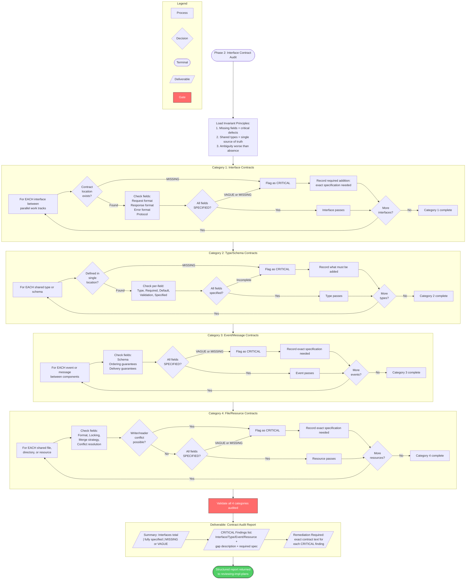

<!-- diagram-meta: {"source": "commands/review-plan-contracts.md","source_hash": "sha256:e4a6bf3d40307d3b64e9e4390a9852b2de960802df0424cecadadb66b9c21973","generated_at": "2026-03-19T07:12:25Z","generator": "generate_diagrams.py"} -->
# Diagram: review-plan-contracts

# review-plan-contracts

## Overview

This command is a single-phase audit process (Phase 2 of reviewing-impl-plans) that systematically checks four categories of contracts between parallel work tracks. It follows a linear flow: audit each category, flag gaps, then produce a structured report.

## Diagram

```mermaid
flowchart TD
    subgraph Legend
        L1[Process]
        L2{Decision}
        L3([Terminal])
        L4[/"Deliverable"/]
        L5[Gate]:::gate
    end

    Start([Phase 2: Interface Contract Audit]) --> Principles[Load Invariant Principles:<br>1. Missing fields = critical defects<br>2. Shared types = single source of truth<br>3. Ambiguity worse than absence]

    Principles --> Cat1

    subgraph Cat1 [Category 1: Interface Contracts]
        IC_Start[For EACH interface between<br>parallel work tracks] --> IC_Check{Contract<br>location<br>exists?}
        IC_Check -->|MISSING| IC_Flag[Flag as CRITICAL]
        IC_Check -->|Found| IC_Fields[Check fields:<br>Request format<br>Response format<br>Error format<br>Protocol]
        IC_Fields --> IC_Status{All fields<br>SPECIFIED?}
        IC_Status -->|Yes| IC_Pass[Interface passes]
        IC_Status -->|VAGUE or MISSING| IC_Flag
        IC_Flag --> IC_Remediation[Record required addition:<br>exact specification needed]
        IC_Remediation --> IC_Next{More<br>interfaces?}
        IC_Pass --> IC_Next
        IC_Next -->|Yes| IC_Start
        IC_Next -->|No| IC_Done[Category 1 complete]
    end

    Cat1 --> Cat2

    subgraph Cat2 [Category 2: Type/Schema Contracts]
        TS_Start[For EACH shared type or schema] --> TS_Defined{Defined in<br>single<br>location?}
        TS_Defined -->|MISSING| TS_Flag[Flag as CRITICAL]
        TS_Defined -->|Found| TS_Fields[Check per-field:<br>Type, Required, Default,<br>Validation, Specified]
        TS_Fields --> TS_Complete{All fields<br>specified?}
        TS_Complete -->|Yes| TS_Pass[Type passes]
        TS_Complete -->|Incomplete| TS_Flag
        TS_Flag --> TS_Remediation[Record what must be added]
        TS_Remediation --> TS_Next{More<br>types?}
        TS_Pass --> TS_Next
        TS_Next -->|Yes| TS_Start
        TS_Next -->|No| TS_Done[Category 2 complete]
    end

    Cat2 --> Cat3

    subgraph Cat3 [Category 3: Event/Message Contracts]
        EM_Start[For EACH event or message<br>between components] --> EM_Check[Check fields:<br>Schema<br>Ordering guarantees<br>Delivery guarantees]
        EM_Check --> EM_Status{All fields<br>SPECIFIED?}
        EM_Status -->|Yes| EM_Pass[Event passes]
        EM_Status -->|VAGUE or MISSING| EM_Flag[Flag as CRITICAL]
        EM_Flag --> EM_Remediation[Record exact specification needed]
        EM_Remediation --> EM_Next{More<br>events?}
        EM_Pass --> EM_Next
        EM_Next -->|Yes| EM_Start
        EM_Next -->|No| EM_Done[Category 3 complete]
    end

    Cat3 --> Cat4

    subgraph Cat4 [Category 4: File/Resource Contracts]
        FR_Start[For EACH shared file,<br>directory, or resource] --> FR_Check[Check fields:<br>Format, Locking,<br>Merge strategy,<br>Conflict resolution]
        FR_Check --> FR_Conflict{Writer/reader<br>conflict<br>possible?}
        FR_Conflict -->|Yes| FR_Flag[Flag as CRITICAL]
        FR_Conflict -->|No| FR_Fields{All fields<br>SPECIFIED?}
        FR_Fields -->|Yes| FR_Pass[Resource passes]
        FR_Fields -->|VAGUE or MISSING| FR_Flag
        FR_Flag --> FR_Remediation[Record exact specification needed]
        FR_Remediation --> FR_Next{More<br>resources?}
        FR_Pass --> FR_Next
        FR_Next -->|Yes| FR_Start
        FR_Next -->|No| FR_Done[Category 4 complete]
    end

    Cat4 --> Validate

    Validate[Validate all 4 categories audited]:::gate --> Report

    subgraph Report [Deliverable: Contract Audit Report]
        R_Summary[/"Summary: Interfaces total<br>| fully specified | MISSING or VAGUE"/] --> R_Critical[/"CRITICAL Findings list:<br>Interface/Type/Event/Resource +<br>gap description + required spec"/]
        R_Critical --> R_Remediation[/"Remediation Required:<br>exact contract text for<br>each CRITICAL finding"/]
    end

    Report --> Done([Structured report returned<br>to reviewing-impl-plans]):::success

    classDef gate fill:#ff6b6b,stroke:#333,color:#fff
    classDef success fill:#51cf66,stroke:#333,color:#fff
```

## Key Characteristics

- **Linear, exhaustive audit**: All four contract categories must be checked; skipping any is forbidden.
- **No subagent dispatches**: This is a single-agent command executed as part of the reviewing-impl-plans workflow.
- **Binary severity model**: Every field is either SPECIFIED (passes) or VAGUE/MISSING (CRITICAL). There is no intermediate severity.
- **Structured output only**: Narrative prose is forbidden; the deliverable must follow the exact template format.
