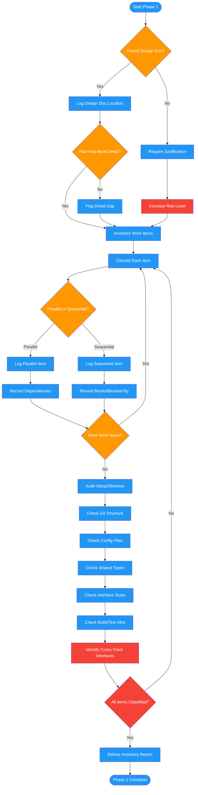

<!-- diagram-meta: {"source": "commands/review-plan-inventory.md", "source_hash": "sha256:3994c536dccf1634ad3f1bd027888a88248711390e6af3facb081f54b6e3f7a2", "generated_at": "2026-02-19T00:00:00Z", "generator": "generate_diagrams.py"} -->
# Diagram: review-plan-inventory

Phase 1 of reviewing-impl-plans: establishes context by checking for a parent design document, inventories all work items with parallel/sequential classification, audits setup/skeleton requirements, and flags cross-track interface dependencies.

## Legend

| Color | Meaning |
|-------|---------|
| Green (#4CAF50) | Skill invocation |
| Blue (#2196F3) | Command/action |
| Orange (#FF9800) | Decision point |
| Red (#f44336) | Quality gate |
