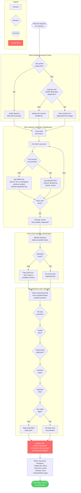

<!-- diagram-meta: {"source": "commands/review-plan-inventory.md","source_hash": "sha256:6573108212e8ecec2f0f77a5914e576186857d570cd74ce98ce4f24554befa12","generator": "stamp"} -->
# Diagram: review-plan-inventory

Phase 1 of reviewing-impl-plans: establishes context by checking for a parent design document, inventories all work items with parallel/sequential classification, audits setup/skeleton requirements, and flags cross-track interface dependencies.

## Process Flow

```mermaid
flowchart TD
    subgraph Legend
        direction LR
        L1[Process]
        L2{Decision}
        L3([Terminal])
        L4[Quality Gate]:::gate
    end

    Start([Receive impl plan<br>for inventory]) --> DesignDoc

    subgraph P1["Parent Design Document Check"]
        DesignDoc{Has parent<br>design doc?}
        DesignDoc -->|YES| DocDetail{Impl plan has<br>MORE detail than<br>design doc?}
        DesignDoc -->|NO| Justify[Justify absence<br>Risk level increases]
        DocDetail -->|YES| DocOK[Design doc anchors<br>confidence]
        DocDetail -->|NO| DocGap[Flag: sections not<br>elaborated from design]
    end

    Justify --> Inventory
    DocOK --> Inventory
    DocGap --> Inventory

    subgraph P2["Plan Inventory: Work Item Classification"]
        Inventory[Count total<br>work items] --> ClassifyLoop
        ClassifyLoop[For EACH work item]
        ClassifyLoop --> IsParallel{Can execute<br>concurrently?}
        IsParallel -->|YES| TagParallel[Tag PARALLEL<br>Record: can run alongside,<br>worktree needed,<br>interface dependencies]
        IsParallel -->|NO| TagSequential[Tag SEQUENTIAL<br>Record: blocked by,<br>blocks, reason]
        TagParallel --> MoreItems{More work<br>items?}
        TagSequential --> MoreItems
        MoreItems -->|YES| ClassifyLoop
        MoreItems -->|NO| CountSummary[Compute counts:<br>total, parallel, sequential]
    end

    CountSummary --> Interfaces

    subgraph P3["Cross-Track Interface Identification"]
        Interfaces[Identify interfaces<br>between parallel tracks] --> HasInterfaces{Interfaces<br>found?}
        HasInterfaces -->|YES| FlagInterfaces[Flag CRITICAL:<br>each needs a<br>complete contract]
        HasInterfaces -->|NO| NoInterfaces[No cross-track<br>dependencies]
    end

    FlagInterfaces --> Setup
    NoInterfaces --> Setup

    subgraph P4["Setup/Skeleton Work Validation"]
        Setup[Check setup items that<br>must complete before<br>parallel execution]
        Setup --> CheckRepo{Git repo<br>structure?}
        CheckRepo --> CheckConfig{Config<br>files?}
        CheckConfig --> CheckTypes{Shared type<br>definitions?}
        CheckTypes --> CheckStubs{Interface<br>stubs?}
        CheckStubs --> CheckBuild{Build/test<br>infra?}
        CheckBuild --> SetupGaps{Any setup<br>gaps?}
        SetupGaps -->|YES| FlagGaps[Flag unspecified<br>setup work]
        SetupGaps -->|NO| SetupComplete[All setup work<br>documented]
    end

    FlagGaps --> Gate
    SetupComplete --> Gate

    Gate[Quality Gate:<br>All items classified?<br>All interfaces documented?<br>All setup gaps flagged?]:::gate
    Gate --> Deliverable

    Deliverable[Return structured markdown:<br>- Design doc status<br>- Work item counts<br>- Interface count<br>- Setup/skeleton gaps] --> End([Deliverable returned<br>to orchestrator]):::success

    classDef gate fill:#ff6b6b,stroke:#c92a2a,color:#fff
    classDef success fill:#51cf66,stroke:#2b8a3e,color:#fff
```

## Legend

| Shape / Color | Meaning |
|---------------|---------|
| Rectangle | Process step |
| Diamond | Decision point |
| Stadium (rounded) | Terminal (start/end) |
| Red (#ff6b6b) | Quality gate |
| Green (#51cf66) | Success terminal |

## Key Principles

| Principle | Enforcement Point |
|-----------|-------------------|
| Design doc anchors confidence | Parent Design Document Check |
| Classify before scheduling | Work Item Classification loop |
| Cross-track interfaces are highest risk | Interface Identification (flagged CRITICAL) |
| Unclassified items = failure mode | Quality Gate before deliverable |
