<!-- diagram-meta: {"source": "commands/scientific-debugging/scientific-debugging.md", "source_hash": "sha256:81c6e47e40b155e163594c3ea0a06d2784d0488e02bf95de22c12b4f2f5fcfde", "generated_at": "2026-02-19T00:00:00Z", "generator": "generate_diagrams.py"} -->
# Diagram: scientific-debugging

Rigorous theory-experiment debugging methodology. Forms exactly 3 theories from the symptom alone (no data gathering first, no ranking), designs 3+ experiments per theory with explicit prove/disprove criteria, tests one theory at a time, and cycles until root cause is confirmed.

```mermaid
flowchart TD
  Start([Start]) --> ReceiveSymptom[Receive symptom\ndescription]
  ReceiveSymptom --> FormTheories[Form exactly\n3 theories]
  FormTheories --> RankCheck{Any ranking\nor probability?}
  RankCheck -- Yes --> RemoveRanking[Remove ranking\nall theories equal]
  RemoveRanking --> FormTheories
  RankCheck -- No --> DesignExperiments[Design 3+ experiments\nper theory]
  DesignExperiments --> ProveDisprove[Define prove/disprove\ncriteria per experiment]
  ProveDisprove --> PresentPlan[Present Scientific\nDebugging Plan]
  PresentPlan --> UserApproval{User approves\nplan?}
  UserApproval -- Adjust --> FormTheories
  UserApproval -- Skip to theory --> SelectTheory[Skip to chosen theory]
  UserApproval -- Yes --> TestTheory[Test current theory]
  SelectTheory --> TestTheory
  TestTheory --> InvokeIsolated[/Invoke isolated-testing/]
  InvokeIsolated --> RunExperiment[Run single experiment]
  RunExperiment --> EvalResult{Experiment\nresult?}
  EvalResult -- Proves --> HunchCheck[/Invoke verifying-hunches/]
  HunchCheck --> Confirmed{Hunch\nconfirmed?}
  Confirmed -- No --> NextExperiment
  Confirmed -- Yes --> RootCause([Root cause confirmed])
  EvalResult -- Disproves --> NextExperiment{More experiments\nfor this theory?}
  NextExperiment -- Yes --> RunExperiment
  NextExperiment -- No --> TheoryDisproved[Theory disproved]
  TheoryDisproved --> MoreTheories{More theories\nto test?}
  MoreTheories -- Yes --> TestTheory
  MoreTheories -- No --> AllExhausted[All 3 theories\nexhausted]
  AllExhausted --> SummarizeData[Summarize experiment\ndata]
  SummarizeData --> FormTheories

  style Start fill:#4CAF50,color:#fff
  style RootCause fill:#4CAF50,color:#fff
  style InvokeIsolated fill:#4CAF50,color:#fff
  style HunchCheck fill:#4CAF50,color:#fff
  style RankCheck fill:#f44336,color:#fff
  style UserApproval fill:#FF9800,color:#fff
  style EvalResult fill:#FF9800,color:#fff
  style Confirmed fill:#f44336,color:#fff
  style NextExperiment fill:#FF9800,color:#fff
  style MoreTheories fill:#FF9800,color:#fff
  style ReceiveSymptom fill:#2196F3,color:#fff
  style FormTheories fill:#2196F3,color:#fff
  style RemoveRanking fill:#2196F3,color:#fff
  style DesignExperiments fill:#2196F3,color:#fff
  style ProveDisprove fill:#2196F3,color:#fff
  style PresentPlan fill:#2196F3,color:#fff
  style SelectTheory fill:#2196F3,color:#fff
  style TestTheory fill:#2196F3,color:#fff
  style RunExperiment fill:#2196F3,color:#fff
  style TheoryDisproved fill:#2196F3,color:#fff
  style AllExhausted fill:#2196F3,color:#fff
  style SummarizeData fill:#2196F3,color:#fff
```

## Legend

| Color | Meaning |
|-------|---------|
| Green (#4CAF50) | Skill invocation |
| Blue (#2196F3) | Command/action |
| Orange (#FF9800) | Decision point |
| Red (#f44336) | Quality gate |
