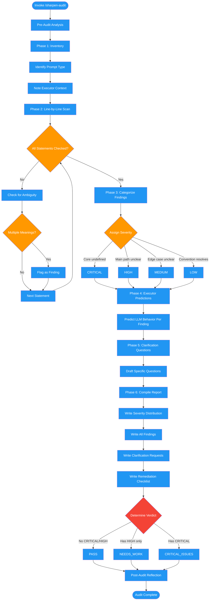

<!-- diagram-meta: {"source": "commands/sharpen-audit.md", "source_hash": "sha256:ac9b53942754ea1d54cad14a3cc82d8039b3d0fe7b93c4069adde8a34d5d924d", "generated_at": "2026-02-19T00:00:00Z", "generator": "generate_diagrams.py"} -->
# Diagram: sharpen-audit

Audits LLM prompts and instructions for ambiguity through a 6-phase protocol: inventory, line-by-line scan, categorize findings, generate executor predictions, draft clarification questions, and compile a structured report with severity ratings and verdict.

## Legend

| Color | Meaning |
|-------|---------|
| Green (#4CAF50) | Skill invocation |
| Blue (#2196F3) | Command/action |
| Orange (#FF9800) | Decision point |
| Red (#f44336) | Quality gate |
