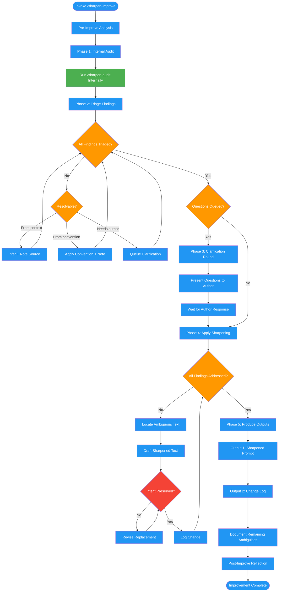

<!-- diagram-meta: {"source": "commands/sharpen-improve.md", "source_hash": "sha256:28bb7d26310c6be28f7bbcc5fd0a0873f22158e69c1c6d35313eb740ce8a8d05", "generated_at": "2026-02-19T00:00:00Z", "generator": "generate_diagrams.py"} -->
# Diagram: sharpen-improve

Rewrites ambiguous LLM prompts to eliminate guesswork. Runs an internal audit first, triages findings, asks clarifying questions when needed, applies sharpening patterns, and produces the improved prompt with a change log.

## Legend

| Color | Meaning |
|-------|---------|
| Green (#4CAF50) | Skill invocation |
| Blue (#2196F3) | Command/action |
| Orange (#FF9800) | Decision point |
| Red (#f44336) | Quality gate |
