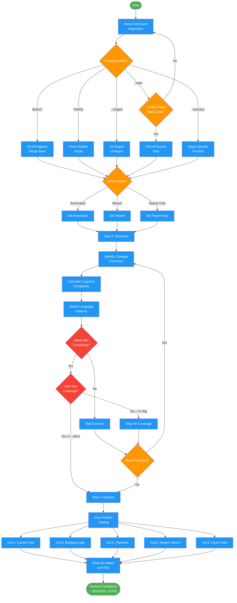

<!-- diagram-meta: {"source": "commands/simplify-analyze.md", "source_hash": "sha256:1c3f807263d035109daa49e3243d660e592cba4b2d7117a5ac670b306680d452", "generated_at": "2026-02-19T00:00:00Z", "generator": "generate_diagrams.py"} -->
# Diagram: simplify-analyze

Analyze code for cognitive complexity and identify simplification opportunities. Covers mode selection, discovery, and analysis phases.

## Legend

| Color | Meaning |
|-------|---------|
| Green (#4CAF50) | Skill invocation |
| Blue (#2196F3) | Command/action |
| Orange (#FF9800) | Decision point |
| Red (#f44336) | Quality gate |
