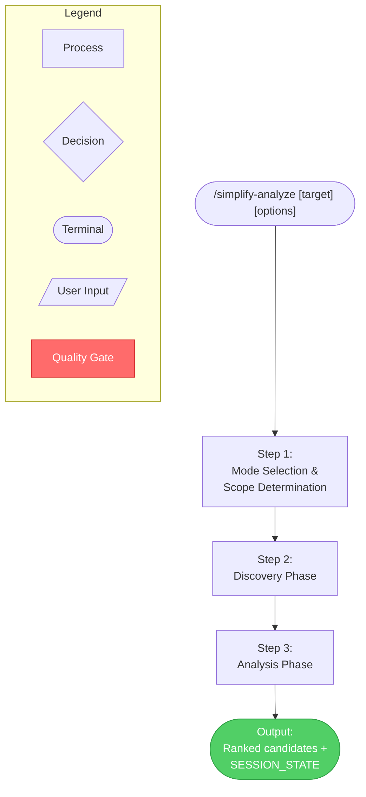
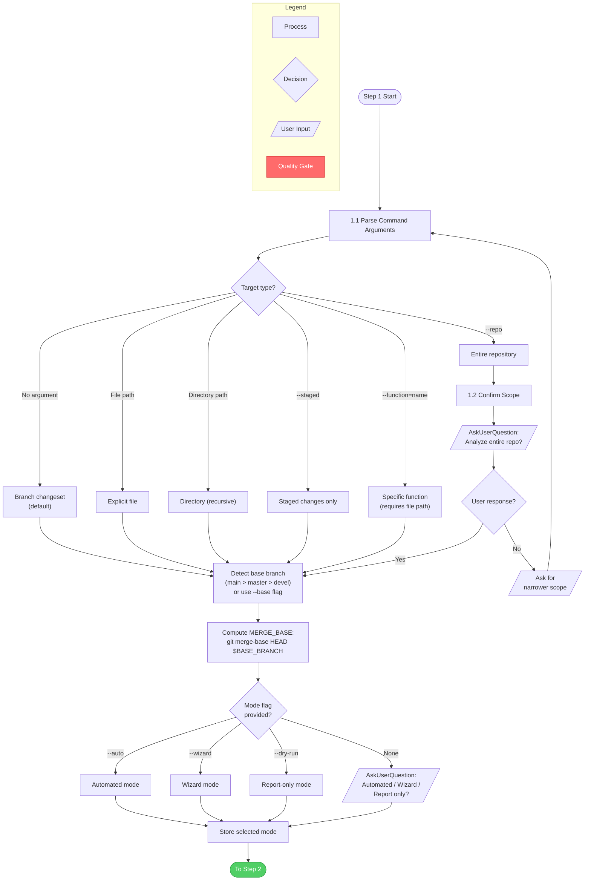
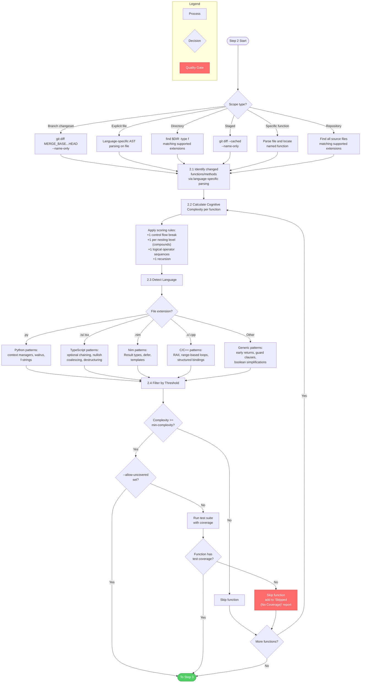
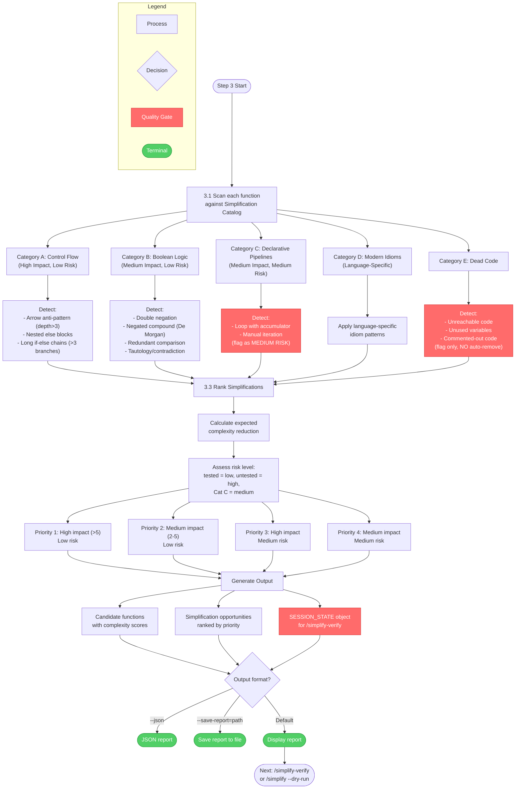

<!-- diagram-meta: {"source": "commands/simplify-analyze.md","source_hash": "sha256:125d99a6644405e3d584d557d0487bf15f4e75c12a539afa0fe992e51816ae7f","generator": "stamp"} -->
# simplify-analyze Command Diagram

## Overview

```mermaid
flowchart TD
    subgraph Legend
        L1[Process]
        L2{Decision}
        L3([Terminal])
        L4[/User Input/]
        L5[Quality Gate]:::gate
    end

    START(["/simplify-analyze [target] [options]"]) --> S1["Step 1:<br>Mode Selection &<br>Scope Determination"]
    S1 --> S2["Step 2:<br>Discovery Phase"]
    S2 --> S3["Step 3:<br>Analysis Phase"]
    S3 --> OUT(["Output:<br>Ranked candidates +<br>SESSION_STATE"])

    classDef gate fill:#ff6b6b,color:#fff,stroke:#d63031
    classDef success fill:#51cf66,color:#fff,stroke:#2f9e44
    class L5 gate
    class OUT success
```

## Step 1: Mode Selection and Scope Determination

```mermaid
flowchart TD
    subgraph Legend
        L1[Process]
        L2{Decision}
        L3[/User Input/]
        L4[Quality Gate]:::gate
    end

    START(["Step 1 Start"]) --> PARSE["1.1 Parse Command Arguments"]

    PARSE --> TARGET{Target type?}
    TARGET -->|No argument| BRANCH["Branch changeset<br>(default)"]
    TARGET -->|File path| FILE["Explicit file"]
    TARGET -->|Directory path| DIR["Directory (recursive)"]
    TARGET -->|"--staged"| STAGED["Staged changes only"]
    TARGET -->|"--function=name"| FUNC["Specific function<br>(requires file path)"]
    TARGET -->|"--repo"| REPO["Entire repository"]

    REPO --> CONFIRM_SCOPE["1.2 Confirm Scope"]
    CONFIRM_SCOPE --> ASK_REPO[/"AskUserQuestion:<br>Analyze entire repo?"/]
    ASK_REPO --> REPO_YES{User response?}
    REPO_YES -->|Yes| BASE_DETECT
    REPO_YES -->|No| ASK_NARROW[/"Ask for<br>narrower scope"/]
    ASK_NARROW --> PARSE

    BRANCH --> BASE_DETECT
    FILE --> BASE_DETECT
    DIR --> BASE_DETECT
    STAGED --> BASE_DETECT
    FUNC --> BASE_DETECT

    BASE_DETECT["Detect base branch<br>(main > master > devel)<br>or use --base flag"]
    BASE_DETECT --> MERGE_BASE["Compute MERGE_BASE:<br>git merge-base HEAD $BASE_BRANCH"]

    MERGE_BASE --> MODE_CHECK{Mode flag<br>provided?}
    MODE_CHECK -->|"--auto"| AUTO["Automated mode"]
    MODE_CHECK -->|"--wizard"| WIZARD["Wizard mode"]
    MODE_CHECK -->|"--dry-run"| REPORT["Report-only mode"]
    MODE_CHECK -->|None| ASK_MODE[/"AskUserQuestion:<br>Automated / Wizard /<br>Report only?"/]
    ASK_MODE --> MODE_SELECTED

    AUTO --> MODE_SELECTED["Store selected mode"]
    WIZARD --> MODE_SELECTED
    REPORT --> MODE_SELECTED
    MODE_SELECTED --> END_S1(["To Step 2"])

    classDef gate fill:#ff6b6b,color:#fff,stroke:#d63031
    classDef success fill:#51cf66,color:#fff,stroke:#2f9e44
    class END_S1 success
```

## Step 2: Discovery Phase

```mermaid
flowchart TD
    subgraph Legend
        L1[Process]
        L2{Decision}
        L3[Quality Gate]:::gate
    end

    START(["Step 2 Start"]) --> SCOPE{Scope type?}

    SCOPE -->|Branch changeset| GIT_DIFF["git diff MERGE_BASE...HEAD<br>--name-only"]
    SCOPE -->|Explicit file| AST_FILE["Language-specific AST<br>parsing on file"]
    SCOPE -->|Directory| FIND_FILES["find $DIR -type f<br>matching supported extensions"]
    SCOPE -->|Staged| GIT_STAGED["git diff --cached<br>--name-only"]
    SCOPE -->|Specific function| PARSE_FUNC["Parse file and locate<br>named function"]
    SCOPE -->|Repository| FIND_ALL["Find all source files<br>matching supported extensions"]

    GIT_DIFF --> IDENTIFY["2.1 Identify changed<br>functions/methods<br>via language-specific parsing"]
    AST_FILE --> IDENTIFY
    FIND_FILES --> IDENTIFY
    GIT_STAGED --> IDENTIFY
    PARSE_FUNC --> IDENTIFY
    FIND_ALL --> IDENTIFY

    IDENTIFY --> COMPLEXITY["2.2 Calculate Cognitive<br>Complexity per function"]

    COMPLEXITY --> RULES["Apply scoring rules:<br>+1 control flow break<br>+1 per nesting level (compounds)<br>+1 logical operator sequences<br>+1 recursion"]

    RULES --> LANG_DETECT["2.3 Detect Language"]
    LANG_DETECT --> LANG{File extension?}
    LANG -->|.py| PYTHON["Python patterns:<br>context managers, walrus,<br>f-strings"]
    LANG -->|.ts/.tsx| TS["TypeScript patterns:<br>optional chaining, nullish<br>coalescing, destructuring"]
    LANG -->|.nim| NIM["Nim patterns:<br>Result types, defer,<br>templates"]
    LANG -->|.c/.cpp| CPP["C/C++ patterns:<br>RAII, range-based loops,<br>structured bindings"]
    LANG -->|Other| GENERIC["Generic patterns:<br>early returns, guard clauses,<br>boolean simplifications"]

    PYTHON --> FILTER
    TS --> FILTER
    NIM --> FILTER
    CPP --> FILTER
    GENERIC --> FILTER

    FILTER["2.4 Filter by Threshold"]
    FILTER --> THRESH{Complexity >=<br>min-complexity?}
    THRESH -->|No| SKIP_LOW["Skip function"]
    THRESH -->|Yes| COVERAGE_CHECK{--allow-uncovered<br>set?}

    COVERAGE_CHECK -->|Yes| PASS_TO_S3
    COVERAGE_CHECK -->|No| RUN_COV["Run test suite<br>with coverage"]
    RUN_COV --> COV_RESULT{Function has<br>test coverage?}
    COV_RESULT -->|Yes| PASS_TO_S3
    COV_RESULT -->|No| SKIP_NOCOV["Skip function<br>add to 'Skipped<br>(No Coverage)' report"]:::gate

    SKIP_LOW --> NEXT_FUNC{More functions?}
    SKIP_NOCOV --> NEXT_FUNC
    NEXT_FUNC -->|Yes| COMPLEXITY
    NEXT_FUNC -->|No| PASS_TO_S3

    PASS_TO_S3(["To Step 3"])

    classDef gate fill:#ff6b6b,color:#fff,stroke:#d63031
    classDef success fill:#51cf66,color:#fff,stroke:#2f9e44
    class PASS_TO_S3 success
```

## Step 3: Analysis Phase and Output

```mermaid
flowchart TD
    subgraph Legend
        L1[Process]
        L2{Decision}
        L3[Quality Gate]:::gate
        L4([Terminal]):::success
    end

    START(["Step 3 Start"]) --> SCAN["3.1 Scan each function<br>against Simplification Catalog"]

    SCAN --> CAT_A["Category A: Control Flow<br>(High Impact, Low Risk)"]
    SCAN --> CAT_B["Category B: Boolean Logic<br>(Medium Impact, Low Risk)"]
    SCAN --> CAT_C["Category C: Declarative Pipelines<br>(Medium Impact, Medium Risk)"]
    SCAN --> CAT_D["Category D: Modern Idioms<br>(Language-Specific)"]
    SCAN --> CAT_E["Category E: Dead Code"]

    CAT_A --> A_PAT["Detect:<br>- Arrow anti-pattern (depth>3)<br>- Nested else blocks<br>- Long if-else chains (>3 branches)"]
    CAT_B --> B_PAT["Detect:<br>- Double negation<br>- Negated compound (De Morgan)<br>- Redundant comparison<br>- Tautology/contradiction"]
    CAT_C --> C_PAT["Detect:<br>- Loop with accumulator<br>- Manual iteration<br>(flag as MEDIUM RISK)"]:::gate
    CAT_D --> D_PAT["Apply language-specific<br>idiom patterns"]
    CAT_E --> E_PAT["Detect:<br>- Unreachable code<br>- Unused variables<br>- Commented-out code<br>(flag only, NO auto-remove)"]:::gate

    A_PAT --> RANK
    B_PAT --> RANK
    C_PAT --> RANK
    D_PAT --> RANK
    E_PAT --> RANK

    RANK["3.3 Rank Simplifications"]

    RANK --> CALC_IMPACT["Calculate expected<br>complexity reduction"]
    CALC_IMPACT --> ASSESS_RISK["Assess risk level:<br>tested = low, untested = high,<br>Cat C = medium"]

    ASSESS_RISK --> P1["Priority 1: High impact (>5)<br>Low risk"]
    ASSESS_RISK --> P2["Priority 2: Medium impact (2-5)<br>Low risk"]
    ASSESS_RISK --> P3["Priority 3: High impact<br>Medium risk"]
    ASSESS_RISK --> P4["Priority 4: Medium impact<br>Medium risk"]

    P1 --> OUTPUT["Generate Output"]
    P2 --> OUTPUT
    P3 --> OUTPUT
    P4 --> OUTPUT

    OUTPUT --> O1["Candidate functions<br>with complexity scores"]
    OUTPUT --> O2["Simplification opportunities<br>ranked by priority"]
    OUTPUT --> O3["SESSION_STATE object<br>for /simplify-verify"]:::gate

    O1 --> FMT{Output format?}
    O2 --> FMT
    O3 --> FMT

    FMT -->|"--json"| JSON(["JSON report"]):::success
    FMT -->|"--save-report=path"| SAVE(["Save report to file"]):::success
    FMT -->|Default| DISPLAY(["Display report"]):::success

    DISPLAY --> NEXT(["Next: /simplify-verify<br>or /simplify --dry-run"])

    classDef gate fill:#ff6b6b,color:#fff,stroke:#d63031
    classDef success fill:#51cf66,color:#fff,stroke:#2f9e44
    class L3 gate
    class L4 success
```

## Cross-Reference Table

| Overview Node | Detail Diagram | Key Activities |
|---|---|---|
| Step 1: Mode Selection & Scope Determination | Step 1 diagram | Argument parsing, scope confirmation, base branch detection, mode selection |
| Step 2: Discovery Phase | Step 2 diagram | Function identification, cognitive complexity scoring, language detection, threshold + coverage filtering |
| Step 3: Analysis Phase | Step 3 diagram | Pattern catalog scan (Categories A-E), risk/impact ranking, output generation |
| Output | Step 3 diagram (bottom) | Ranked candidates, SESSION_STATE for downstream commands |

## Key Quality Gates

| Gate | Location | Behavior |
|---|---|---|
| Coverage gate | Step 2.4 | Functions with 0% coverage skipped unless `--allow-uncovered` |
| Complexity threshold | Step 2.4 | Functions below `--min-complexity` (default 5) excluded |
| Repo scope confirmation | Step 1.2 | `--repo` flag requires explicit user confirmation |
| Commented code protection | Step 3 (Cat E) | Commented-out code flagged for review only, never auto-removed |
| Category C risk flag | Step 3 (Cat C) | Declarative pipeline transforms flagged as medium risk |
| SESSION_STATE required | Output | Must always be included; downstream `/simplify-verify` depends on it |
