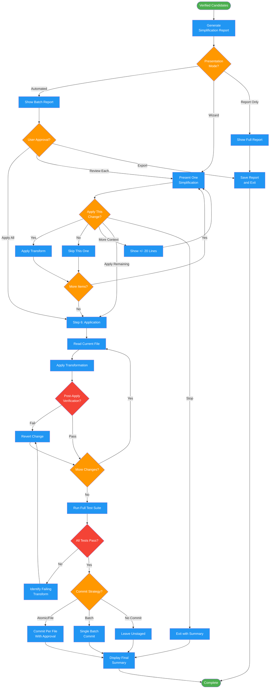

<!-- diagram-meta: {"source": "commands/simplify-transform.md", "source_hash": "sha256:4a0965eaa0740a62d856a2c5a298d7c2558cf59e57db04c976110fecbe2a0f9a", "generated_at": "2026-02-19T00:00:00Z", "generator": "generate_diagrams.py"} -->
# Diagram: simplify-transform

Present and apply verified simplifications with multi-mode workflow and git integration. Handles automated, wizard, and report-only presentation modes.

## Legend

| Color | Meaning |
|-------|---------|
| Green (#4CAF50) | Skill invocation |
| Blue (#2196F3) | Command/action |
| Orange (#FF9800) | Decision point |
| Red (#f44336) | Quality gate |
