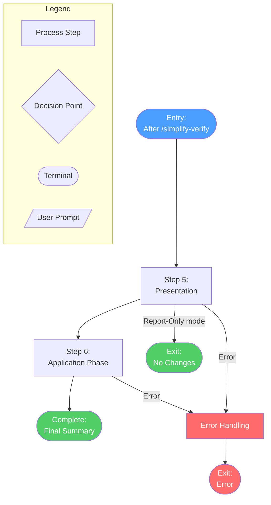
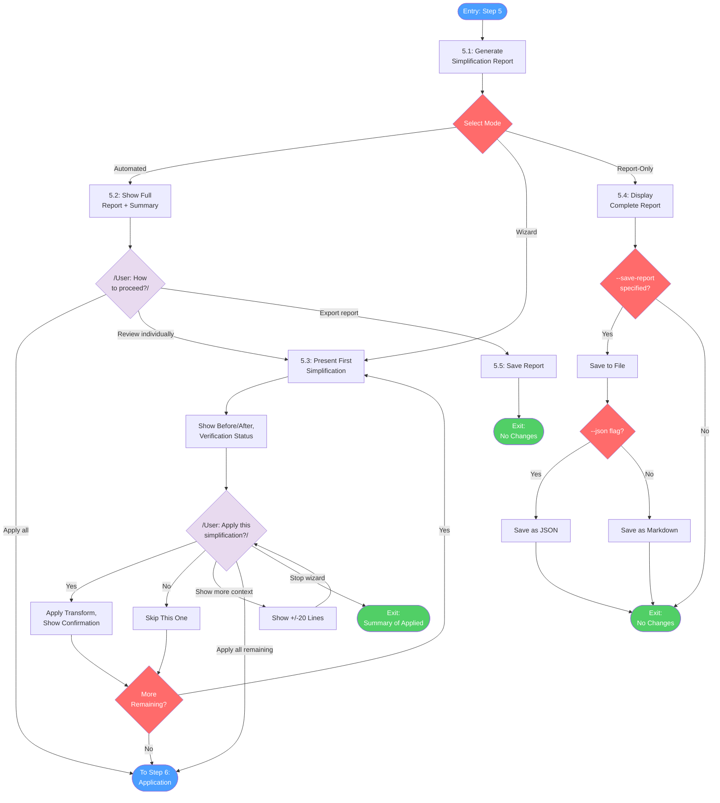
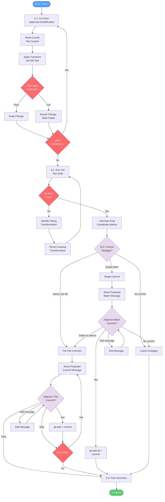
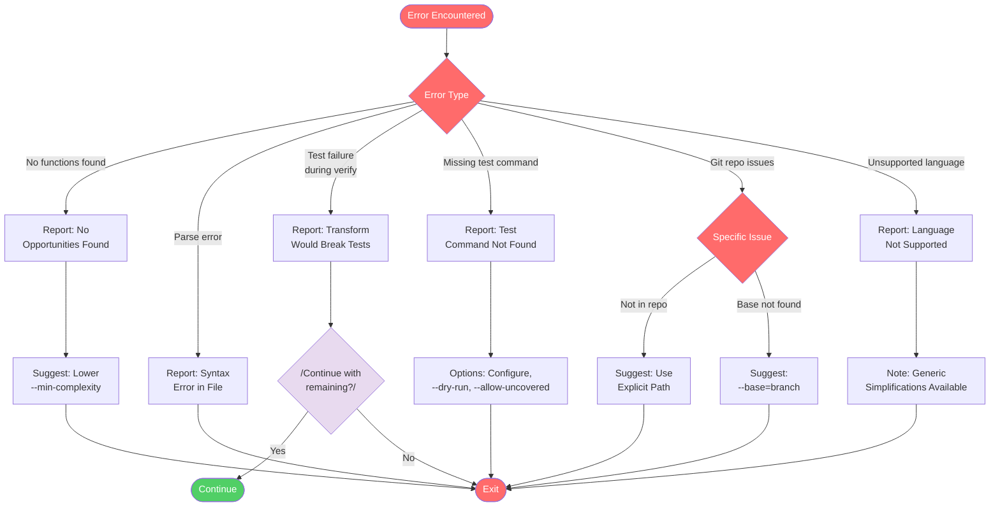
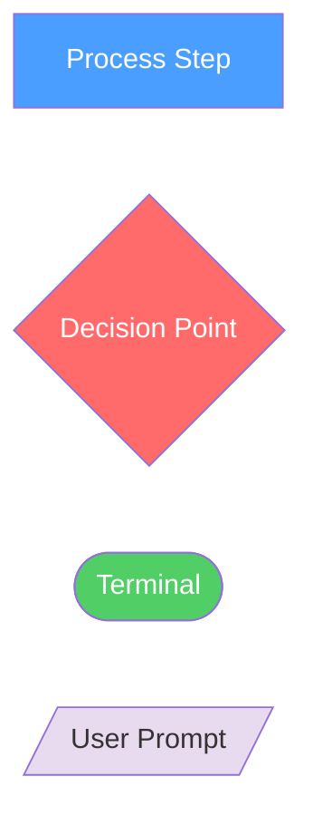

<!-- diagram-meta: {"source": "commands/simplify-transform.md", "source_hash": "sha256:71b593cbcbd7607080bdabd9147f7c0153ec9d8f5328d6bd7392374513a31f9f", "generated_at": "2026-03-10T06:28:48Z", "generator": "generate_diagrams.py"} -->
# Diagram: simplify-transform

## Overview

```mermaid
flowchart TD
    ENTRY([Entry:<br/>After /simplify-verify]) --> S5[Step 5:<br/>Presentation]
    S5 --> S6[Step 6:<br/>Application Phase]
    S5 -->|Report-Only mode| EXIT_REPORT([Exit:<br/>No Changes])
    S6 --> DONE([Complete:<br/>Final Summary])
    S5 -->|Error| ERR[Error Handling]
    S6 -->|Error| ERR
    ERR --> EXIT_ERR([Exit:<br/>Error])

    subgraph Legend
        L1[Process Step]
        L2{Decision Point}
        L3([Terminal])
        L4[/User Prompt/]
    end

    style ENTRY fill:#4a9eff,color:#fff
    style EXIT_REPORT fill:#51cf66,color:#fff
    style DONE fill:#51cf66,color:#fff
    style EXIT_ERR fill:#ff6b6b,color:#fff
    style ERR fill:#ff6b6b,color:#fff
```

## Step 5: Presentation

```mermaid
flowchart TD
    S5([Entry: Step 5]) --> GEN_REPORT[5.1: Generate<br/>Simplification Report]
    GEN_REPORT --> MODE{Select Mode}

    MODE -->|Automated| AUTO_PRESENT[5.2: Show Full<br/>Report + Summary]
    MODE -->|Wizard| WIZ_PRESENT[5.3: Present First<br/>Simplification]
    MODE -->|Report-Only| RPT_PRESENT[5.4: Display<br/>Complete Report]

    AUTO_PRESENT --> AUTO_ASK{/User: How<br/>to proceed?/}
    AUTO_ASK -->|Apply all| TO_STEP6([To Step 6:<br/>Application])
    AUTO_ASK -->|Review individually| WIZ_PRESENT
    AUTO_ASK -->|Export report| SAVE_REPORT[5.5: Save Report]
    SAVE_REPORT --> EXIT_NO_CHANGE([Exit:<br/>No Changes])

    WIZ_PRESENT --> WIZ_SHOW[Show Before/After,<br/>Verification Status]
    WIZ_SHOW --> WIZ_ASK{/User: Apply this<br/>simplification?/}
    WIZ_ASK -->|Yes| WIZ_APPLY[Apply Transform,<br/>Show Confirmation]
    WIZ_ASK -->|No| WIZ_SKIP[Skip This One]
    WIZ_ASK -->|Show more context| WIZ_CTX[Show +/-20 Lines]
    WIZ_CTX --> WIZ_ASK
    WIZ_ASK -->|Apply all remaining| TO_STEP6
    WIZ_ASK -->|Stop wizard| WIZ_EXIT([Exit:<br/>Summary of Applied])
    WIZ_APPLY --> WIZ_MORE{More<br/>Remaining?}
    WIZ_SKIP --> WIZ_MORE
    WIZ_MORE -->|Yes| WIZ_PRESENT
    WIZ_MORE -->|No| TO_STEP6

    RPT_PRESENT --> RPT_SAVE{--save-report<br/>specified?}
    RPT_SAVE -->|Yes| SAVE_RPT_FILE[Save to File]
    RPT_SAVE -->|No| EXIT_RPT([Exit:<br/>No Changes])
    SAVE_RPT_FILE --> RPT_JSON{--json flag?}
    RPT_JSON -->|Yes| SAVE_JSON[Save as JSON]
    RPT_JSON -->|No| SAVE_MD[Save as Markdown]
    SAVE_JSON --> EXIT_RPT
    SAVE_MD --> EXIT_RPT

    style S5 fill:#4a9eff,color:#fff
    style TO_STEP6 fill:#4a9eff,color:#fff
    style EXIT_NO_CHANGE fill:#51cf66,color:#fff
    style EXIT_RPT fill:#51cf66,color:#fff
    style WIZ_EXIT fill:#51cf66,color:#fff
    style AUTO_ASK fill:#e8daef
    style WIZ_ASK fill:#e8daef
    classDef decision fill:#ff6b6b,color:#fff
    class MODE,RPT_SAVE,RPT_JSON,WIZ_MORE decision
```

## Step 6: Application Phase

```mermaid
flowchart TD
    S6([Entry: Step 6]) --> APPLY_LOOP[6.1: For Each<br/>Approved Simplification]

    APPLY_LOOP --> READ[Read Current<br/>File Content]
    READ --> EDIT[Apply Transform<br/>via Edit Tool]
    EDIT --> VERIFY{Post-Apply<br/>Verification}
    VERIFY -->|Pass| KEEP[Keep Change]
    VERIFY -->|Fail| REVERT[Revert Change,<br/>Mark Failed]
    KEEP --> MORE_APPLY{More<br/>Transforms?}
    REVERT --> MORE_APPLY
    MORE_APPLY -->|Yes| APPLY_LOOP
    MORE_APPLY -->|No| FULL_TEST[6.2: Run Full<br/>Test Suite]

    FULL_TEST --> TEST_RESULT{All Tests<br/>Pass?}
    TEST_RESULT -->|Yes| METRICS[Calculate Final<br/>Complexity Metrics]
    TEST_RESULT -->|No| FIND_CAUSE[Identify Failing<br/>Transformation]
    FIND_CAUSE --> REVERT_CAUSE[Revert Causing<br/>Transformation]
    REVERT_CAUSE --> FULL_TEST

    METRICS --> GIT_ASK{/6.3: Commit<br/>Strategy?/}
    GIT_ASK -->|Atomic per file| ATOMIC[Per-File Commits]
    GIT_ASK -->|Single batch| BATCH[Single Commit]
    GIT_ASK -->|No commit| NO_COMMIT[Leave Unstaged]

    ATOMIC --> ATOM_SHOW[Show Proposed<br/>Commit Message]
    ATOM_SHOW --> ATOM_ASK{/Approve This<br/>Commit?/}
    ATOM_ASK -->|Yes| ATOM_EXEC[git add + commit]
    ATOM_ASK -->|Edit message| ATOM_EDIT[Edit Message]
    ATOM_EDIT --> ATOM_ASK
    ATOM_ASK -->|Skip| ATOM_MORE{More Files?}
    ATOM_ASK -->|Stop| SUMMARY
    ATOM_EXEC --> ATOM_MORE
    ATOM_MORE -->|Yes| ATOM_SHOW
    ATOM_MORE -->|No| SUMMARY

    BATCH --> BATCH_SHOW[Show Proposed<br/>Batch Message]
    BATCH_SHOW --> BATCH_ASK{/Approve Batch<br/>Commit?/}
    BATCH_ASK -->|Yes| BATCH_EXEC[git add all +<br/>commit]
    BATCH_ASK -->|Edit message| BATCH_EDIT[Edit Message]
    BATCH_EDIT --> BATCH_ASK
    BATCH_ASK -->|Switch to atomic| ATOMIC
    BATCH_ASK -->|No commit| NO_COMMIT
    BATCH_EXEC --> SUMMARY

    NO_COMMIT --> SUMMARY[6.4: Final Summary]
    SUMMARY --> DONE([Complete])

    style S6 fill:#4a9eff,color:#fff
    style DONE fill:#51cf66,color:#fff
    style GIT_ASK fill:#e8daef
    style ATOM_ASK fill:#e8daef
    style BATCH_ASK fill:#e8daef
    classDef decision fill:#ff6b6b,color:#fff
    class VERIFY,TEST_RESULT,MORE_APPLY,ATOM_MORE decision
```

## Error Handling

```mermaid
flowchart TD
    ERR([Error Encountered]) --> ERR_TYPE{Error Type}

    ERR_TYPE -->|No functions found| NO_FUNC[Report: No<br/>Opportunities Found]
    NO_FUNC --> SUGGEST_LOWER[Suggest: Lower<br/>--min-complexity]
    SUGGEST_LOWER --> EXIT_ERR([Exit])

    ERR_TYPE -->|Parse error| PARSE[Report: Syntax<br/>Error in File]
    PARSE --> EXIT_ERR

    ERR_TYPE -->|Test failure<br/>during verify| TEST_FAIL[Report: Transform<br/>Would Break Tests]
    TEST_FAIL --> SKIP_ASK{/Continue with<br/>remaining?/}
    SKIP_ASK -->|Yes| CONTINUE([Continue])
    SKIP_ASK -->|No| EXIT_ERR

    ERR_TYPE -->|Missing test command| NO_CMD[Report: Test<br/>Command Not Found]
    NO_CMD --> CMD_OPTS[Options: Configure,<br/>--dry-run, --allow-uncovered]
    CMD_OPTS --> EXIT_ERR

    ERR_TYPE -->|Git repo issues| GIT_ERR{Specific Issue}
    GIT_ERR -->|Not in repo| NOT_REPO[Suggest: Use<br/>Explicit Path]
    GIT_ERR -->|Base not found| NO_BASE[Suggest:<br/>--base=branch]
    NOT_REPO --> EXIT_ERR
    NO_BASE --> EXIT_ERR

    ERR_TYPE -->|Unsupported language| LANG[Report: Language<br/>Not Supported]
    LANG --> LANG_NOTE[Note: Generic<br/>Simplifications Available]
    LANG_NOTE --> EXIT_ERR

    style ERR fill:#ff6b6b,color:#fff
    style EXIT_ERR fill:#ff6b6b,color:#fff
    style CONTINUE fill:#51cf66,color:#fff
    style SKIP_ASK fill:#e8daef
    classDef decision fill:#ff6b6b,color:#fff
    class ERR_TYPE,GIT_ERR decision
```

## Cross-Reference

| Overview Node | Detail Section | Source |
|---|---|---|
| Step 5: Presentation | Step 5: Presentation | `commands/simplify-transform.md:37-252` |
| Step 6: Application Phase | Step 6: Application Phase | `commands/simplify-transform.md:296-457` |
| Error Handling | Error Handling | `commands/simplify-transform.md:461-543` |

## Legend

```mermaid
flowchart LR
    L1[Process Step]
    L2{Decision Point}
    L3([Terminal])
    L4[/User Prompt/]
    style L1 fill:#4a9eff,color:#fff
    style L2 fill:#ff6b6b,color:#fff
    style L3 fill:#51cf66,color:#fff
    style L4 fill:#e8daef
```
