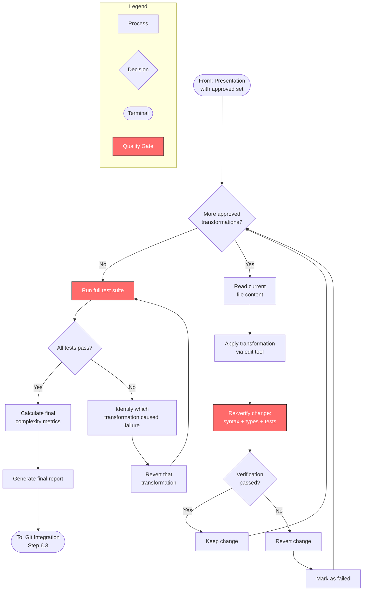

<!-- diagram-meta: {"source": "commands/simplify-transform.md","source_hash": "sha256:6e5faff691f4829e4cc876ac4eeee0b796ec562b2c9e6e6af9de5ebc5a2358d8","generator": "stamp"} -->
# simplify-transform Diagrams

## Overview: High-Level Flow

Shows the two major phases (Presentation and Application) with mode branching and error handling.

```mermaid
flowchart TD
    subgraph Legend
        L1[Process]
        L2{Decision}
        L3([Terminal])
        L4[/"User Prompt"/]
        L5[Quality Gate]:::gate
    end

    Start([Entry from /simplify-verify]) --> GenReport[Step 5.1: Generate<br>Simplification Report]
    GenReport --> ModeCheck{Which mode?}

    ModeCheck -->|Automated| AutoPresent[Step 5.2: Automated Mode<br>Present batch report]
    ModeCheck -->|Wizard| WizPresent[Step 5.3: Wizard Mode<br>Present one-at-a-time]
    ModeCheck -->|Report-Only| ReportPresent[Step 5.4: Report-Only Mode<br>Display analysis]

    AutoPresent --> AutoAsk{/"How to proceed?"/}
    AutoAsk -->|Apply all| Apply[Step 6: Application Phase]
    AutoAsk -->|Review individually| WizPresent
    AutoAsk -->|Export report| SaveReport[Step 5.5: Save Report]

    WizPresent --> WizLoop[Wizard Loop:<br>Per-simplification approval]
    WizLoop -->|All reviewed/applied| Apply
    WizLoop -->|"Apply all remaining"| Apply
    WizLoop -->|"Stop wizard"| SaveReport

    ReportPresent --> SaveCheck{--save-report<br>specified?}
    SaveCheck -->|Yes| SaveReport
    SaveCheck -->|No| ReportExit([Exit: No changes])

    SaveReport --> SaveFormat{--json flag?}
    SaveFormat -->|Yes| SaveJSON[Save as JSON]
    SaveFormat -->|No| SaveMD[Save as Markdown]
    SaveJSON --> ReportExit
    SaveMD --> ReportExit

    Apply --> ApplyTransform[Step 6.1: Apply<br>Transformations]
    ApplyTransform --> PostVerify[Step 6.2: Post-Application<br>Verification]:::gate
    PostVerify --> PostPass{All tests pass?}
    PostPass -->|Yes| GitInteg[Step 6.3: Git Integration]
    PostPass -->|No| RevertFailing[Revert failing<br>transformations]
    RevertFailing --> PostVerify

    GitInteg --> CommitAsk{/"Commit strategy?"/}
    CommitAsk -->|Atomic per file| AtomicCommit[Atomic Commits]
    CommitAsk -->|Single batch| BatchCommit[Batch Commit]
    CommitAsk -->|No commit| NoCommit[Leave unstaged]

    AtomicCommit --> Summary[Step 6.4: Final Summary]
    BatchCommit --> Summary
    NoCommit --> Summary
    Summary --> Done([Complete]):::success

    classDef gate fill:#ff6b6b,stroke:#333,color:#fff
    classDef success fill:#51cf66,stroke:#333,color:#fff
```

### Cross-Reference Table

| Overview Node | Detail Diagram |
|---|---|
| Step 5.2: Automated Mode | Detail A: Automated Mode |
| Step 5.3: Wizard Mode / Wizard Loop | Detail B: Wizard Mode |
| Step 5.5: Save Report | Detail C: Save Report |
| Step 6.1: Apply Transformations | Detail D: Application Phase |
| Step 6.2: Post-Application Verification | Detail D: Application Phase |
| Step 6.3: Git Integration | Detail E: Git Integration |
| Error Handling | Detail F: Error Handling |

---

## Detail A: Automated Mode Presentation (Step 5.2)

```mermaid
flowchart TD
    subgraph Legend
        L1[Process]
        L2{Decision}
        L3([Terminal])
        L4[/"User Prompt"/]
    end

    Start([From: Generate Report]) --> ShowReport[Display full report<br>with all proposed changes]
    ShowReport --> ShowStats[Display summary statistics]
    ShowStats --> Ask{/"Found N opportunities.<br>How to proceed?"/}

    Ask -->|"Apply all simplifications<br>(will verify each)"| ToApply([To: Application Phase<br>Step 6])
    Ask -->|"Review each one<br>individually"| ToWizard([To: Wizard Mode<br>Step 5.3])
    Ask -->|"Export report<br>and exit"| ToSave([To: Save Report<br>Step 5.5])
```

---

## Detail B: Wizard Mode Presentation (Step 5.3)

```mermaid
flowchart TD
    subgraph Legend
        L1[Process]
        L2{Decision}
        L3([Terminal])
        L4[/"User Prompt"/]
    end

    Start([From: Mode Selection]) --> NextItem{More simplifications<br>remaining?}
    NextItem -->|No| AllDone([To: Application Phase<br>with approved set])

    NextItem -->|Yes| Present[Present simplification N of total:<br>file, function, complexity delta,<br>pattern, risk, before/after code,<br>verification status]

    Present --> Ask{/"Apply this<br>simplification?"/}

    Ask -->|"Yes, apply"| MarkApproved[Mark as approved]
    MarkApproved --> ShowConfirm[Show confirmation]
    ShowConfirm --> NextItem

    Ask -->|"No, skip"| MarkSkipped[Mark as skipped]
    MarkSkipped --> NextItem

    Ask -->|"Show more context<br>(+/-20 lines)"| Expand[Display wider<br>code window]
    Expand --> Ask

    Ask -->|"Apply all remaining<br>(switch to automated)"| ToAuto([To: Application Phase<br>approve all remaining])

    Ask -->|"Stop wizard"| ExitSummary[Show summary of<br>what was applied]
    ExitSummary --> ToSave([To: Save Report<br>Step 5.5])
```

---

## Detail C: Save Report (Step 5.5)

```mermaid
flowchart TD
    subgraph Legend
        L1[Process]
        L2{Decision}
        L3([Terminal])
    end

    Start([From: Presentation]) --> CustomPath{--save-report=path<br>specified?}

    CustomPath -->|Yes| UsePath[Use custom path]
    CustomPath -->|No| DetectRepo[Detect outermost<br>git repo root]

    DetectRepo --> RepoCheck{In a git repo?}
    RepoCheck -->|No| AskInit{/"Init repo or<br>use fallback?"/}
    AskInit --> FallbackPath[Use _no-repo<br>fallback path]

    RepoCheck -->|Yes| EncodePath["Encode project path:<br>strip leading /, tr / to -"]
    EncodePath --> DefaultPath["Build path:<br>SPELLBOOK_CONFIG_DIR/docs/<br>project-encoded/reports/<br>simplify-report-DATE.md"]

    UsePath --> MkDir["mkdir -p directory"]
    DefaultPath --> MkDir
    FallbackPath --> MkDir

    MkDir --> FormatCheck{--json flag?}
    FormatCheck -->|Yes| WriteJSON[Write JSON report]
    FormatCheck -->|No| WriteMD[Write Markdown report]

    WriteJSON --> Done([Report saved]):::success
    WriteMD --> Done

    classDef success fill:#51cf66,stroke:#333,color:#fff
```

---

## Detail D: Application Phase (Steps 6.1 - 6.2)

```mermaid
flowchart TD
    subgraph Legend
        L1[Process]
        L2{Decision}
        L3([Terminal])
        L5[Quality Gate]:::gate
    end

    Start([From: Presentation<br>with approved set]) --> NextTx{More approved<br>transformations?}

    NextTx -->|No| FullSuite[Run full test suite]:::gate

    NextTx -->|Yes| ReadFile[Read current<br>file content]
    ReadFile --> ApplyEdit[Apply transformation<br>via edit tool]
    ApplyEdit --> ReVerify[Re-verify change:<br>syntax + types + tests]:::gate

    ReVerify --> VerifyPass{Verification<br>passed?}
    VerifyPass -->|Yes| KeepChange[Keep change]
    KeepChange --> NextTx

    VerifyPass -->|No| RevertChange[Revert change]
    RevertChange --> MarkFailed[Mark as failed]
    MarkFailed --> NextTx

    FullSuite --> SuitePass{All tests pass?}
    SuitePass -->|Yes| CalcMetrics[Calculate final<br>complexity metrics]
    CalcMetrics --> GenFinal[Generate final report]
    GenFinal --> ToGit([To: Git Integration<br>Step 6.3])

    SuitePass -->|No| Identify[Identify which<br>transformation caused failure]
    Identify --> RevertCulprit[Revert that<br>transformation]
    RevertCulprit --> FullSuite

    classDef gate fill:#ff6b6b,stroke:#333,color:#fff
```

---

## Detail E: Git Integration (Step 6.3)

```mermaid
flowchart TD
    subgraph Legend
        L1[Process]
        L2{Decision}
        L3([Terminal])
        L4[/"User Prompt"/]
    end

    Start([From: Post-Application<br>Verification]) --> CommitAsk{/"How should I<br>handle commits?"/}

    CommitAsk -->|"Atomic per file"| AtomicLoop{More files<br>with changes?}
    CommitAsk -->|"Single batch commit"| ShowBatch[Show proposed<br>batch commit message]
    CommitAsk -->|"No commit"| ListChanges[List applied changes<br>with review commands]

    %% Atomic flow
    AtomicLoop -->|No| Summary([To: Final Summary]):::success
    AtomicLoop -->|Yes| ShowFileMsg[Show proposed commit<br>message for file]
    ShowFileMsg --> FileAsk{/"Commit this file<br>with this message?"/}

    FileAsk -->|"Yes, commit"| ExecFileCommit["git add file &&<br>git commit -m msg"]
    ExecFileCommit --> AtomicLoop

    FileAsk -->|"Edit message"| EditFileMsg[User edits message]
    EditFileMsg --> ExecFileCommit

    FileAsk -->|"Skip this commit"| AtomicLoop
    FileAsk -->|"Stop (no more commits)"| Summary

    %% Batch flow
    ShowBatch --> BatchAsk{/"Commit all changes<br>with this message?"/}

    BatchAsk -->|"Yes, commit all"| ExecBatch["git add all files &&<br>git commit -m msg"]
    ExecBatch --> Summary

    BatchAsk -->|"Edit message"| EditBatchMsg[User edits message]
    EditBatchMsg --> ExecBatch

    BatchAsk -->|"Switch to atomic"| AtomicLoop
    BatchAsk -->|"No commit"| ListChanges

    %% No commit flow
    ListChanges --> Summary

    classDef success fill:#51cf66,stroke:#333,color:#fff
```

---

## Detail F: Error Handling

```mermaid
flowchart TD
    subgraph Legend
        L1[Process]
        L2{Decision}
        L3([Terminal])
        L4[/"User Prompt"/]
    end

    Error{Error type?}

    Error -->|"No functions found"| NoFunc[Display: scope, count analyzed,<br>0 above threshold]
    NoFunc --> Suggest1["Suggest: lower --min-complexity,<br>use --allow-uncovered,<br>check different scope"]
    Suggest1 --> Exit1([Exit])

    Error -->|"Parse error"| ParseErr["Display: Cannot analyze file<br>+ error details"]
    ParseErr --> FixFirst["Fix syntax errors<br>before running"]
    FixFirst --> Exit2([Exit])

    Error -->|"Test failure<br>during verification"| TestFail["Display: Verification failed<br>for function in file"]
    TestFail --> SkipIt[Simplification skipped]
    SkipIt --> ContAsk{/"Continue with<br>remaining?"/}
    ContAsk -->|Yes| Continue([Resume processing])
    ContAsk -->|No| Exit3([Exit])

    Error -->|"Missing test command"| NoTest["Display: test command not found,<br>detected project type"]
    NoTest --> TestOpts{/"How to proceed?"/}
    TestOpts -->|"Configure test command"| Configure([User configures])
    TestOpts -->|"Use --dry-run"| DryRun([Analysis only])
    TestOpts -->|"Use --allow-uncovered"| Uncovered([Skip verification])

    Error -->|"Git repo issues"| GitErr{Sub-type?}
    GitErr -->|"Not in repo"| NotRepo["Suggest: use explicit<br>file/directory path"]
    GitErr -->|"Base branch not found"| NoBranch["Suggest: --base=branch<br>or explicit path"]
    NotRepo --> Exit4([Exit])
    NoBranch --> Exit5([Exit])

    Error -->|"Unsupported language"| UnsupLang["List supported languages,<br>note generic simplifications<br>available for all"]
    UnsupLang --> Exit6([Exit])
```
