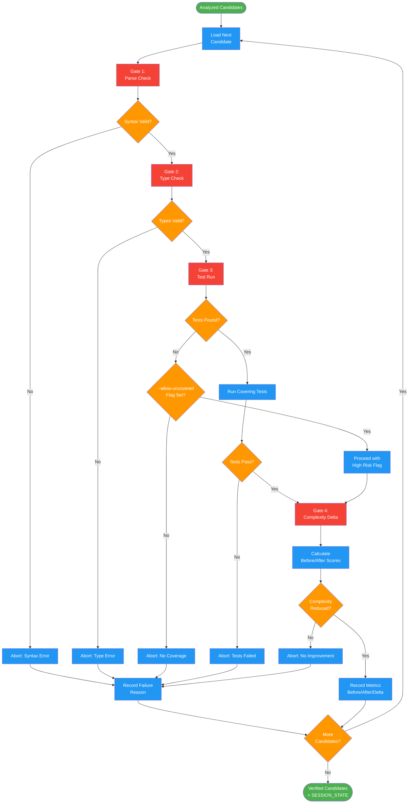

<!-- diagram-meta: {"source": "commands/simplify-verify.md", "source_hash": "sha256:5910c137bad483d041c7146e47cc7921b976c529ea663242581e96d86df93e3a", "generated_at": "2026-02-19T00:00:00Z", "generator": "generate_diagrams.py"} -->
# Diagram: simplify-verify

Multi-gate verification pipeline for simplification candidates. Each candidate passes through parse, type, test, and complexity gates.

## Legend

| Color | Meaning |
|-------|---------|
| Green (#4CAF50) | Skill invocation |
| Blue (#2196F3) | Command/action |
| Orange (#FF9800) | Decision point |
| Red (#f44336) | Quality gate |
