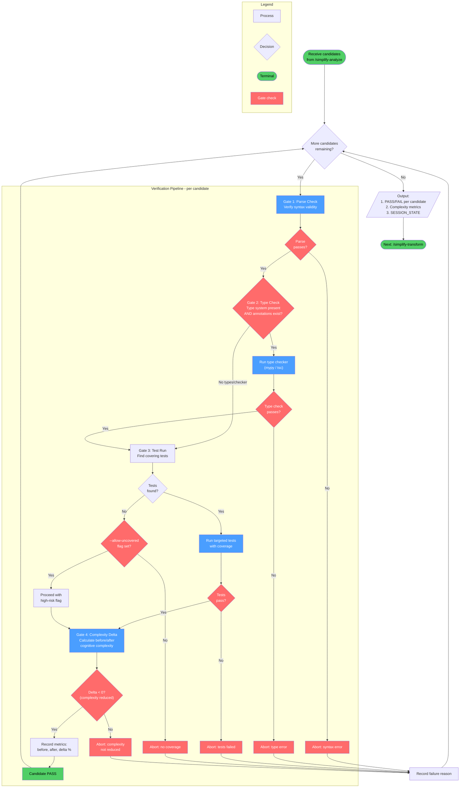

<!-- diagram-meta: {"source": "commands/simplify-verify.md","source_hash": "sha256:eb4ff3805cf438f66d5bdd095c57ea08b2048285442dc42e2b3f7d36b8f1dd15","generator": "stamp"} -->
# Diagram: simplify-verify

Multi-gate verification pipeline for simplification candidates. Each candidate passes through parse, type, test, and complexity gates sequentially. Failure at any gate aborts that candidate and continues to the next.

```mermaid
flowchart TD
    subgraph Legend
        L1[Process]
        L2{Decision}
        L3([Terminal])
        L4["Gate check"]
        style L3 fill:#51cf66,color:#000
        style L4 fill:#ff6b6b,color:#fff
    end

    Start([Receive candidates<br>from /simplify-analyze]) --> Iterate

    Iterate{More candidates<br>remaining?}
    Iterate -- No --> Output
    Iterate -- Yes --> G1

    subgraph Pipeline ["Verification Pipeline - per candidate"]
        G1["Gate 1: Parse Check<br>Verify syntax validity"]
        G1 --> G1D{Parse<br>passes?}
        G1D -- No --> Abort1["Abort: syntax error"]
        G1D -- Yes --> G2

        G2{"Gate 2: Type Check<br>Type system present<br>AND annotations exist?"}
        G2 -- No types/checker --> G3
        G2 -- Yes --> G2Run["Run type checker<br>(mypy / tsc)"]
        G2Run --> G2D{Type check<br>passes?}
        G2D -- No --> Abort2["Abort: type error"]
        G2D -- Yes --> G3

        G3["Gate 3: Test Run<br>Find covering tests"]
        G3 --> G3Found{Tests<br>found?}
        G3Found -- Yes --> G3Run["Run targeted tests<br>with coverage"]
        G3Run --> G3D{Tests<br>pass?}
        G3D -- No --> Abort3["Abort: tests failed"]
        G3D -- Yes --> G4

        G3Found -- No --> G3Uncov{"--allow-uncovered<br>flag set?"}
        G3Uncov -- No --> Abort4["Abort: no coverage"]
        G3Uncov -- Yes --> G4Flag["Proceed with<br>high-risk flag"]
        G4Flag --> G4

        G4["Gate 4: Complexity Delta<br>Calculate before/after<br>cognitive complexity"]
        G4 --> G4D{"Delta < 0?<br>(complexity reduced)"}
        G4D -- No --> Abort5["Abort: complexity<br>not reduced"]
        G4D -- Yes --> Record["Record metrics:<br>before, after, delta %"]
        Record --> Pass["Candidate PASS"]
    end

    Abort1 --> RecordFail["Record failure reason"]
    Abort2 --> RecordFail
    Abort3 --> RecordFail
    Abort4 --> RecordFail
    Abort5 --> RecordFail
    RecordFail --> Iterate
    Pass --> Iterate

    Output[/"Output:<br>1. PASS/FAIL per candidate<br>2. Complexity metrics<br>3. SESSION_STATE"/]
    Output --> Next([Next: /simplify-transform])

    style G1 fill:#4a9eff,color:#fff
    style G2Run fill:#4a9eff,color:#fff
    style G3Run fill:#4a9eff,color:#fff
    style G4 fill:#4a9eff,color:#fff
    style G1D fill:#ff6b6b,color:#fff
    style G2D fill:#ff6b6b,color:#fff
    style G2 fill:#ff6b6b,color:#fff
    style G3D fill:#ff6b6b,color:#fff
    style G3Uncov fill:#ff6b6b,color:#fff
    style G4D fill:#ff6b6b,color:#fff
    style Pass fill:#51cf66,color:#000
    style Next fill:#51cf66,color:#000
    style Start fill:#51cf66,color:#000
    style Abort1 fill:#ff6b6b,color:#fff
    style Abort2 fill:#ff6b6b,color:#fff
    style Abort3 fill:#ff6b6b,color:#fff
    style Abort4 fill:#ff6b6b,color:#fff
    style Abort5 fill:#ff6b6b,color:#fff
```

## Legend

| Color | Meaning |
|-------|---------|
| Blue (#4a9eff) | Process / execution step |
| Red (#ff6b6b) | Quality gate / abort condition |
| Green (#51cf66) | Success terminal |

## Node-to-Source Reference

| Node | Source Section |
|------|---------------|
| Gate 1: Parse Check | Section 4.2 - Language-specific syntax validation (py_compile, tsc, nim check, gcc/clang) |
| Gate 2: Type Check | Section 4.3 - Conditional on type system and annotation presence (mypy, tsc) |
| Gate 3: Test Run | Section 4.4 - Targeted test execution with coverage mapping |
| --allow-uncovered | Section 4.4 + Invariant Principle 4 - Explicit flag for uncovered functions |
| Gate 4: Complexity Delta | Section 4.5 - Before/after cognitive complexity, delta must be negative |
| Abort paths | Invariant Principles 1-2 - All gates must pass; failures recorded and skipped |
| Output / SESSION_STATE | Output section - Feeds into /simplify-transform |
