<!-- diagram-meta: {"source": "commands/systematic-debugging/systematic-debugging.md", "source_hash": "sha256:bbba218b60e4cd57d0a8a26d61ce08fe793c047f8fb3c0219bdcdb373c51c65d", "generated_at": "2026-02-19T00:00:00Z", "generator": "generate_diagrams.py"} -->
# Diagram: systematic-debugging

4-phase root cause debugging methodology. Enforces the iron law: no fixes without root cause investigation first. Phases: root cause investigation, pattern analysis, hypothesis and testing (with isolated-testing and verifying-hunches sub-skills), and implementation with a 3-fix circuit breaker that escalates to architectural review.

```mermaid
flowchart TD
  Start([Start]) --> P1[Phase 1: Root Cause\nInvestigation]
  P1 --> ReadErrors[Read error messages\nand stack traces]
  ReadErrors --> Reproduce[Reproduce consistently]
  Reproduce --> Reproducible{Reproducible?}
  Reproducible -- No --> GatherData[Gather more data]
  GatherData --> Reproduce
  Reproducible -- Yes --> CheckChanges[Check recent changes\ngit diff]
  CheckChanges --> MultiComp{Multi-component\nsystem?}
  MultiComp -- Yes --> Instrument[Add diagnostic\ninstrumentation]
  Instrument --> RunDiag[Run once for evidence]
  RunDiag --> IdentifyLayer[Identify failing layer]
  IdentifyLayer --> TraceFlow
  MultiComp -- No --> TraceFlow[Trace data flow\nto source]
  TraceFlow --> P2[Phase 2: Pattern Analysis]
  P2 --> FindWorking[Find working examples]
  FindWorking --> CompareRef[Compare against\nreferences]
  CompareRef --> ListDiffs[Identify all\ndifferences]
  ListDiffs --> CheckDeps[Understand dependencies]
  CheckDeps --> P3[Phase 3: Hypothesis\nand Testing]
  P3 --> InvokeIsolated[/Invoke isolated-testing/]
  InvokeIsolated --> FormHypothesis[Form single hypothesis]
  FormHypothesis --> DesignTest[Design repro test\nwith predictions]
  DesignTest --> Execute[Execute test ONCE]
  Execute --> Verdict{Result?}
  Verdict -- Reproduced --> VerifyHunch[/Invoke verifying-hunches/]
  VerifyHunch --> P4[Phase 4: Implementation]
  Verdict -- Disproved --> FormHypothesis
  Verdict -- Inconclusive --> RefineTest[Refine test]
  RefineTest --> Execute
  P4 --> CreateTest[Create failing test\ncase]
  CreateTest --> TDD[/Invoke TDD skill/]
  TDD --> SingleFix[Implement single fix]
  SingleFix --> VerifyFix{Fix works?}
  VerifyFix -- Yes --> NoRegression{No regressions?}
  NoRegression -- Yes --> Done([Done])
  NoRegression -- No --> SingleFix
  VerifyFix -- No --> FixCount{Fixes\nattempted >= 3?}
  FixCount -- No --> P1
  FixCount -- Yes --> ArchReview[STOP: Question\narchitecture]
  ArchReview --> Discuss[Discuss with user\nbefore more fixes]
  Discuss --> ArchDecision{Refactor\narchitecture?}
  ArchDecision -- Yes --> Refactor([Architectural refactor])
  ArchDecision -- No --> P1

  style Start fill:#4CAF50,color:#fff
  style Done fill:#4CAF50,color:#fff
  style Refactor fill:#4CAF50,color:#fff
  style InvokeIsolated fill:#4CAF50,color:#fff
  style VerifyHunch fill:#4CAF50,color:#fff
  style TDD fill:#4CAF50,color:#fff
  style Reproducible fill:#FF9800,color:#fff
  style MultiComp fill:#FF9800,color:#fff
  style Verdict fill:#FF9800,color:#fff
  style VerifyFix fill:#f44336,color:#fff
  style NoRegression fill:#f44336,color:#fff
  style FixCount fill:#f44336,color:#fff
  style ArchDecision fill:#FF9800,color:#fff
  style P1 fill:#2196F3,color:#fff
  style P2 fill:#2196F3,color:#fff
  style P3 fill:#2196F3,color:#fff
  style P4 fill:#2196F3,color:#fff
  style ReadErrors fill:#2196F3,color:#fff
  style Reproduce fill:#2196F3,color:#fff
  style GatherData fill:#2196F3,color:#fff
  style CheckChanges fill:#2196F3,color:#fff
  style Instrument fill:#2196F3,color:#fff
  style RunDiag fill:#2196F3,color:#fff
  style IdentifyLayer fill:#2196F3,color:#fff
  style TraceFlow fill:#2196F3,color:#fff
  style FindWorking fill:#2196F3,color:#fff
  style CompareRef fill:#2196F3,color:#fff
  style ListDiffs fill:#2196F3,color:#fff
  style CheckDeps fill:#2196F3,color:#fff
  style FormHypothesis fill:#2196F3,color:#fff
  style DesignTest fill:#2196F3,color:#fff
  style Execute fill:#2196F3,color:#fff
  style RefineTest fill:#2196F3,color:#fff
  style CreateTest fill:#2196F3,color:#fff
  style SingleFix fill:#2196F3,color:#fff
  style ArchReview fill:#f44336,color:#fff
  style Discuss fill:#2196F3,color:#fff
```

## Legend

| Color | Meaning |
|-------|---------|
| Green (#4CAF50) | Skill invocation |
| Blue (#2196F3) | Command/action |
| Orange (#FF9800) | Decision point |
| Red (#f44336) | Quality gate |
