<!-- diagram-meta: {"source": "commands/test-bar-remove.md", "source_hash": "sha256:73ba6c3ae21a857aea6478f9729bb23d6a2169c00e7d4fbe99784da7ef6de6b0", "generated_at": "2026-02-19T00:00:00Z", "generator": "generate_diagrams.py"} -->
# Diagram: test-bar-remove

Cleanly remove all test apparatus code injected by /test-bar. Reads the manifest, checks for user modifications, reverts modified files, deletes created files, verifies clean state, and removes the manifest.

```mermaid
flowchart TD
  Start([Start]) --> ReadManifest[Step 1: Read manifest]
  ReadManifest --> ManifestExists{Manifest\nexists?}
  ManifestExists -- Yes --> ParseManifest[Parse manifest]
  ManifestExists -- No --> Heuristic[Heuristic detection]
  Heuristic --> ArtifactsFound{Artifacts\nfound?}
  ArtifactsFound -- No --> ExitClean([No test bar found])
  ArtifactsFound -- Yes --> SyntheticManifest[Build synthetic manifest]
  SyntheticManifest --> SafetyCheck
  ParseManifest --> SafetyCheck[Step 2: Safety check]
  SafetyCheck --> CheckMods{User modifications\ndetected?}
  CheckMods -- Yes --> WarnUser[Warn user\noffer options]
  WarnUser --> UserChoice{User\nchoice?}
  UserChoice -- Revert --> RevertFiles
  UserChoice -- Skip --> SkipFile[Skip file]
  UserChoice -- Stash --> StashFirst[Stash changes]
  StashFirst --> RevertFiles
  SkipFile --> DeleteFiles
  CheckMods -- No --> RevertFiles[Step 3: Revert files]
  RevertFiles --> VerifyRevert{Revert\nsucceeded?}
  VerifyRevert -- No --> ManualList[Add to manual cleanup]
  VerifyRevert -- Yes --> DeleteFiles[Step 4: Delete created files]
  ManualList --> DeleteFiles
  DeleteFiles --> VerifyDelete[Confirm deletion]
  VerifyDelete --> RefScan[Step 5a: Scan references]
  RefScan --> RefsRemain{References\nremain?}
  RefsRemain -- Yes --> CleanRefs[Clean leftover refs]
  CleanRefs --> CompileCheck
  RefsRemain -- No --> CompileCheck{Step 5b: Compile\ncheck passes?}
  CompileCheck -- Errors --> FixDangling[Fix dangling imports]
  FixDangling --> CompileCheck
  CompileCheck -- Clean --> GitStatus[Step 5c: Git status]
  GitStatus --> DeleteManifest[Step 6: Delete manifest]
  DeleteManifest --> Output[Display summary]
  Output --> Done([Done])

  style Start fill:#4CAF50,color:#fff
  style Done fill:#4CAF50,color:#fff
  style ExitClean fill:#f44336,color:#fff
  style ManifestExists fill:#FF9800,color:#fff
  style ArtifactsFound fill:#FF9800,color:#fff
  style CheckMods fill:#FF9800,color:#fff
  style UserChoice fill:#FF9800,color:#fff
  style VerifyRevert fill:#FF9800,color:#fff
  style RefsRemain fill:#FF9800,color:#fff
  style CompileCheck fill:#f44336,color:#fff
  style ReadManifest fill:#2196F3,color:#fff
  style ParseManifest fill:#2196F3,color:#fff
  style Heuristic fill:#2196F3,color:#fff
  style SyntheticManifest fill:#2196F3,color:#fff
  style SafetyCheck fill:#2196F3,color:#fff
  style WarnUser fill:#2196F3,color:#fff
  style RevertFiles fill:#2196F3,color:#fff
  style SkipFile fill:#2196F3,color:#fff
  style StashFirst fill:#2196F3,color:#fff
  style ManualList fill:#2196F3,color:#fff
  style DeleteFiles fill:#2196F3,color:#fff
  style VerifyDelete fill:#2196F3,color:#fff
  style RefScan fill:#2196F3,color:#fff
  style CleanRefs fill:#2196F3,color:#fff
  style FixDangling fill:#2196F3,color:#fff
  style GitStatus fill:#2196F3,color:#fff
  style DeleteManifest fill:#2196F3,color:#fff
  style Output fill:#2196F3,color:#fff
```

## Legend

| Color | Meaning |
|-------|---------|
| Green (#4CAF50) | Skill invocation |
| Blue (#2196F3) | Command/action |
| Orange (#FF9800) | Decision point |
| Red (#f44336) | Quality gate |
