<!-- diagram-meta: {"source": "commands/test-bar.md", "source_hash": "sha256:e90bed7bf0b680061dc68033c37d8586a987461be6c8f44c91e59116082e2b27", "generated_at": "2026-02-19T00:00:00Z", "generator": "generate_diagrams.py"} -->
# Diagram: test-bar

Generate a floating QA test overlay for the current branch's UI changes. Analyzes branch diffs, builds a scenario matrix, creates a self-contained React overlay component with one-click scenario buttons, writes a manifest, and verifies compilation.

```mermaid
flowchart TD
  Start([Start]) --> P1[Phase 1: Branch Analysis]
  P1 --> MB[Detect merge base]
  MB --> CF[List changed files]
  CF --> HasFiles{Changed files?}
  HasFiles -- No --> Exit1([No changes, exit])
  HasFiles -- Yes --> ReadFiles[Read full files]
  ReadFiles --> Analyze[Identify conditionals\nand data triggers]
  Analyze --> DetectFW[Detect framework]
  DetectFW --> P2[Phase 2: Scenario Matrix]
  P2 --> BuildMatrix[Build scenario matrix]
  BuildMatrix --> UserApproval{User approves\nscenarios?}
  UserApproval -- Adjust --> BuildMatrix
  UserApproval -- Yes --> P3[Phase 3: Implementation]
  P3 --> CreateOverlay[Create overlay component]
  CreateOverlay --> CreateData[Create scenario data]
  CreateData --> InjectOverlay[Inject into root]
  InjectOverlay --> P4[Write manifest]
  P4 --> WriteManifest[Write manifest JSON]
  WriteManifest --> P5[Phase 5: Verification]
  P5 --> CompileCheck{Compile check\npasses?}
  CompileCheck -- No --> FixIssues[Fix issues]
  FixIssues --> CompileCheck
  CompileCheck -- Yes --> ImportCheck{Imports resolve?}
  ImportCheck -- No --> FixImports[Fix imports]
  FixImports --> ImportCheck
  ImportCheck -- Yes --> DevGuard{Dev guards\npresent?}
  DevGuard -- No --> AddGuards[Add dev guards]
  AddGuards --> DevGuard
  DevGuard -- Yes --> Output[Display summary]
  Output --> Done([Done])

  style Start fill:#4CAF50,color:#fff
  style Done fill:#4CAF50,color:#fff
  style Exit1 fill:#f44336,color:#fff
  style HasFiles fill:#FF9800,color:#fff
  style UserApproval fill:#FF9800,color:#fff
  style CompileCheck fill:#f44336,color:#fff
  style ImportCheck fill:#f44336,color:#fff
  style DevGuard fill:#f44336,color:#fff
  style P1 fill:#2196F3,color:#fff
  style P2 fill:#2196F3,color:#fff
  style P3 fill:#2196F3,color:#fff
  style P4 fill:#2196F3,color:#fff
  style P5 fill:#2196F3,color:#fff
  style MB fill:#2196F3,color:#fff
  style CF fill:#2196F3,color:#fff
  style ReadFiles fill:#2196F3,color:#fff
  style Analyze fill:#2196F3,color:#fff
  style DetectFW fill:#2196F3,color:#fff
  style BuildMatrix fill:#2196F3,color:#fff
  style CreateOverlay fill:#2196F3,color:#fff
  style CreateData fill:#2196F3,color:#fff
  style InjectOverlay fill:#2196F3,color:#fff
  style WriteManifest fill:#2196F3,color:#fff
  style FixIssues fill:#2196F3,color:#fff
  style FixImports fill:#2196F3,color:#fff
  style AddGuards fill:#2196F3,color:#fff
  style Output fill:#2196F3,color:#fff
```

## Legend

| Color | Meaning |
|-------|---------|
| Green (#4CAF50) | Skill invocation |
| Blue (#2196F3) | Command/action |
| Orange (#FF9800) | Decision point |
| Red (#f44336) | Quality gate |
