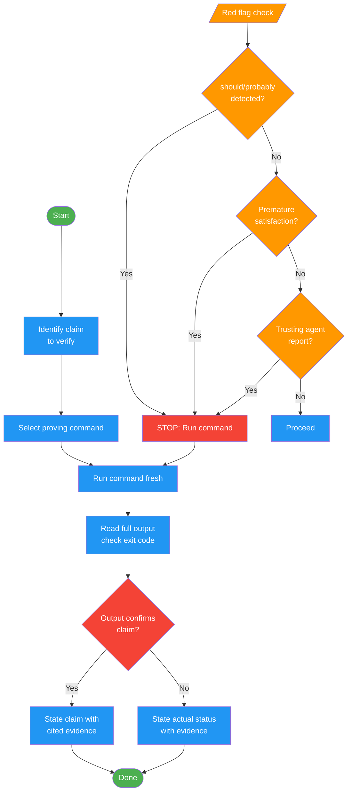

<!-- diagram-meta: {"source": "commands/verify.md", "source_hash": "sha256:a6c09aa5fdeda80188cd2913db060488a84d7734d02dec8fc8365ea87c075404", "generated_at": "2026-02-19T00:00:00Z", "generator": "generate_diagrams.py"} -->
# Diagram: verify

Run verification commands and confirm output before making success claims. Enforces evidence-before-assertions discipline: identify the proving command, run it fresh, read full output, then and only then state the claim with cited evidence.

## Legend

| Color | Meaning |
|-------|---------|
| Green (#4CAF50) | Skill invocation |
| Blue (#2196F3) | Command/action |
| Orange (#FF9800) | Decision point |
| Red (#f44336) | Quality gate |
