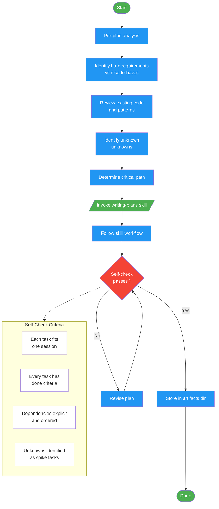

<!-- diagram-meta: {"source": "commands/write-plan.md", "source_hash": "sha256:236da353413a691a48256711f04ada835ff1ea78d33416d9a059f8c948177ef8", "generated_at": "2026-02-19T00:00:00Z", "generator": "generate_diagrams.py"} -->
# Diagram: write-plan

Transform requirements into an executable implementation plan with atomic, verifiable tasks. Invokes the writing-plans skill, stores output in the project artifacts directory.

## Legend

| Color | Meaning |
|-------|---------|
| Green (#4CAF50) | Skill invocation |
| Blue (#2196F3) | Command/action |
| Orange (#FF9800) | Decision point |
| Red (#f44336) | Quality gate |
