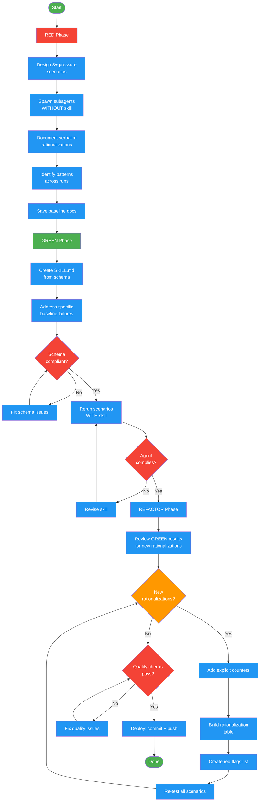

<!-- diagram-meta: {"source": "commands/write-skill-test.md", "source_hash": "sha256:4acb9df69531cb26d7d79c5b169b614acd6edc7eb8d4927b1cb4b293551be036", "generated_at": "2026-02-19T00:00:00Z", "generator": "generate_diagrams.py"} -->
# Diagram: write-skill-test

RED-GREEN-REFACTOR implementation for skill testing. Establishes baseline agent behavior without the skill (RED), writes a minimal skill addressing observed failures (GREEN), then closes loopholes by adding counters for new rationalizations (REFACTOR).

## Legend

| Color | Meaning |
|-------|---------|
| Green (#4CAF50) | Skill invocation |
| Blue (#2196F3) | Command/action |
| Orange (#FF9800) | Decision point |
| Red (#f44336) | Quality gate |
