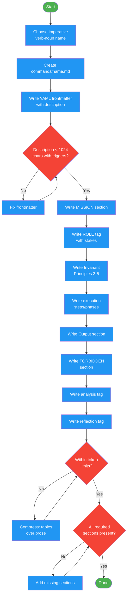

<!-- diagram-meta: {"source": "commands/writing-commands-create.md", "source_hash": "sha256:8fb89918d4164547b5d4b246ff6162e5572395db6f21ae164066692e01656893", "generated_at": "2026-02-19T00:00:00Z", "generator": "generate_diagrams.py"} -->
# Diagram: writing-commands-create

Create a new command file following the command schema. Applies file naming conventions, YAML frontmatter, required sections (MISSION, ROLE, Invariant Principles, execution steps, Output, FORBIDDEN, analysis, reflection), and token efficiency targets.

## Legend

| Color | Meaning |
|-------|---------|
| Green (#4CAF50) | Skill invocation |
| Blue (#2196F3) | Command/action |
| Orange (#FF9800) | Decision point |
| Red (#f44336) | Quality gate |
