<!-- diagram-meta: {"source": "commands/writing-commands-paired.md", "source_hash": "sha256:b51e1f8d03901da55f3bf3958743b7b01133aa44a82ae71321a17c2c528c19cb", "generated_at": "2026-02-19T00:00:00Z", "generator": "generate_diagrams.py"} -->
# Diagram: writing-commands-paired

Create paired commands (create + remove) with proper artifact contracts. Ensures every command that produces artifacts has a matching removal command with manifest tracking, heuristic fallback discovery, safety checks, and verification.

```mermaid
flowchart TD
  Start([Start]) --> IdentifyArtifacts[Identify all artifacts\ncreated by command]
  IdentifyArtifacts --> DefineManifest[Define manifest\nformat and location]
  DefineManifest --> WriteCreator[Write creating command\nwith manifest generation]
  WriteCreator --> WriteRemover[Write removal command]
  WriteRemover --> ManifestRead[Reads manifest first]
  ManifestRead --> HeuristicFallback[Heuristic fallback\nif manifest missing]
  HeuristicFallback --> ModCheck[Check timestamps\nbefore reverting]
  ModCheck --> ReportOutput[Report removed\nvs preserved]
  ReportOutput --> CrossRef[Add cross-references\nin both commands]
  CrossRef --> NeedsAssessment{Produces evaluative\noutput?}
  NeedsAssessment -- Yes --> DesignAssessment[/Run design-assessment/]
  DesignAssessment --> CopyDimensions[Copy dimensions,\nseverity, schema]
  CopyDimensions --> TestBoth
  NeedsAssessment -- No --> TestBoth[Test create then remove]
  TestBoth --> CleanState{Clean state\nafter removal?}
  CleanState -- No --> FixContract[Fix contract issues]
  FixContract --> TestBoth
  CleanState -- Yes --> Output[Output: paired\ncommand files]
  Output --> Done([Done])

  style Start fill:#4CAF50,color:#fff
  style Done fill:#4CAF50,color:#fff
  style DesignAssessment fill:#4CAF50,color:#fff
  style NeedsAssessment fill:#FF9800,color:#fff
  style CleanState fill:#f44336,color:#fff
  style IdentifyArtifacts fill:#2196F3,color:#fff
  style DefineManifest fill:#2196F3,color:#fff
  style WriteCreator fill:#2196F3,color:#fff
  style WriteRemover fill:#2196F3,color:#fff
  style ManifestRead fill:#2196F3,color:#fff
  style HeuristicFallback fill:#2196F3,color:#fff
  style ModCheck fill:#2196F3,color:#fff
  style ReportOutput fill:#2196F3,color:#fff
  style CrossRef fill:#2196F3,color:#fff
  style CopyDimensions fill:#2196F3,color:#fff
  style TestBoth fill:#2196F3,color:#fff
  style FixContract fill:#2196F3,color:#fff
  style Output fill:#2196F3,color:#fff
```

## Legend

| Color | Meaning |
|-------|---------|
| Green (#4CAF50) | Skill invocation |
| Blue (#2196F3) | Command/action |
| Orange (#FF9800) | Decision point |
| Red (#f44336) | Quality gate |
