<!-- diagram-meta: {"source": "commands/writing-commands-review.md", "source_hash": "sha256:2aa42addcd90c11a61b33717c761795728527fb0d34f4b4cf3fec0faff62e2f9", "generated_at": "2026-02-19T00:00:00Z", "generator": "generate_diagrams.py"} -->
# Diagram: writing-commands-review

Review and test a command against the full quality checklist. Evaluates structure, content quality, behavioral clarity, and anti-patterns. Produces a scored review report and runs the command testing protocol (dry run, happy path, error path, edge case).

```mermaid
flowchart TD
  Start([Start]) --> ReadCmd[Read full command]
  ReadCmd --> StructCheck[Structure checklist]
  StructCheck --> HasFM{YAML frontmatter?}
  HasFM --> HasMission{MISSION section?}
  HasMission --> HasRole{ROLE tag?}
  HasRole --> HasInvariants{Invariant\nPrinciples?}
  HasInvariants --> HasSteps{Execution steps?}
  HasSteps --> HasOutput{Output section?}
  HasOutput --> HasForbidden{FORBIDDEN section?}
  HasForbidden --> HasAnalysis{Analysis tag?}
  HasAnalysis --> HasReflection{Reflection tag?}
  HasReflection --> ContentCheck[Content quality check]
  ContentCheck --> Imperatives{Steps are\nimperative?}
  Imperatives --> Tables{Tables for\nstructured data?}
  Tables --> Branches{All conditionals\nhave both branches?}
  Branches --> BehaviorCheck[Behavioral check]
  BehaviorCheck --> NoAmbiguity{No ambiguity\nat any step?}
  NoAmbiguity --> TestableInvariants{Invariants\ntestable?}
  TestableInvariants --> AntiPatterns[Anti-pattern check]
  AntiPatterns --> Score[Compute score]
  Score --> ScoreGate{Score >= 80%?}
  ScoreGate -- No --> RevisionNeeded[Flag for revision]
  ScoreGate -- Yes --> TestProtocol[Testing protocol]
  TestProtocol --> DryRun[Dry run]
  DryRun --> HappyPath[Happy path test]
  HappyPath --> ErrorPath[Error path test]
  ErrorPath --> EdgeCase[Edge case test]
  EdgeCase --> AllPass{All 4 tests\npass?}
  AllPass -- No --> DocIssues[Document failures]
  DocIssues --> Report
  AllPass -- Yes --> Report[Produce review report]
  RevisionNeeded --> Report
  Report --> Done([Done])

  style Start fill:#4CAF50,color:#fff
  style Done fill:#4CAF50,color:#fff
  style ScoreGate fill:#f44336,color:#fff
  style AllPass fill:#f44336,color:#fff
  style HasFM fill:#FF9800,color:#fff
  style HasMission fill:#FF9800,color:#fff
  style HasRole fill:#FF9800,color:#fff
  style HasInvariants fill:#FF9800,color:#fff
  style HasSteps fill:#FF9800,color:#fff
  style HasOutput fill:#FF9800,color:#fff
  style HasForbidden fill:#FF9800,color:#fff
  style HasAnalysis fill:#FF9800,color:#fff
  style HasReflection fill:#FF9800,color:#fff
  style Imperatives fill:#FF9800,color:#fff
  style Tables fill:#FF9800,color:#fff
  style Branches fill:#FF9800,color:#fff
  style NoAmbiguity fill:#FF9800,color:#fff
  style TestableInvariants fill:#FF9800,color:#fff
  style ReadCmd fill:#2196F3,color:#fff
  style StructCheck fill:#2196F3,color:#fff
  style ContentCheck fill:#2196F3,color:#fff
  style BehaviorCheck fill:#2196F3,color:#fff
  style AntiPatterns fill:#2196F3,color:#fff
  style Score fill:#2196F3,color:#fff
  style RevisionNeeded fill:#2196F3,color:#fff
  style TestProtocol fill:#2196F3,color:#fff
  style DryRun fill:#2196F3,color:#fff
  style HappyPath fill:#2196F3,color:#fff
  style ErrorPath fill:#2196F3,color:#fff
  style EdgeCase fill:#2196F3,color:#fff
  style DocIssues fill:#2196F3,color:#fff
  style Report fill:#2196F3,color:#fff
```

## Legend

| Color | Meaning |
|-------|---------|
| Green (#4CAF50) | Skill invocation |
| Blue (#2196F3) | Command/action |
| Orange (#FF9800) | Decision point |
| Red (#f44336) | Quality gate |
