<!-- diagram-meta: {"source": "skills/advanced-code-review/SKILL.md", "source_hash": "sha256:4c2984954c80a718ac21a44b66de358d8a13e54fed73dd255216f495b4c7bbc6", "generated_at": "2026-02-20T00:13:41Z", "generator": "generate_diagrams.py"} -->
# Diagram: advanced-code-review

Multi-phase code review with strategic planning, historical context analysis, deep multi-pass review, verification of findings, and final report generation. Each phase produces artifacts and must pass a self-check before proceeding.

```mermaid
flowchart TD
    Start([Start Review])
    ModeRouter{Local or PR?}
    ResolveTarget[Resolve Target Ref]

    Phase1["/advanced-code-review-plan"]
    P1Out[Manifest + Plan]
    P1Gate{Phase 1 Self-Check}

    Phase2["/advanced-code-review-context"]
    P2Out[Context + Previous Items]
    P2Gate{Phase 2 Self-Check}
    P2Fail[Proceed Empty Context]

    Phase3["/advanced-code-review-review"]
    SecurityPass[Security Pass]
    CorrectnessPass[Correctness Pass]
    QualityPass[Quality Pass]
    PolishPass[Polish Pass]
    P3Out[Findings JSON + MD]
    P3Gate{Phase 3 Self-Check}

    Phase4["/advanced-code-review-verify"]
    VerifyFindings[Fact-Check Each Finding]
    RemoveRefuted[Remove REFUTED]
    FlagInconclusive[Flag INCONCLUSIVE]
    P4Out[Verification Audit]
    P4Gate{Phase 4 Self-Check}

    Phase5["/advanced-code-review-report"]
    P5Out[Report + Summary JSON]
    P5Gate{Phase 5 Self-Check}

    FinalGate{All Artifacts Valid?}
    Done([Review Complete])
    CircuitBreak([Circuit Breaker Halt])

    Start --> ModeRouter
    ModeRouter -->|"Branch name"| ResolveTarget
    ModeRouter -->|"PR # or URL"| ResolveTarget
    ResolveTarget --> Phase1

    Phase1 --> P1Out --> P1Gate
    P1Gate -->|Pass| Phase2
    P1Gate -->|"Fail: no target/changes"| CircuitBreak

    Phase2 --> P2Out --> P2Gate
    P2Gate -->|Pass| Phase3
    P2Gate -->|"Non-blocking failure"| P2Fail --> Phase3

    Phase3 --> SecurityPass --> CorrectnessPass --> QualityPass --> PolishPass
    PolishPass --> P3Out --> P3Gate
    P3Gate -->|Pass| Phase4
    P3Gate -->|Fail| CircuitBreak

    Phase4 --> VerifyFindings --> RemoveRefuted --> FlagInconclusive
    FlagInconclusive --> P4Out --> P4Gate
    P4Gate -->|Pass| Phase5
    P4Gate -->|">3 failures"| CircuitBreak

    Phase5 --> P5Out --> P5Gate
    P5Gate -->|Pass| FinalGate
    P5Gate -->|Fail| CircuitBreak

    FinalGate -->|"All 8 artifacts exist"| Done
    FinalGate -->|"Missing artifacts"| CircuitBreak

    style Start fill:#4CAF50,color:#fff
    style Done fill:#4CAF50,color:#fff
    style Phase1 fill:#2196F3,color:#fff
    style Phase2 fill:#2196F3,color:#fff
    style Phase3 fill:#2196F3,color:#fff
    style Phase4 fill:#2196F3,color:#fff
    style Phase5 fill:#2196F3,color:#fff
    style SecurityPass fill:#2196F3,color:#fff
    style CorrectnessPass fill:#2196F3,color:#fff
    style QualityPass fill:#2196F3,color:#fff
    style PolishPass fill:#2196F3,color:#fff
    style ResolveTarget fill:#2196F3,color:#fff
    style VerifyFindings fill:#2196F3,color:#fff
    style RemoveRefuted fill:#2196F3,color:#fff
    style FlagInconclusive fill:#2196F3,color:#fff
    style ModeRouter fill:#FF9800,color:#fff
    style P1Gate fill:#f44336,color:#fff
    style P2Gate fill:#f44336,color:#fff
    style P3Gate fill:#f44336,color:#fff
    style P4Gate fill:#f44336,color:#fff
    style P5Gate fill:#f44336,color:#fff
    style FinalGate fill:#f44336,color:#fff
    style CircuitBreak fill:#f44336,color:#fff
    style P2Fail fill:#FF9800,color:#fff
```

## Legend

| Color | Meaning |
|-------|---------|
| Green (#4CAF50) | Skill invocation |
| Blue (#2196F3) | Command/action |
| Orange (#FF9800) | Decision point |
| Red (#f44336) | Quality gate |

## Cross-Reference

| Node | Source Reference |
|------|----------------|
| ModeRouter | Mode Router table (lines 76-86) |
| Phase1 / `/advanced-code-review-plan` | Phase 1: Strategic Planning (lines 101-109) |
| Phase2 / `/advanced-code-review-context` | Phase 2: Context Analysis (lines 113-123) |
| P2Fail (Proceed Empty Context) | "Phase 2 failures are non-blocking" (line 123) |
| Phase3 / `/advanced-code-review-review` | Phase 3: Deep Review (lines 127-136) |
| SecurityPass, CorrectnessPass, QualityPass, PolishPass | Multi-pass review order (line 129) |
| Phase4 / `/advanced-code-review-verify` | Phase 4: Verification (lines 139-147) |
| RemoveRefuted | "REFUTED removed" (line 147) |
| FlagInconclusive | "INCONCLUSIVE flagged" (line 147) |
| Phase5 / `/advanced-code-review-report` | Phase 5: Report Generation (lines 151-159) |
| FinalGate | Final Self-Check, Output Verification (lines 240-242) |
| CircuitBreak | Circuit Breakers (lines 210-218) |
