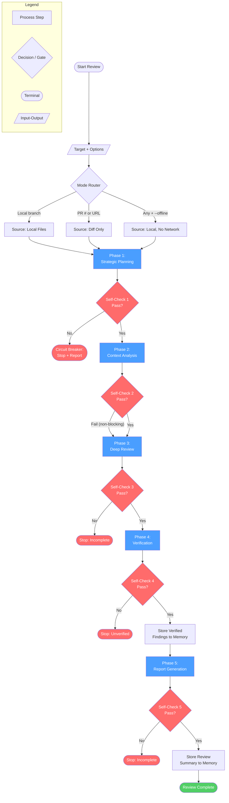
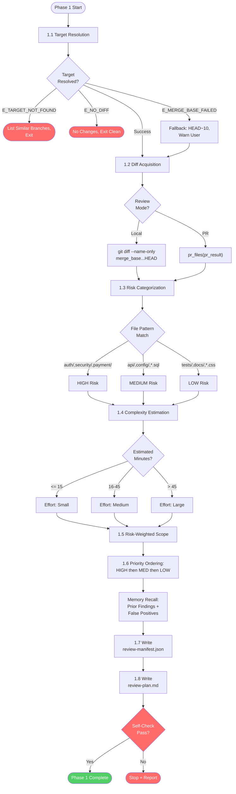
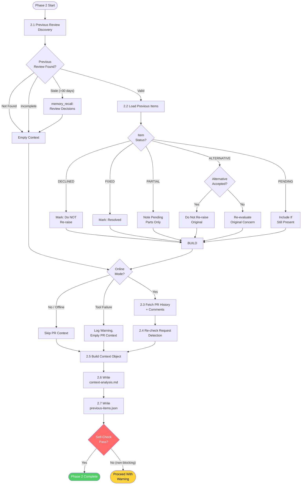
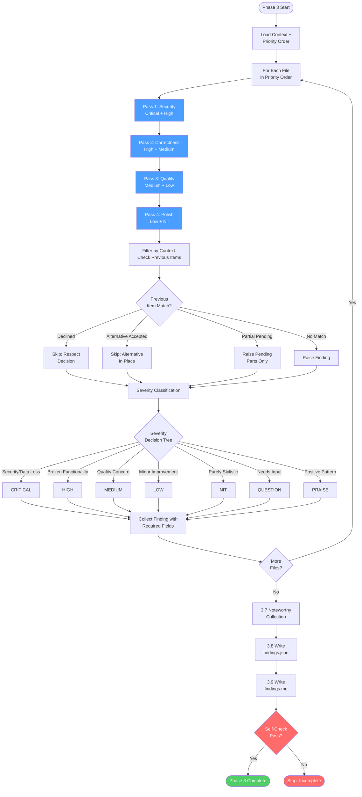
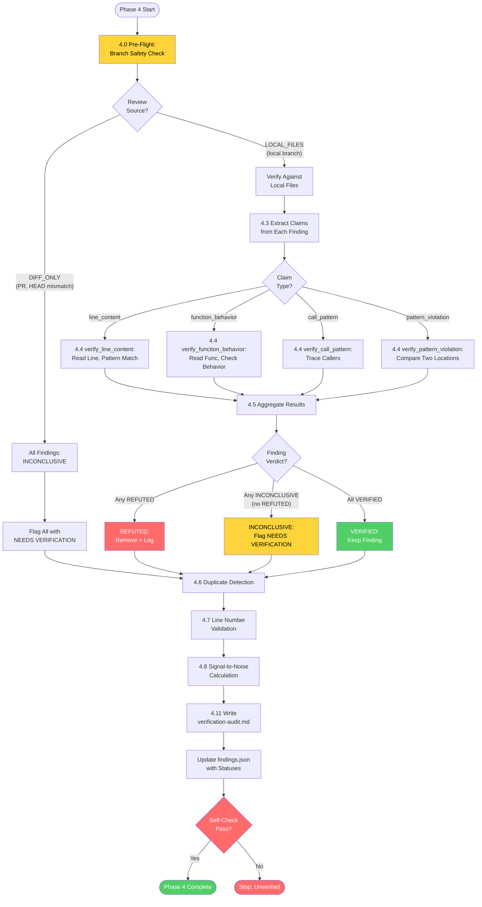
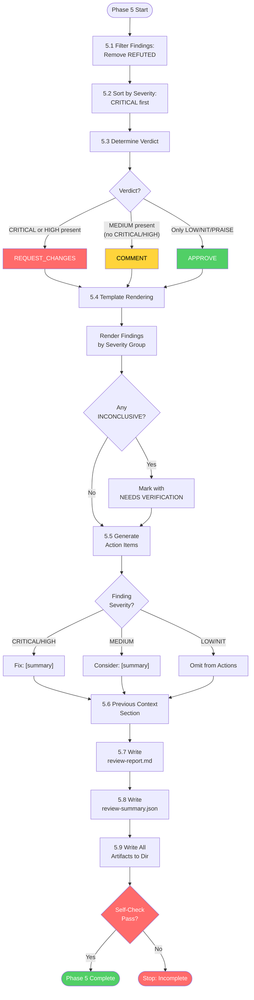
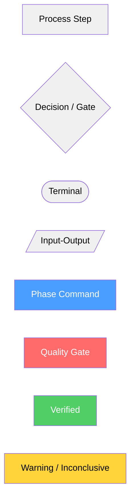

<!-- diagram-meta: {"source": "skills/advanced-code-review/SKILL.md", "source_hash": "sha256:c32c46fa5432e5b5bb6aaa3d0d2b2eb2a7d5d3c1780a215e62e1f24348f411b2", "generated_at": "2026-03-10T06:20:20Z", "generator": "generate_diagrams.py"} -->
# Diagram: advanced-code-review

## Overview

```mermaid
flowchart TD
    START([Start Review]) --> INPUT[/Target + Options/]
    INPUT --> ROUTER{Mode Router}
    ROUTER -->|"Local branch"| LOCAL[Source: Local Files]
    ROUTER -->|"PR # or URL"| PR[Source: Diff Only]
    ROUTER -->|"Any + --offline"| OFFLINE[Source: Local, No Network]
    
    LOCAL --> P1[Phase 1:<br>Strategic Planning]
    PR --> P1
    OFFLINE --> P1
    
    P1 --> SC1{Self-Check 1<br>Pass?}
    SC1 -->|No| CB1([Circuit Breaker:<br>Stop + Report])
    SC1 -->|Yes| P2[Phase 2:<br>Context Analysis]
    
    P2 --> SC2{Self-Check 2<br>Pass?}
    SC2 -->|"Fail (non-blocking)"| P3
    SC2 -->|Yes| P3[Phase 3:<br>Deep Review]
    
    P3 --> SC3{Self-Check 3<br>Pass?}
    SC3 -->|No| CB3([Stop: Incomplete])
    SC3 -->|Yes| P4[Phase 4:<br>Verification]
    
    P4 --> SC4{Self-Check 4<br>Pass?}
    SC4 -->|No| CB4([Stop: Unverified])
    SC4 -->|Yes| MEMORY1[Store Verified<br>Findings to Memory]
    MEMORY1 --> P5[Phase 5:<br>Report Generation]
    
    P5 --> SC5{Self-Check 5<br>Pass?}
    SC5 -->|No| CB5([Stop: Incomplete])
    SC5 -->|Yes| MEMORY2[Store Review<br>Summary to Memory]
    MEMORY2 --> DONE([Review Complete])

    subgraph Legend
        L1[Process Step]
        L2{Decision / Gate}
        L3([Terminal])
        L4[/Input-Output/]
    end
    style P1 fill:#4a9eff,color:#fff
    style P2 fill:#4a9eff,color:#fff
    style P3 fill:#4a9eff,color:#fff
    style P4 fill:#4a9eff,color:#fff
    style P5 fill:#4a9eff,color:#fff
    style SC1 fill:#ff6b6b,color:#fff
    style SC2 fill:#ff6b6b,color:#fff
    style SC3 fill:#ff6b6b,color:#fff
    style SC4 fill:#ff6b6b,color:#fff
    style SC5 fill:#ff6b6b,color:#fff
    style DONE fill:#51cf66,color:#fff
    style CB1 fill:#ff6b6b,color:#fff
    style CB3 fill:#ff6b6b,color:#fff
    style CB4 fill:#ff6b6b,color:#fff
    style CB5 fill:#ff6b6b,color:#fff
```

## Phase 1: Strategic Planning

```mermaid
flowchart TD
    START([Phase 1 Start]) --> RESOLVE[1.1 Target Resolution]
    RESOLVE --> RESOLVE_OK{Target<br>Resolved?}
    RESOLVE_OK -->|"E_TARGET_NOT_FOUND"| FAIL1([List Similar Branches,<br>Exit])
    RESOLVE_OK -->|"E_NO_DIFF"| FAIL2([No Changes, Exit Clean])
    RESOLVE_OK -->|"E_MERGE_BASE_FAILED"| FALLBACK[Fallback: HEAD~10,<br>Warn User]
    RESOLVE_OK -->|Success| DIFF
    FALLBACK --> DIFF[1.2 Diff Acquisition]
    
    DIFF --> DIFF_MODE{Review<br>Mode?}
    DIFF_MODE -->|Local| GIT_DIFF["git diff --name-only<br>merge_base...HEAD"]
    DIFF_MODE -->|PR| PR_FILES["pr_files(pr_result)"]
    GIT_DIFF --> RISK
    PR_FILES --> RISK
    
    RISK[1.3 Risk Categorization] --> CATEGORIZE{File Pattern<br>Match}
    CATEGORIZE -->|"auth/,security/,payment/"| HIGH_RISK[HIGH Risk]
    CATEGORIZE -->|"api/,config/,*.sql"| MED_RISK[MEDIUM Risk]
    CATEGORIZE -->|"tests/,docs/,*.css"| LOW_RISK[LOW Risk]
    HIGH_RISK --> COMPLEX
    MED_RISK --> COMPLEX
    LOW_RISK --> COMPLEX
    
    COMPLEX[1.4 Complexity Estimation] --> EFFORT{Estimated<br>Minutes?}
    EFFORT -->|"<= 15"| SMALL[Effort: Small]
    EFFORT -->|"16-45"| MEDIUM[Effort: Medium]
    EFFORT -->|"> 45"| LARGE[Effort: Large]
    SMALL --> SCOPE
    MEDIUM --> SCOPE
    LARGE --> SCOPE
    
    SCOPE[1.5 Risk-Weighted Scope] --> PRIORITY[1.6 Priority Ordering:<br>HIGH then MED then LOW]
    PRIORITY --> MEMORY[Memory Recall:<br>Prior Findings +<br>False Positives]
    MEMORY --> MANIFEST[1.7 Write<br>review-manifest.json]
    MANIFEST --> PLAN[1.8 Write<br>review-plan.md]
    PLAN --> SC{Self-Check<br>Pass?}
    SC -->|Yes| DONE([Phase 1 Complete])
    SC -->|No| STOP([Stop + Report])

    style FAIL1 fill:#ff6b6b,color:#fff
    style FAIL2 fill:#ff6b6b,color:#fff
    style STOP fill:#ff6b6b,color:#fff
    style SC fill:#ff6b6b,color:#fff
    style DONE fill:#51cf66,color:#fff
```

## Phase 2: Context Analysis

```mermaid
flowchart TD
    START([Phase 2 Start]) --> DISCOVER[2.1 Previous Review<br>Discovery]
    DISCOVER --> FOUND{Previous<br>Review Found?}
    
    FOUND -->|Not Found| EMPTY_CTX[Empty Context]
    FOUND -->|"Stale (>30 days)"| MEMORY_RECALL[memory_recall:<br>Review Decisions]
    FOUND -->|"Incomplete"| EMPTY_CTX
    FOUND -->|Valid| LOAD[2.2 Load Previous Items]
    MEMORY_RECALL --> EMPTY_CTX
    
    LOAD --> STATUS{Item<br>Status?}
    STATUS -->|DECLINED| DECLINED[Mark: Do NOT<br>Re-raise]
    STATUS -->|FIXED| FIXED[Mark: Resolved]
    STATUS -->|PARTIAL| PARTIAL[Note Pending<br>Parts Only]
    STATUS -->|ALTERNATIVE| ALT{Alternative<br>Accepted?}
    STATUS -->|PENDING| PENDING[Include If<br>Still Present]
    ALT -->|Yes| ALT_OK[Do Not Re-raise<br>Original]
    ALT -->|No| ALT_REJECT[Re-evaluate<br>Original Concern]
    
    DECLINED --> BUILD
    FIXED --> BUILD
    PARTIAL --> BUILD
    ALT_OK --> BUILD
    ALT_REJECT --> BUILD
    PENDING --> BUILD
    EMPTY_CTX --> ONLINE
    
    BUILD --> ONLINE{Online<br>Mode?}
    ONLINE -->|Yes| PR_FETCH[2.3 Fetch PR History<br>+ Comments]
    ONLINE -->|No / Offline| SKIP_PR[Skip PR Context]
    ONLINE -->|"Tool Failure"| WARN[Log Warning,<br>Empty PR Context]
    
    PR_FETCH --> RECHECK[2.4 Re-check Request<br>Detection]
    SKIP_PR --> CTX_BUILD
    WARN --> CTX_BUILD
    RECHECK --> CTX_BUILD[2.5 Build Context Object]
    
    CTX_BUILD --> WRITE_CTX[2.6 Write<br>context-analysis.md]
    WRITE_CTX --> WRITE_PREV[2.7 Write<br>previous-items.json]
    WRITE_PREV --> SC{Self-Check<br>Pass?}
    SC -->|Yes| DONE([Phase 2 Complete])
    SC -->|"No (non-blocking)"| DONE_WARN([Proceed With<br>Warning])

    style SC fill:#ff6b6b,color:#fff
    style DONE fill:#51cf66,color:#fff
    style DONE_WARN fill:#ffd43b,color:#000
```

## Phase 3: Deep Review

```mermaid
flowchart TD
    START([Phase 3 Start]) --> LOAD[Load Context +<br>Priority Order]
    LOAD --> FILE_LOOP[For Each File<br>in Priority Order]
    
    FILE_LOOP --> PASS1[Pass 1: Security<br>Critical + High]
    PASS1 --> PASS2[Pass 2: Correctness<br>High + Medium]
    PASS2 --> PASS3[Pass 3: Quality<br>Medium + Low]
    PASS3 --> PASS4[Pass 4: Polish<br>Low + Nit]
    
    PASS4 --> FILTER[Filter by Context:<br>Check Previous Items]
    FILTER --> PREV_CHECK{Previous<br>Item Match?}
    
    PREV_CHECK -->|Declined| SKIP_D[Skip: Respect<br>Decision]
    PREV_CHECK -->|"Alternative Accepted"| SKIP_A[Skip: Alternative<br>In Place]
    PREV_CHECK -->|"Partial Pending"| RAISE_P[Raise Pending<br>Parts Only]
    PREV_CHECK -->|No Match| RAISE[Raise Finding]
    
    SKIP_D --> CLASSIFY
    SKIP_A --> CLASSIFY
    RAISE_P --> CLASSIFY
    RAISE --> CLASSIFY
    
    CLASSIFY[Severity Classification] --> SEV_TREE{Severity<br>Decision Tree}
    SEV_TREE -->|"Security/Data Loss"| CRITICAL[CRITICAL]
    SEV_TREE -->|"Broken Functionality"| HIGH[HIGH]
    SEV_TREE -->|"Quality Concern"| MEDIUM_S[MEDIUM]
    SEV_TREE -->|"Minor Improvement"| LOW_S[LOW]
    SEV_TREE -->|"Purely Stylistic"| NIT[NIT]
    SEV_TREE -->|"Needs Input"| QUESTION[QUESTION]
    SEV_TREE -->|"Positive Pattern"| PRAISE[PRAISE]
    
    CRITICAL --> COLLECT
    HIGH --> COLLECT
    MEDIUM_S --> COLLECT
    LOW_S --> COLLECT
    NIT --> COLLECT
    QUESTION --> COLLECT
    PRAISE --> COLLECT
    
    COLLECT[Collect Finding with<br>Required Fields] --> MORE{More<br>Files?}
    MORE -->|Yes| FILE_LOOP
    MORE -->|No| NOTEWORTHY[3.7 Noteworthy<br>Collection]
    NOTEWORTHY --> WRITE_JSON[3.8 Write<br>findings.json]
    WRITE_JSON --> WRITE_MD[3.9 Write<br>findings.md]
    WRITE_MD --> SC{Self-Check<br>Pass?}
    SC -->|Yes| DONE([Phase 3 Complete])
    SC -->|No| STOP([Stop: Incomplete])

    style SC fill:#ff6b6b,color:#fff
    style DONE fill:#51cf66,color:#fff
    style STOP fill:#ff6b6b,color:#fff
    style PASS1 fill:#4a9eff,color:#fff
    style PASS2 fill:#4a9eff,color:#fff
    style PASS3 fill:#4a9eff,color:#fff
    style PASS4 fill:#4a9eff,color:#fff
```

## Phase 4: Verification

```mermaid
flowchart TD
    START([Phase 4 Start]) --> PREFLIGHT[4.0 Pre-Flight:<br>Branch Safety Check]
    PREFLIGHT --> SOURCE{Review<br>Source?}
    
    SOURCE -->|"LOCAL_FILES<br>(local branch)"| LOCAL_MODE[Verify Against<br>Local Files]
    SOURCE -->|"DIFF_ONLY<br>(PR, HEAD mismatch)"| DIFF_MODE[All Findings:<br>INCONCLUSIVE]
    
    DIFF_MODE --> FLAG_ALL[Flag All with<br>NEEDS VERIFICATION]
    FLAG_ALL --> DEDUP
    
    LOCAL_MODE --> EXTRACT[4.3 Extract Claims<br>from Each Finding]
    EXTRACT --> CLAIM_TYPE{Claim<br>Type?}
    
    CLAIM_TYPE -->|line_content| VLC[4.4 verify_line_content:<br>Read Line, Pattern Match]
    CLAIM_TYPE -->|function_behavior| VFB[4.4 verify_function_behavior:<br>Read Func, Check Behavior]
    CLAIM_TYPE -->|call_pattern| VCP[4.4 verify_call_pattern:<br>Trace Callers]
    CLAIM_TYPE -->|pattern_violation| VPV[4.4 verify_pattern_violation:<br>Compare Two Locations]
    
    VLC --> AGGREGATE
    VFB --> AGGREGATE
    VCP --> AGGREGATE
    VPV --> AGGREGATE
    
    AGGREGATE[4.5 Aggregate Results] --> VERDICT{Finding<br>Verdict?}
    VERDICT -->|"Any REFUTED"| REFUTED[REFUTED:<br>Remove + Log]
    VERDICT -->|"Any INCONCLUSIVE<br>(no REFUTED)"| INCONC[INCONCLUSIVE:<br>Flag NEEDS VERIFICATION]
    VERDICT -->|"All VERIFIED"| VERIFIED[VERIFIED:<br>Keep Finding]
    
    REFUTED --> DEDUP
    INCONC --> DEDUP
    VERIFIED --> DEDUP
    
    DEDUP[4.6 Duplicate Detection] --> VALIDATE[4.7 Line Number<br>Validation]
    VALIDATE --> SNR[4.8 Signal-to-Noise<br>Calculation]
    SNR --> WRITE[4.11 Write<br>verification-audit.md]
    WRITE --> UPDATE[Update findings.json<br>with Statuses]
    UPDATE --> SC{Self-Check<br>Pass?}
    SC -->|Yes| DONE([Phase 4 Complete])
    SC -->|No| STOP([Stop: Unverified])

    style SC fill:#ff6b6b,color:#fff
    style DONE fill:#51cf66,color:#fff
    style STOP fill:#ff6b6b,color:#fff
    style PREFLIGHT fill:#ffd43b,color:#000
    style REFUTED fill:#ff6b6b,color:#fff
    style VERIFIED fill:#51cf66,color:#fff
    style INCONC fill:#ffd43b,color:#000
```

## Phase 5: Report Generation

```mermaid
flowchart TD
    START([Phase 5 Start]) --> FILTER[5.1 Filter Findings:<br>Remove REFUTED]
    FILTER --> SORT[5.2 Sort by Severity:<br>CRITICAL first]
    SORT --> VERDICT[5.3 Determine Verdict]
    
    VERDICT --> VERDICT_TYPE{Verdict?}
    VERDICT_TYPE -->|"CRITICAL or HIGH present"| REQ_CHANGES[REQUEST_CHANGES]
    VERDICT_TYPE -->|"MEDIUM present<br>(no CRITICAL/HIGH)"| COMMENT[COMMENT]
    VERDICT_TYPE -->|"Only LOW/NIT/PRAISE"| APPROVE[APPROVE]
    
    REQ_CHANGES --> RENDER
    COMMENT --> RENDER
    APPROVE --> RENDER
    
    RENDER[5.4 Template Rendering] --> FINDINGS_SEC[Render Findings<br>by Severity Group]
    FINDINGS_SEC --> INCONC_FLAG{Any<br>INCONCLUSIVE?}
    INCONC_FLAG -->|Yes| MARK_NEEDS[Mark with<br>NEEDS VERIFICATION]
    INCONC_FLAG -->|No| ACTION
    MARK_NEEDS --> ACTION
    
    ACTION[5.5 Generate<br>Action Items] --> ACTION_TYPE{Finding<br>Severity?}
    ACTION_TYPE -->|"CRITICAL/HIGH"| FIX["Fix: [summary]"]
    ACTION_TYPE -->|MEDIUM| CONSIDER["Consider: [summary]"]
    ACTION_TYPE -->|"LOW/NIT"| SKIP[Omit from Actions]
    
    FIX --> PREV_CTX
    CONSIDER --> PREV_CTX
    SKIP --> PREV_CTX
    
    PREV_CTX[5.6 Previous Context<br>Section] --> WRITE_REPORT[5.7 Write<br>review-report.md]
    WRITE_REPORT --> WRITE_JSON[5.8 Write<br>review-summary.json]
    WRITE_JSON --> WRITE_FILES[5.9 Write All<br>Artifacts to Dir]
    WRITE_FILES --> SC{Self-Check<br>Pass?}
    SC -->|Yes| DONE([Phase 5 Complete])
    SC -->|No| STOP([Stop: Incomplete])

    style SC fill:#ff6b6b,color:#fff
    style DONE fill:#51cf66,color:#fff
    style STOP fill:#ff6b6b,color:#fff
    style REQ_CHANGES fill:#ff6b6b,color:#fff
    style COMMENT fill:#ffd43b,color:#000
    style APPROVE fill:#51cf66,color:#fff
```

## Cross-Reference

| Overview Node | Detail Section | Source |
|---|---|---|
| Phase 1: Strategic Planning | Phase 1: Strategic Planning | `commands/advanced-code-review-plan.md` |
| Phase 2: Context Analysis | Phase 2: Context Analysis | `commands/advanced-code-review-context.md` |
| Phase 3: Deep Review | Phase 3: Deep Review | `commands/advanced-code-review-review.md` |
| Phase 4: Verification | Phase 4: Verification | `commands/advanced-code-review-verify.md` |
| Phase 5: Report Generation | Phase 5: Report Generation | `commands/advanced-code-review-report.md` |
| Mode Router | Phase 1 (1.2 Diff Acquisition) | `skills/advanced-code-review/SKILL.md:76-83` |
| Circuit Breakers | Phase 1 (Target Resolution errors) | `skills/advanced-code-review/SKILL.md:238-246` |
| Memory Store (Findings) | Phase 4 (Persist Verified Findings) | `skills/advanced-code-review/SKILL.md:166-172` |
| Memory Store (Summary) | Phase 5 (Persist Review Summary) | `skills/advanced-code-review/SKILL.md:183-187` |

## Legend

```mermaid
flowchart LR
    L1[Process Step]
    L2{Decision / Gate}
    L3([Terminal])
    L4[/Input-Output/]
    L5[Phase Command]
    L6[Quality Gate]
    L7[Verified]
    L8[Warning / Inconclusive]
    style L1 fill:#f0f0f0,color:#000
    style L2 fill:#f0f0f0,color:#000
    style L3 fill:#f0f0f0,color:#000
    style L4 fill:#f0f0f0,color:#000
    style L5 fill:#4a9eff,color:#fff
    style L6 fill:#ff6b6b,color:#fff
    style L7 fill:#51cf66,color:#fff
    style L8 fill:#ffd43b,color:#000
```
