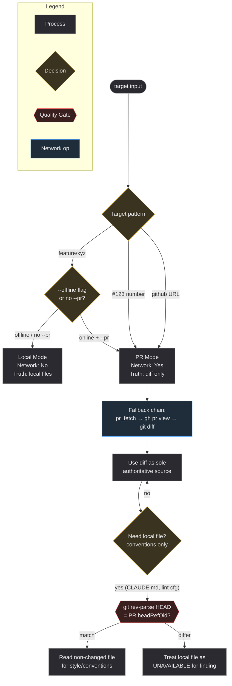
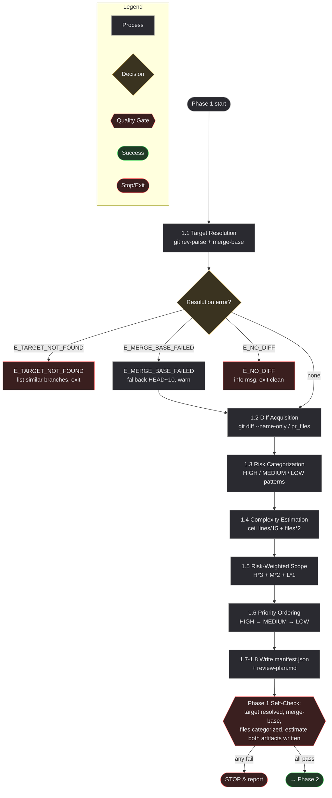
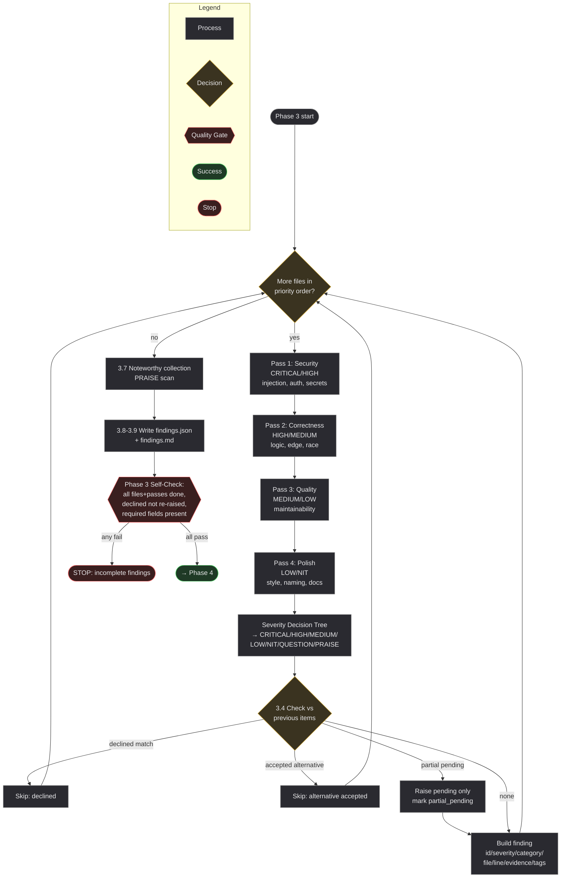
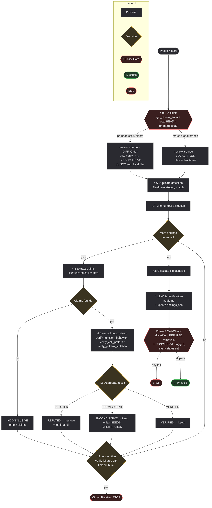
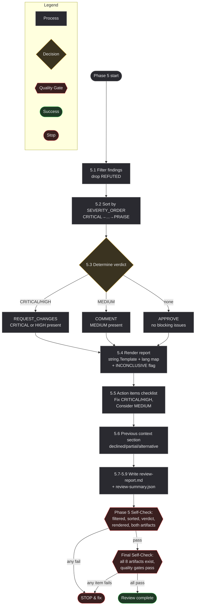

<!-- diagram-meta: {"source": "skills/advanced-code-review/SKILL.md", "source_hash": "sha256:5f550671331e0110a692aeae528a9a245ca42aec627ddf5b361f4f88682e1b9c", "generated_at": "2026-05-25T23:21:37Z", "generator": "generate_diagrams.py"} -->
# Diagram: advanced-code-review

# Advanced Code Review — Skill Flow Diagrams

Multi-phase deep code review with historical context tracking, fact-checked findings, and tiered severity reporting. Decomposed into an overview plus six detail diagrams (mode routing + five phases).

## Overview: Five-Phase Pipeline

```mermaid
flowchart TD
    start([Invoke: advanced-code-review target]):::terminal
    disambig{Could request<br/>match >1 review skill?}:::decision
    ask[/AskUserQuestion:<br/>disambiguate review skill/]:::gate
    router{Mode Router:<br/>target pattern?}:::decision
    local[Local Mode<br/>source = local files]:::process
    prmode[PR Mode<br/>source = DIFF ONLY]:::process
    shaguard{{PR Mode SHA guard:<br/>local HEAD = PR HEAD?}}:::gate

    p1[Phase 1: Strategic Planning<br/>/advanced-code-review-plan]:::process
    sc1{Phase 1<br/>self-check pass?}:::decision
    p2[Phase 2: Context Analysis<br/>/advanced-code-review-context]:::process
    sc2{Phase 2<br/>self-check pass?}:::decision
    p3[Phase 3: Deep Review<br/>/advanced-code-review-review]:::process
    sc3{Phase 3<br/>self-check pass?}:::decision
    p4[Phase 4: Verification<br/>/advanced-code-review-verify]:::process
    sc4{Phase 4<br/>self-check pass?}:::decision
    p5[Phase 5: Report Generation<br/>/advanced-code-review-report]:::process
    finalsc{{Final self-check:<br/>all gates pass?}}:::gate

    cb([Circuit Breaker:<br/>STOP execution]):::failterm
    done([Review complete:<br/>8 artifacts written]):::success

    start --> disambig
    disambig -->|Yes| ask --> router
    disambig -->|No| router
    router -->|"feature/xyz branch"| local
    router -->|"#123 / URL"| prmode
    router -->|"any + --offline"| local
    prmode --> shaguard
    shaguard -->|"match"| p1
    shaguard -->|"differ → local unavailable"| p1
    local --> p1

    p1 --> sc1
    sc1 -->|fail / target unresolved / no diff| cb
    sc1 -->|pass| p2
    p2 --> sc2
    sc2 -->|"fail (non-blocking)<br/>proceed empty context"| p3
    sc2 -->|pass| p3
    p3 --> sc3
    sc3 -->|fail| cb
    sc3 -->|pass| p4
    p4 --> sc4
    sc4 -->|"fail / >3 verify failures /<br/>timeout exceeded"| cb
    sc4 -->|pass| p5
    p5 --> finalsc
    finalsc -->|"any item fails → STOP & fix"| p5
    finalsc -->|all pass| done

    subgraph legend [Legend]
        direction LR
        l1[Process]:::process
        l2{Decision}:::decision
        l3{{Quality Gate}}:::gate
        l4([Success]):::success
        l5([Stop/Fail]):::failterm
    end

    classDef process fill:#2a2a30,stroke:#888,color:#e8e8ea
    classDef decision fill:#3a3320,stroke:#d4a72c,color:#e8e8ea
    classDef gate fill:#3a1f1f,stroke:#ff6b6b,color:#e8e8ea
    classDef subagent fill:#1f2d3a,stroke:#4a9eff,color:#e8e8ea
    classDef success fill:#1f3a26,stroke:#51cf66,color:#e8e8ea
    classDef failterm fill:#3a1f1f,stroke:#ff6b6b,color:#e8e8ea
    classDef terminal fill:#2a2a30,stroke:#aaa,color:#e8e8ea
```

**Cross-reference: overview node → detail diagram**

| Overview node | Detail diagram |
|---------------|----------------|
| Mode Router / PR Mode SHA guard | [Mode Routing & PR Safety](#mode-routing--pr-safety) |
| Phase 1: Strategic Planning | [Phase 1 — Strategic Planning](#phase-1--strategic-planning) |
| Phase 2: Context Analysis | [Phase 2 — Context Analysis](#phase-2--context-analysis) |
| Phase 3: Deep Review | [Phase 3 — Deep Review](#phase-3--deep-review) |
| Phase 4: Verification | [Phase 4 — Verification](#phase-4--verification) |
| Phase 5: Report Generation | [Phase 5 — Report Generation](#phase-5--report-generation) |

---

## Mode Routing & PR Safety

```mermaid
flowchart TD
    target([target input]):::terminal
    pat{Target pattern}:::decision
    offlineflag{"--offline flag<br/>or no --pr?"}:::decision

    local[Local Mode<br/>Network: No<br/>Truth: local files]:::process
    pr[PR Mode<br/>Network: Yes<br/>Truth: diff only]:::process

    fetch[Fallback chain:<br/>pr_fetch → gh pr view → git diff]:::subagent
    needlocal{Need local file?<br/>conventions only}:::decision
    sha{{git rev-parse HEAD<br/>= PR headRefOid?}}:::gate
    readok[Read non-changed file<br/>for style/conventions]:::process
    unavail[Treat local file as<br/>UNAVAILABLE for finding]:::process
    diffonly[Use diff as sole<br/>authoritative source]:::process

    target --> pat
    pat -->|"feature/xyz"| offlineflag
    pat -->|"#123 number"| pr
    pat -->|"github URL"| pr
    offlineflag -->|"offline / no --pr"| local
    offlineflag -->|"online + --pr"| pr

    pr --> fetch --> diffonly
    diffonly --> needlocal
    needlocal -->|"no"| diffonly
    needlocal -->|"yes (CLAUDE.md, lint cfg)"| sha
    sha -->|"match"| readok
    sha -->|"differ"| unavail

    subgraph legend [Legend]
        direction LR
        l1[Process]:::process
        l2{Decision}:::decision
        l3{{Quality Gate}}:::gate
        l4[Network op]:::subagent
    end

    classDef process fill:#2a2a30,stroke:#888,color:#e8e8ea
    classDef decision fill:#3a3320,stroke:#d4a72c,color:#e8e8ea
    classDef gate fill:#3a1f1f,stroke:#ff6b6b,color:#e8e8ea
    classDef subagent fill:#1f2d3a,stroke:#4a9eff,color:#e8e8ea
    classDef terminal fill:#2a2a30,stroke:#aaa,color:#e8e8ea
```

> The SHA guard is the skill's most-emphasized safeguard: in PR mode, reading local files when `local HEAD ≠ PR HEAD` produces confidently wrong REFUTED verdicts on real bugs (`<CRITICAL>` block, lines 87–100; `<FORBIDDEN>` lines 211–212).

---

## Phase 1 — Strategic Planning

`/advanced-code-review-plan` → outputs `review-manifest.json`, `review-plan.md`

```mermaid
flowchart TD
    start([Phase 1 start]):::terminal
    resolve[1.1 Target Resolution<br/>git rev-parse + merge-base]:::process
    rerr{Resolution error?}:::decision
    e1[E_TARGET_NOT_FOUND<br/>list similar branches, exit]:::failterm
    e2[E_MERGE_BASE_FAILED<br/>fallback HEAD~10, warn]:::process
    e3[E_NO_DIFF<br/>info msg, exit clean]:::failterm

    diff[1.2 Diff Acquisition<br/>git diff --name-only / pr_files]:::process
    cat[1.3 Risk Categorization<br/>HIGH / MEDIUM / LOW patterns]:::process
    complex[1.4 Complexity Estimation<br/>ceil lines/15 + files*2]:::process
    weight[1.5 Risk-Weighted Scope<br/>H*3 + M*2 + L*1]:::process
    order[1.6 Priority Ordering<br/>HIGH → MEDIUM → LOW]:::process
    out[1.7-1.8 Write manifest.json<br/>+ review-plan.md]:::process

    sc{{Phase 1 Self-Check:<br/>target resolved, merge-base,<br/>files categorized, estimate,<br/>both artifacts written}}:::gate
    stop([STOP & report]):::failterm
    next([→ Phase 2]):::success

    start --> resolve --> rerr
    rerr -->|E_TARGET_NOT_FOUND| e1
    rerr -->|E_MERGE_BASE_FAILED| e2 --> diff
    rerr -->|E_NO_DIFF| e3
    rerr -->|none| diff
    diff --> cat --> complex --> weight --> order --> out --> sc
    sc -->|any fail| stop
    sc -->|all pass| next

    subgraph legend [Legend]
        direction LR
        l1[Process]:::process
        l2{Decision}:::decision
        l3{{Quality Gate}}:::gate
        l4([Success]):::success
        l5([Stop/Exit]):::failterm
    end

    classDef process fill:#2a2a30,stroke:#888,color:#e8e8ea
    classDef decision fill:#3a3320,stroke:#d4a72c,color:#e8e8ea
    classDef gate fill:#3a1f1f,stroke:#ff6b6b,color:#e8e8ea
    classDef success fill:#1f3a26,stroke:#51cf66,color:#e8e8ea
    classDef failterm fill:#3a1f1f,stroke:#ff6b6b,color:#e8e8ea
    classDef terminal fill:#2a2a30,stroke:#aaa,color:#e8e8ea
```

---

## Phase 2 — Context Analysis

`/advanced-code-review-context` → outputs `context-analysis.md`, `previous-items.json` (non-blocking phase)

```mermaid
flowchart TD
    start([Phase 2 start]):::terminal
    discover[2.1 Previous Review Discovery<br/>key = branch-mergebaseSHA:8]:::process
    exists{review_dir +<br/>manifest exist?}:::decision
    stale{Age > STALENESS_DAYS<br/>= 30?}:::decision
    incomplete{previous-items.json +<br/>findings.json present?}:::decision
    fresh[Start fresh<br/>empty context]:::process

    items[2.2 Load Previous Items<br/>states: PENDING/FIXED/DECLINED/<br/>PARTIAL/ALTERNATIVE]:::process
    online{Online + PR mode?}:::decision
    pr[2.3 Fetch PR history<br/>pr_fetch + gh_api comments]:::subagent
    skip["[OFFLINE] skip PR history"]:::process
    toolfail{Tool failure?}:::decision
    warn[Log warning,<br/>empty PR context]:::process
    recheck[2.4 Detect re-check requests<br/>PTAL / please re-check /<br/>addressed in sha]:::process
    build[2.5 Build context object<br/>declined/partial/alternative/recheck]:::process
    out[2.6-2.7 Write context-analysis.md<br/>+ previous-items.json]:::process

    sc{{Phase 2 Self-Check<br/>(non-blocking)}}:::gate
    next([→ Phase 3]):::success

    start --> discover --> exists
    exists -->|no| fresh
    exists -->|yes| stale
    stale -->|yes| fresh
    stale -->|no| incomplete
    incomplete -->|no| fresh
    incomplete -->|yes| items
    fresh --> online
    items --> online
    online -->|yes| pr --> toolfail
    online -->|no| skip --> recheck
    toolfail -->|yes| warn --> recheck
    toolfail -->|no| recheck
    recheck --> build --> out --> sc
    sc -->|"pass OR fail<br/>(proceed either way)"| next

    subgraph legend [Legend]
        direction LR
        l1[Process]:::process
        l2{Decision}:::decision
        l3{{Quality Gate}}:::gate
        l4([Success]):::success
        l5[Network op]:::subagent
    end

    classDef process fill:#2a2a30,stroke:#888,color:#e8e8ea
    classDef decision fill:#3a3320,stroke:#d4a72c,color:#e8e8ea
    classDef gate fill:#3a1f1f,stroke:#ff6b6b,color:#e8e8ea
    classDef subagent fill:#1f2d3a,stroke:#4a9eff,color:#e8e8ea
    classDef success fill:#1f3a26,stroke:#51cf66,color:#e8e8ea
    classDef terminal fill:#2a2a30,stroke:#aaa,color:#e8e8ea
```

---

## Phase 3 — Deep Review

`/advanced-code-review-review` → outputs `findings.json`, `findings.md`

```mermaid
flowchart TD
    start([Phase 3 start]):::terminal
    loop{More files in<br/>priority order?}:::decision
    p1[Pass 1: Security<br/>CRITICAL/HIGH<br/>injection, auth, secrets]:::process
    p2[Pass 2: Correctness<br/>HIGH/MEDIUM<br/>logic, edge, race]:::process
    p3[Pass 3: Quality<br/>MEDIUM/LOW<br/>maintainability]:::process
    p4[Pass 4: Polish<br/>LOW/NIT<br/>style, naming, docs]:::process

    sev[Severity Decision Tree<br/>→ CRITICAL/HIGH/MEDIUM/<br/>LOW/NIT/QUESTION/PRAISE]:::process
    ctx{3.4 Check vs<br/>previous items}:::decision
    declined[Skip: declined]:::process
    altacc[Skip: alternative accepted]:::process
    partial[Raise pending only<br/>mark partial_pending]:::process
    raise[Build finding<br/>id/severity/category/<br/>file/line/evidence/tags]:::process

    praise[3.7 Noteworthy collection<br/>PRAISE scan]:::process
    out[3.8-3.9 Write findings.json<br/>+ findings.md]:::process
    sc{{Phase 3 Self-Check:<br/>all files+passes done,<br/>declined not re-raised,<br/>required fields present}}:::gate
    stop([STOP: incomplete findings]):::failterm
    next([→ Phase 4]):::success

    start --> loop
    loop -->|yes| p1 --> p2 --> p3 --> p4 --> sev --> ctx
    ctx -->|declined match| declined --> loop
    ctx -->|accepted alternative| altacc --> loop
    ctx -->|partial pending| partial --> raise
    ctx -->|none| raise
    raise --> loop
    loop -->|no| praise --> out --> sc
    sc -->|any fail| stop
    sc -->|all pass| next

    subgraph legend [Legend]
        direction LR
        l1[Process]:::process
        l2{Decision}:::decision
        l3{{Quality Gate}}:::gate
        l4([Success]):::success
        l5([Stop]):::failterm
    end

    classDef process fill:#2a2a30,stroke:#888,color:#e8e8ea
    classDef decision fill:#3a3320,stroke:#d4a72c,color:#e8e8ea
    classDef gate fill:#3a1f1f,stroke:#ff6b6b,color:#e8e8ea
    classDef success fill:#1f3a26,stroke:#51cf66,color:#e8e8ea
    classDef failterm fill:#3a1f1f,stroke:#ff6b6b,color:#e8e8ea
    classDef terminal fill:#2a2a30,stroke:#aaa,color:#e8e8ea
```

---

## Phase 4 — Verification

`/advanced-code-review-verify` → outputs `verification-audit.md`, updated `findings.json`

```mermaid
flowchart TD
    start([Phase 4 start]):::terminal
    preflight{{4.0 Pre-flight:<br/>get_review_source<br/>local HEAD = pr_head_sha?}}:::gate
    diffonly[review_source = DIFF_ONLY<br/>ALL verify_* → INCONCLUSIVE<br/>do NOT read local files]:::process
    localok[review_source = LOCAL_FILES<br/>files authoritative]:::process

    dup[4.6 Duplicate detection<br/>file+line+category match]:::process
    lineval[4.7 Line number validation]:::process
    loop{More findings<br/>to verify?}:::decision
    extract[4.3 Extract claims<br/>line/function/call/pattern]:::process
    noclaims{Claims found?}:::decision
    inconc1[INCONCLUSIVE<br/>empty claims]:::process

    vfuncs[4.4 verify_line_content /<br/>verify_function_behavior /<br/>verify_call_pattern /<br/>verify_pattern_violation]:::process
    agg{4.5 Aggregate result}:::decision
    refuted[REFUTED → remove<br/>+ log in audit]:::process
    inconc[INCONCLUSIVE → keep<br/>+ flag NEEDS VERIFICATION]:::process
    verified[VERIFIED → keep]:::process

    cbcheck{>3 consecutive<br/>verify failures OR<br/>timeout 60s?}:::decision
    cb([Circuit Breaker: STOP]):::failterm
    snr[4.8 Calculate signal/noise]:::process
    out[4.11 Write verification-audit.md<br/>+ update findings.json]:::process
    sc{{Phase 4 Self-Check:<br/>all verified, REFUTED removed,<br/>INCONCLUSIVE flagged,<br/>every status set}}:::gate
    stop([STOP]):::failterm
    next([→ Phase 5]):::success

    start --> preflight
    preflight -->|"pr_head set & differs"| diffonly
    preflight -->|"match / local branch"| localok
    diffonly --> dup
    localok --> dup
    dup --> lineval --> loop
    loop -->|yes| extract --> noclaims
    noclaims -->|no| inconc1 --> cbcheck
    noclaims -->|yes| vfuncs --> agg
    agg -->|REFUTED| refuted --> cbcheck
    agg -->|INCONCLUSIVE| inconc --> cbcheck
    agg -->|VERIFIED| verified --> cbcheck
    cbcheck -->|yes| cb
    cbcheck -->|no| loop
    loop -->|no| snr --> out --> sc
    sc -->|any fail| stop
    sc -->|all pass| next

    subgraph legend [Legend]
        direction LR
        l1[Process]:::process
        l2{Decision}:::decision
        l3{{Quality Gate}}:::gate
        l4([Success]):::success
        l5([Stop]):::failterm
    end

    classDef process fill:#2a2a30,stroke:#888,color:#e8e8ea
    classDef decision fill:#3a3320,stroke:#d4a72c,color:#e8e8ea
    classDef gate fill:#3a1f1f,stroke:#ff6b6b,color:#e8e8ea
    classDef success fill:#1f3a26,stroke:#51cf66,color:#e8e8ea
    classDef failterm fill:#3a1f1f,stroke:#ff6b6b,color:#e8e8ea
    classDef terminal fill:#2a2a30,stroke:#aaa,color:#e8e8ea
```

---

## Phase 5 — Report Generation

`/advanced-code-review-report` → outputs `review-report.md`, `review-summary.json`

```mermaid
flowchart TD
    start([Phase 5 start]):::terminal
    filter[5.1 Filter findings<br/>drop REFUTED]:::process
    sort[5.2 Sort by SEVERITY_ORDER<br/>CRITICAL→...→PRAISE]:::process
    verdict{5.3 Determine verdict}:::decision
    rc[REQUEST_CHANGES<br/>CRITICAL or HIGH present]:::process
    comment[COMMENT<br/>MEDIUM present]:::process
    approve[APPROVE<br/>no blocking issues]:::process

    render[5.4 Render report<br/>string.Template + lang map<br/>+ INCONCLUSIVE flag]:::process
    actions[5.5 Action items checklist<br/>Fix CRITICAL/HIGH,<br/>Consider MEDIUM]:::process
    prevctx[5.6 Previous context section<br/>declined/partial/alternative]:::process
    out[5.7-5.9 Write review-report.md<br/>+ review-summary.json]:::process

    sc{{Phase 5 Self-Check:<br/>filtered, sorted, verdict,<br/>rendered, both artifacts}}:::gate
    finalsc{{Final Self-Check:<br/>all 8 artifacts exist,<br/>quality gates pass}}:::gate
    stop([STOP & fix]):::failterm
    done([Review complete]):::success

    start --> filter --> sort --> verdict
    verdict -->|CRITICAL/HIGH| rc --> render
    verdict -->|MEDIUM| comment --> render
    verdict -->|none| approve --> render
    render --> actions --> prevctx --> out --> sc
    sc -->|any fail| stop
    sc -->|pass| finalsc
    finalsc -->|any item fails| stop
    finalsc -->|all pass| done

    subgraph legend [Legend]
        direction LR
        l1[Process]:::process
        l2{Decision}:::decision
        l3{{Quality Gate}}:::gate
        l4([Success]):::success
        l5([Stop]):::failterm
    end

    classDef process fill:#2a2a30,stroke:#888,color:#e8e8ea
    classDef decision fill:#3a3320,stroke:#d4a72c,color:#e8e8ea
    classDef gate fill:#3a1f1f,stroke:#ff6b6b,color:#e8e8ea
    classDef success fill:#1f3a26,stroke:#51cf66,color:#e8e8ea
    classDef failterm fill:#3a1f1f,stroke:#ff6b6b,color:#e8e8ea
    classDef terminal fill:#2a2a30,stroke:#aaa,color:#e8e8ea
```

---

## Source Trace

| Diagram element | Source (SKILL.md unless noted) |
|-----------------|--------------------------------|
| AskUserQuestion disambiguation | description field, lines 3 |
| Mode Router table & implicit offline | lines 76–85 |
| PR Mode diff-only `<CRITICAL>` + SHA guard | lines 87–100; verify §4.0 lines 20–45 |
| Phase command invocations | Phase Overview table, lines 106–112 |
| Per-phase outputs & self-checks | lines 116–166; per-command Self-Check sections |
| Circuit breakers (target, no diff, >3 verify fails, timeout) | lines 219–224 |
| Final self-check / 8 artifacts | lines 229–252 |
| Phase 1 sub-steps 1.1–1.8 + error table | plan.md lines 15–235 |
| Phase 2 discovery/states/recheck/non-blocking | context.md lines 26–270 |
| Phase 3 four passes + severity tree + previous-items integration | review.md lines 19–166 |
| Phase 4 pre-flight, claim extraction, verify funcs, SNR | verify.md lines 19–435 |
| Phase 5 filter/sort/verdict/render | report.md lines 16–340 |
