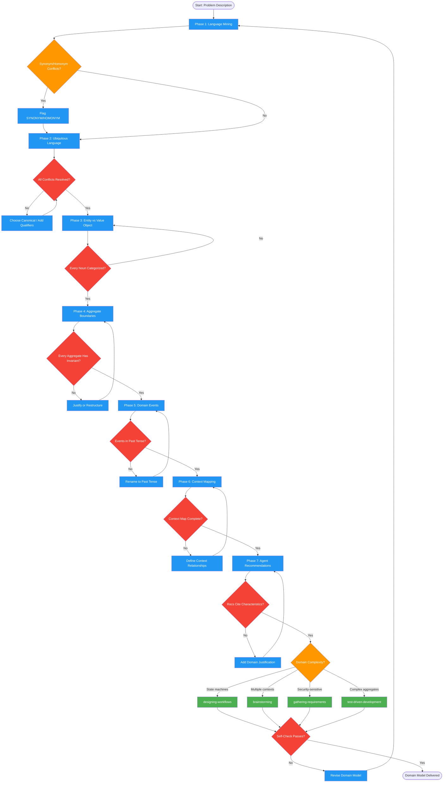

<!-- diagram-meta: {"source": "skills/analyzing-domains/SKILL.md", "source_hash": "sha256:362b95f33886bce79d827e862180db93dbced3d7e6287ef7ba8e96ed8d893685", "generated_at": "2026-02-19T00:00:00Z", "generator": "generate_diagrams.py"} -->
# Diagram: analyzing-domains

Performs Domain-Driven Design analysis: mining ubiquitous language, classifying entities and value objects, detecting aggregate boundaries, identifying domain events, mapping bounded contexts, and producing agent/skill recommendations based on domain characteristics.

## Legend

| Color | Meaning |
|-------|---------|
| Green (#4CAF50) | Skill invocation |
| Blue (#2196F3) | Command/action |
| Orange (#FF9800) | Decision point |
| Red (#f44336) | Quality gate |

## Cross-Reference

| Node | Source Reference |
|------|----------------|
| Phase 1: Language Mining | Phase 1 (lines 47-52) |
| Flag SYNONYM/HOMONYM | Conflict detection (line 52) |
| Phase 2: Ubiquitous Language | Phase 2 (lines 54-58) |
| All Conflicts Resolved? | Quality Gate: Conflicts resolved (line 116) |
| Phase 3: Entity vs Value Object | Phase 3 (lines 60-65) |
| Every Noun Categorized? | Quality Gate: Entities classified (line 117) |
| Phase 4: Aggregate Boundaries | Phase 4 (lines 67-71) |
| Every Aggregate Has Invariant? | Quality Gate: Aggregates bounded (line 118) |
| Phase 5: Domain Events | Phase 5 (lines 73-75) |
| Events in Past Tense? | Forbidden: present tense events (line 128) |
| Phase 6: Context Mapping | Phase 6 (lines 77-81) |
| Context Map Complete? | Quality Gate: Context map complete (line 120) |
| Phase 7: Agent Recommendations | Phase 7 (lines 83-91) |
| Recs Cite Characteristics? | Forbidden: recommending without citing (line 129) |
| designing-workflows | Recommendation: complex state machines (line 87) |
| brainstorming | Recommendation: multiple bounded contexts (line 88) |
| gathering-requirements | Recommendation: security-sensitive (line 89) |
| test-driven-development | Recommendation: complex aggregates (line 90) |
| Self-Check Passes? | Self-Check checklist (lines 134-143) |
