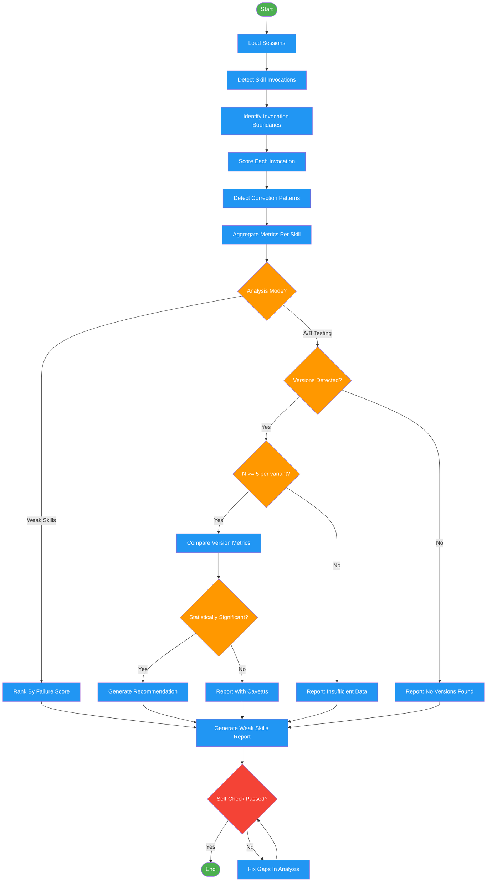

<!-- diagram-meta: {"source": "skills/analyzing-skill-usage/SKILL.md", "source_hash": "sha256:6db879a5e40a26c51aa61c6a1632f665fbf75cf8acd6b52a5990c9911c5b73c0", "generated_at": "2026-02-19T00:00:00Z", "generator": "generate_diagrams.py"} -->
# Diagram: analyzing-skill-usage

Workflow for analyzing skill invocation patterns across session transcripts. Supports two analysis modes: identifying weak skills and A/B testing skill versions.

## Legend

| Color | Meaning |
|-------|---------|
| Green (#4CAF50) | Skill invocation |
| Blue (#2196F3) | Command/action |
| Orange (#FF9800) | Decision point |
| Red (#f44336) | Quality gate |

## Cross-Reference

| Node | Source Reference |
|------|----------------|
| Load Sessions | Extraction Protocol, Step 1: Load Sessions |
| Detect Skill Invocations | Extraction Protocol, Step 2: Detect Skill Invocations |
| Identify Invocation Boundaries | Step 2: End Event detection |
| Score Each Invocation | Extraction Protocol, Step 3: Score Each Invocation |
| Detect Correction Patterns | Step 3: Correction Detection Patterns |
| Aggregate Metrics Per Skill | Extraction Protocol, Step 4: Aggregate Metrics |
| Analysis Mode? | Analysis Modes: Mode 1 vs Mode 2 |
| Rank By Failure Score | Mode 1: Identify Weak Skills |
| Versions Detected? | Mode 2: A/B Testing Versions |
| N >= 5 per variant? | Version Detection: Minimum 5 invocations per variant |
| Compare Version Metrics | Mode 2: A/B Comparison table |
| Statistically Significant? | Mode 2: Significant column (p<0.05) |
| Self-Check Passed? | Self-Check checklist |
