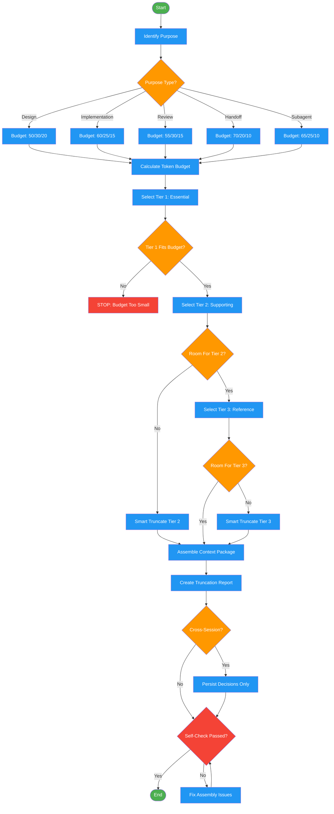

<!-- diagram-meta: {"source": "skills/assembling-context/SKILL.md", "source_hash": "sha256:405a2a98569f608ce23970b2ab0f2737121baa734ae7ccf62b9825cd3db8679a", "generated_at": "2026-02-19T00:00:00Z", "generator": "generate_diagrams.py"} -->
# Diagram: assembling-context

Workflow for curating and assembling tiered context packages for subagents, handoffs, and other consumers. Budget-first approach with intelligent truncation.

## Legend

| Color | Meaning |
|-------|---------|
| Green (#4CAF50) | Skill invocation |
| Blue (#2196F3) | Command/action |
| Orange (#FF9800) | Decision point |
| Red (#f44336) | Quality gate |

## Cross-Reference

| Node | Source Reference |
|------|----------------|
| Identify Purpose | Inputs: purpose (design, implementation, review, handoff, subagent) |
| Purpose Type? | Purpose-Specific Packages table |
| Budget splits | Purpose-Specific Packages: Budget Split column |
| Calculate Token Budget | Token Budget section: tokens = chars / 4 |
| Select Tier 1: Essential | Context Tiers: Tier 1, 40-60% budget |
| Tier 1 Fits Budget? | CRITICAL: Never remove Tier 1 |
| Select Tier 2: Supporting | Context Tiers: Tier 2, 20-35% budget |
| Select Tier 3: Reference | Context Tiers: Tier 3, 10-20% budget |
| Smart Truncate | Token Budget: Smart Truncation |
| Assemble Context Package | Outputs: context_package |
| Create Truncation Report | Outputs: truncation_report |
| Cross-Session? | Cross-Session Context section |
| Persist Decisions Only | Cross-Session Context: Persist vs Regenerate vs Discard |
| Self-Check Passed? | Self-Check checklist |
