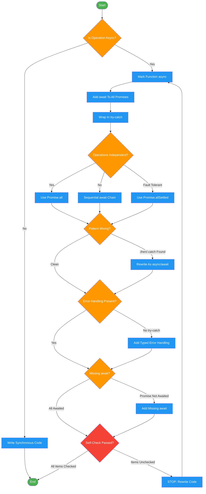

<!-- diagram-meta: {"source": "skills/async-await-patterns/SKILL.md", "source_hash": "sha256:6804677e5d37765cd12045ece19c1ec90a2c8196c09764cd36375a2b940e6601", "generated_at": "2026-02-19T00:00:00Z", "generator": "generate_diagrams.py"} -->
# Diagram: async-await-patterns

Decision and verification workflow for writing production-grade async/await code in JavaScript and TypeScript. Enforces disciplined async patterns over raw promises.

## Legend

| Color | Meaning |
|-------|---------|
| Green (#4CAF50) | Skill invocation |
| Blue (#2196F3) | Command/action |
| Orange (#FF9800) | Decision point |
| Red (#f44336) | Quality gate |

## Cross-Reference

| Node | Source Reference |
|------|----------------|
| Is Operation Async? | Required Reasoning: Step 1 |
| Mark Function async | Invariant Principle 1: Explicit async boundary |
| Add await To All Promises | Invariant Principle 2: Await ALL promises |
| Wrap In try-catch | Invariant Principle 3: Structured error handling |
| Operations Independent? | Invariant Principle 5: Parallelism via combinators |
| Use Promise.all | Parallel vs Sequential section |
| Sequential await Chain | Parallel vs Sequential section |
| Use Promise.allSettled | Parallel vs Sequential: Fault-tolerant |
| Pattern Mixing? | Invariant Principle 4: Pattern consistency |
| Rewrite As async/await | Forbidden Pattern 5: Mixing Async/Await with Promise Chains |
| Error Handling Present? | Forbidden Pattern 4: Missing Error Handling |
| Add Typed Error Handling | Complete Real-World Example: catch block |
| Missing await? | Forbidden Pattern 2: Forgetting await Keyword |
| Self-Check Passed? | Self-Check reflection checklist |
| STOP: Rewrite Code | Self-Check: "If NO to ANY item: STOP. Rewrite" |
