<!-- diagram-meta: {"source": "skills/auditing-green-mirage/SKILL.md", "source_hash": "sha256:059ff52720bd181e48e83a04f1a433d7b1a705c8a10000d03934c502207ce8e8", "generated_at": "2026-02-19T00:00:00Z", "generator": "generate_diagrams.py"} -->
# Diagram: auditing-green-mirage

Forensic test suite audit that traces every test through production code, checks against 8 Green Mirage patterns, and produces a YAML-structured report with dependency-ordered remediation plan.

```mermaid
flowchart TD
    Start([Start]) --> P1[Phase 1: Inventory]
    P1 --> ListTests[List All Test Files]
    ListTests --> ListProd[Map Production Files]
    ListProd --> ScopeEst[Estimate Scope]
    ScopeEst --> ScopeCheck{5+ Test Files?}

    ScopeCheck -->|Yes| ParallelDispatch[Dispatch Parallel Subagents]
    ScopeCheck -->|No| SingleAudit[Single Audit Subagent]

    ParallelDispatch --> P2[Phase 2-3: Systematic Audit]
    SingleAudit --> P2

    P2 --> P2_Sub[/audit-mirage-analyze/]
    P2_Sub --> ForEachTest[For Each Test Function]

    ForEachTest --> Claim[1. CLAIM: What Does Name Promise?]
    Claim --> Path[2. PATH: What Code Executes?]
    Path --> Check[3. CHECK: What Do Assertions Verify?]
    Check --> Escape[4. ESCAPE: What Garbage Passes?]
    Escape --> Impact[5. IMPACT: What Breaks in Prod?]

    Impact --> Pattern8[Check All 8 Mirage Patterns]
    Pattern8 --> Verdict{Verdict?}
    Verdict -->|SOLID| RecordSolid[Record: SOLID]
    Verdict -->|PARTIAL| RecordPartial[Record: PARTIAL + Gaps]
    Verdict -->|GREEN MIRAGE| RecordMirage[Record: GREEN MIRAGE + Fix]

    RecordSolid --> MoreTests{More Tests?}
    RecordPartial --> MoreTests
    RecordMirage --> MoreTests
    MoreTests -->|Yes| ForEachTest
    MoreTests -->|No| P4

    P4[Phase 4: Cross-Test Analysis]
    P4 --> P4_Sub[/audit-mirage-cross/]
    P4_Sub --> UntestedFns[Find Untested Functions]
    UntestedFns --> UntestedErrors[Find Untested Error Paths]
    UntestedErrors --> UntestedEdges[Find Untested Edge Cases]
    UntestedEdges --> IsolationIssues[Check Test Isolation]

    IsolationIssues --> P5[Phase 5-6: Report]
    P5 --> P5_Sub[/audit-mirage-report/]
    P5_Sub --> YAMLBlock[Generate YAML Block]
    YAMLBlock --> HumanSummary[Human-Readable Summary]
    HumanSummary --> DetailedFindings[Detailed Findings + Fix Code]
    DetailedFindings --> RemPlan[Remediation Plan]
    RemPlan --> WriteReport[Write Report to Artifacts]

    WriteReport --> SelfCheck[Self-Check Checklist]
    SelfCheck --> SelfGate{All Items Checked?}
    SelfGate -->|No| GoBack[Go Back and Complete]
    GoBack --> SelfCheck
    SelfGate -->|Yes| QuickStart[Suggest /fixing-tests]
    QuickStart --> End([End])

    style Start fill:#4CAF50,color:#fff
    style End fill:#4CAF50,color:#fff
    style P1 fill:#2196F3,color:#fff
    style ListTests fill:#2196F3,color:#fff
    style ListProd fill:#2196F3,color:#fff
    style ScopeEst fill:#2196F3,color:#fff
    style ParallelDispatch fill:#2196F3,color:#fff
    style SingleAudit fill:#2196F3,color:#fff
    style P2 fill:#2196F3,color:#fff
    style ForEachTest fill:#2196F3,color:#fff
    style Claim fill:#2196F3,color:#fff
    style Path fill:#2196F3,color:#fff
    style Check fill:#2196F3,color:#fff
    style Escape fill:#2196F3,color:#fff
    style Impact fill:#2196F3,color:#fff
    style Pattern8 fill:#2196F3,color:#fff
    style RecordSolid fill:#2196F3,color:#fff
    style RecordPartial fill:#2196F3,color:#fff
    style RecordMirage fill:#2196F3,color:#fff
    style P4 fill:#2196F3,color:#fff
    style UntestedFns fill:#2196F3,color:#fff
    style UntestedErrors fill:#2196F3,color:#fff
    style UntestedEdges fill:#2196F3,color:#fff
    style IsolationIssues fill:#2196F3,color:#fff
    style P5 fill:#2196F3,color:#fff
    style YAMLBlock fill:#2196F3,color:#fff
    style HumanSummary fill:#2196F3,color:#fff
    style DetailedFindings fill:#2196F3,color:#fff
    style RemPlan fill:#2196F3,color:#fff
    style WriteReport fill:#2196F3,color:#fff
    style SelfCheck fill:#2196F3,color:#fff
    style GoBack fill:#2196F3,color:#fff
    style QuickStart fill:#2196F3,color:#fff
    style ScopeCheck fill:#FF9800,color:#fff
    style Verdict fill:#FF9800,color:#fff
    style MoreTests fill:#FF9800,color:#fff
    style SelfGate fill:#f44336,color:#fff
    style P2_Sub fill:#4CAF50,color:#fff
    style P4_Sub fill:#4CAF50,color:#fff
    style P5_Sub fill:#4CAF50,color:#fff
```

## Legend

| Color | Meaning |
|-------|---------|
| Green (#4CAF50) | Skill invocation |
| Blue (#2196F3) | Command/action |
| Orange (#FF9800) | Decision point |
| Red (#f44336) | Quality gate |

## Cross-Reference

| Node | Source Reference |
|------|----------------|
| Phase 1: Inventory | Phase 1 (lines 69-92) |
| List All Test Files | Inventory template (lines 78-81) |
| Map Production Files | Inventory template (lines 83-85) |
| Estimate Scope | Inventory template (lines 87-91) |
| 5+ Test Files? | Subagent dispatch guidance (lines 73, 97) |
| Phase 2-3: Systematic Audit | Phase 2-3 (lines 94-115) |
| /audit-mirage-analyze/ | Command dispatch (line 96) |
| 1. CLAIM: What Does Name Promise? | Reasoning Schema (line 38) |
| 2. PATH: What Code Executes? | Reasoning Schema (line 39) |
| 3. CHECK: What Do Assertions Verify? | Reasoning Schema (line 40) |
| 4. ESCAPE: What Garbage Passes? | Reasoning Schema (line 41) |
| 5. IMPACT: What Breaks in Prod? | Reasoning Schema (line 42) |
| Check All 8 Mirage Patterns | Phase 2-3 (line 97): "all 8 Green Mirage Patterns" |
| Verdict? | Verdicts: SOLID / GREEN MIRAGE / PARTIAL (line 112) |
| Phase 4: Cross-Test Analysis | Phase 4 (lines 117-138) |
| /audit-mirage-cross/ | Command dispatch (line 119) |
| Find Untested Functions | Cross-test template (line 130) |
| Find Untested Error Paths | Cross-test template (line 131) |
| Find Untested Edge Cases | Cross-test template (line 132) |
| Check Test Isolation | Cross-test template (line 133) |
| Phase 5-6: Report | Phase 5-6 (lines 140-163) |
| /audit-mirage-report/ | Command dispatch (line 142) |
| Generate YAML Block | Report format (line 157) |
| Remediation Plan | Report format (line 159) |
| Self-Check Checklist | Self-Check (lines 195-222) |
| All Items Checked? | Line 222: "If NO to ANY item, go back and complete it." |
| Suggest /fixing-tests | Output: "Suggested /fixing-tests invocation" (line 67) |
