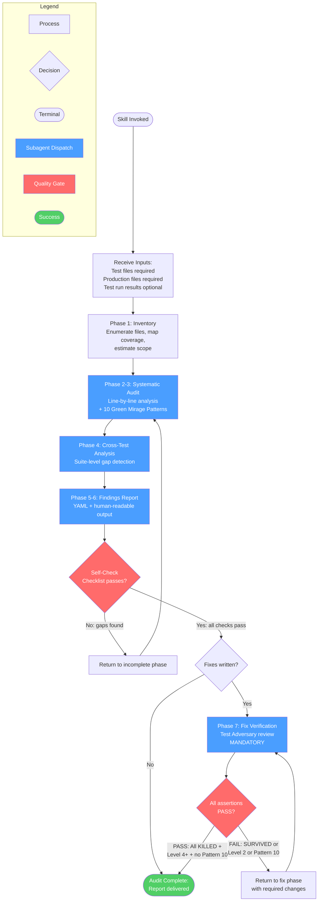
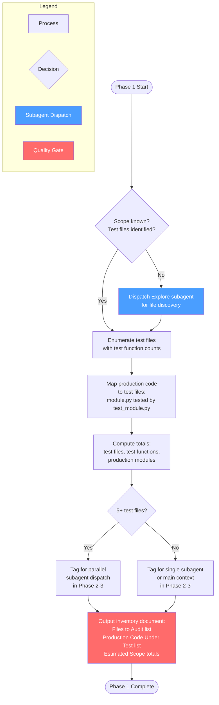
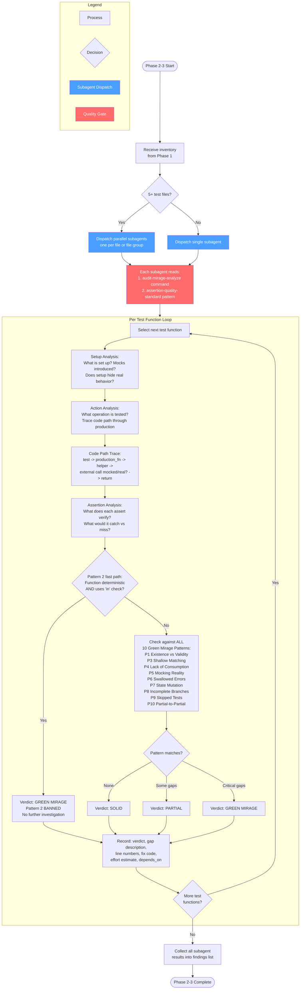
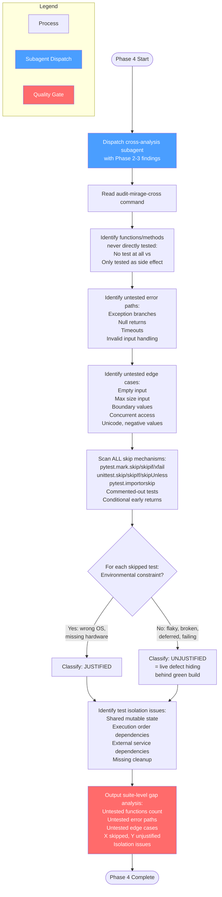
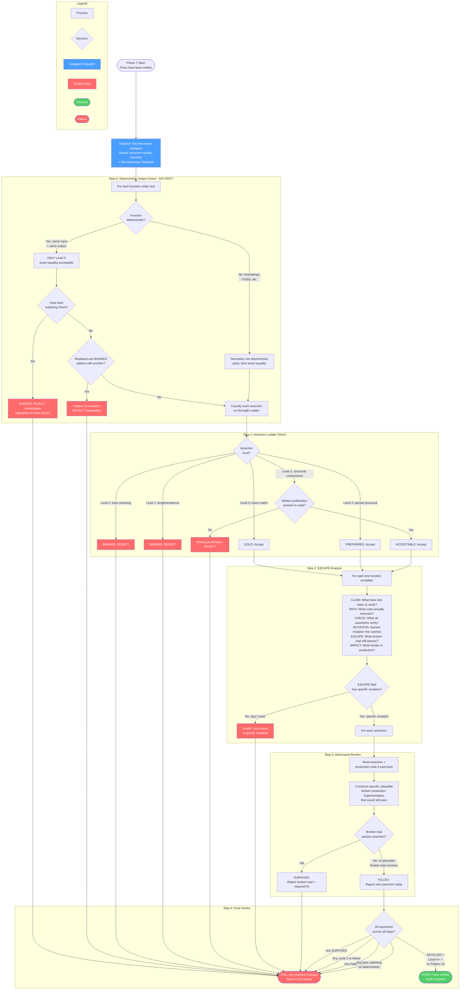

<!-- diagram-meta: {"source": "skills/auditing-green-mirage/SKILL.md", "source_hash": "sha256:057118fd53215aca46b29a6b4f1ba727d503b0199f930108d18f9a46906ee166", "generated_at": "2026-03-02T19:07:13Z", "generator": "generate_diagrams.py"} -->
# Diagram: auditing-green-mirage

Now I have all the source material. Let me construct the diagrams.

## Overview: Auditing Green Mirage Workflow

```mermaid
flowchart TD
    subgraph legend[" Legend "]
        direction LR
        lp[Process]
        ld{Decision}
        lt([Terminal])
        ls[Subagent Dispatch]:::subagent
        lg[Quality Gate]:::gate
        lk([Success]):::success
    end

    START([Skill Invoked]) --> INPUTS
    INPUTS[Receive Inputs:<br>Test files required<br>Production files required<br>Test run results optional]
    INPUTS --> P1

    P1[Phase 1: Inventory<br>Enumerate files, map coverage,<br>estimate scope]
    P1 --> P23

    P23[Phase 2-3: Systematic Audit<br>Line-by-line analysis<br>+ 10 Green Mirage Patterns]:::subagent
    P23 --> P4

    P4[Phase 4: Cross-Test Analysis<br>Suite-level gap detection]:::subagent
    P4 --> P56

    P56[Phase 5-6: Findings Report<br>YAML + human-readable output]:::subagent
    P56 --> SC

    SC{Self-Check<br>Checklist passes?}:::gate
    SC -->|No: gaps found| GOBACK[Return to incomplete phase]
    GOBACK --> P23
    SC -->|Yes: all checks pass| FW

    FW{Fixes written?}
    FW -->|No| DONE([Audit Complete:<br>Report delivered]):::success
    FW -->|Yes| P7

    P7[Phase 7: Fix Verification<br>Test Adversary review<br>MANDATORY]:::subagent
    P7 --> VERDICT

    VERDICT{All assertions<br>PASS?}:::gate
    VERDICT -->|PASS: All KILLED +<br>Level 4+ + no Pattern 10| DONE
    VERDICT -->|FAIL: SURVIVED or<br>Level 2 or Pattern 10| REWORK[Return to fix phase<br>with required changes]
    REWORK --> P7

    classDef subagent fill:#4a9eff,color:#fff
    classDef gate fill:#ff6b6b,color:#fff
    classDef success fill:#51cf66,color:#fff
```

---

## Cross-Reference Table

| Overview Node | Detail Diagram | Source Reference |
|---|---|---|
| Phase 1: Inventory | Detail 1 | SKILL.md lines 96-117 |
| Phase 2-3: Systematic Audit | Detail 2 | SKILL.md lines 119-147, `audit-mirage-analyze` command |
| Phase 4: Cross-Test Analysis | Detail 3 | SKILL.md lines 149-170, `audit-mirage-cross` command |
| Phase 5-6: Findings Report | Detail 4 | SKILL.md lines 172-195, `audit-mirage-report` command |
| Phase 7: Fix Verification | Detail 5 | SKILL.md lines 197-290, `assertion-quality-standard` pattern |

---

## Detail 1: Phase 1 - Inventory

```mermaid
flowchart TD
    subgraph legend[" Legend "]
        direction LR
        lp[Process]
        ld{Decision}
        ls[Subagent Dispatch]:::subagent
        lg[Quality Gate]:::gate
    end

    START([Phase 1 Start]) --> SCOPE

    SCOPE{Scope known?<br>Test files identified?}
    SCOPE -->|No| EXPLORE[Dispatch Explore subagent<br>for file discovery]:::subagent
    SCOPE -->|Yes| ENUM

    EXPLORE --> ENUM

    ENUM[Enumerate test files<br>with test function counts]
    ENUM --> MAP

    MAP[Map production code<br>to test files:<br>module.py tested by test_module.py]
    MAP --> COUNT

    COUNT[Compute totals:<br>test files, test functions,<br>production modules]
    COUNT --> SIZE

    SIZE{5+ test files?}
    SIZE -->|Yes| TAG_PAR[Tag for parallel<br>subagent dispatch<br>in Phase 2-3]
    SIZE -->|No| TAG_SINGLE[Tag for single subagent<br>or main context<br>in Phase 2-3]

    TAG_PAR --> OUTPUT
    TAG_SINGLE --> OUTPUT

    OUTPUT[Output inventory document:<br>Files to Audit list<br>Production Code Under Test list<br>Estimated Scope totals]:::gate
    OUTPUT --> DONE([Phase 1 Complete])

    classDef subagent fill:#4a9eff,color:#fff
    classDef gate fill:#ff6b6b,color:#fff
```

---

## Detail 2: Phase 2-3 - Systematic Audit + 10 Green Mirage Patterns

```mermaid
flowchart TD
    subgraph legend[" Legend "]
        direction LR
        lp[Process]
        ld{Decision}
        ls[Subagent Dispatch]:::subagent
        lg[Quality Gate]:::gate
    end

    START([Phase 2-3 Start]) --> RECV[Receive inventory<br>from Phase 1]
    RECV --> DISPATCH_Q

    DISPATCH_Q{5+ test files?}
    DISPATCH_Q -->|Yes| PAR[Dispatch parallel subagents<br>one per file or file group]:::subagent
    DISPATCH_Q -->|No| SINGLE[Dispatch single subagent]:::subagent

    PAR --> EACH
    SINGLE --> EACH

    EACH[Each subagent reads:<br>1. audit-mirage-analyze command<br>2. assertion-quality-standard pattern]:::gate

    EACH --> LOOP

    subgraph LOOP[" Per Test Function Loop "]
        direction TB
        TF[Select next test function] --> SETUP
        SETUP[Setup Analysis:<br>What is set up? Mocks introduced?<br>Does setup hide real behavior?]
        SETUP --> ACTION
        ACTION[Action Analysis:<br>What operation is tested?<br>Trace code path through production]
        ACTION --> TRACE

        TRACE[Code Path Trace:<br>test -> production_fn -> helper -><br>external call mocked/real? -> return]
        TRACE --> ASSERT_A

        ASSERT_A[Assertion Analysis:<br>What does each assert verify?<br>What would it catch vs miss?]
        ASSERT_A --> P2CHECK

        P2CHECK{Pattern 2 fast path:<br>Function deterministic<br>AND uses 'in' check?}
        P2CHECK -->|Yes| P2BANNED[Verdict: GREEN MIRAGE<br>Pattern 2 BANNED<br>No further investigation]
        P2CHECK -->|No| ALL10

        ALL10[Check against ALL<br>10 Green Mirage Patterns:<br>P1 Existence vs Validity<br>P3 Shallow Matching<br>P4 Lack of Consumption<br>P5 Mocking Reality<br>P6 Swallowed Errors<br>P7 State Mutation<br>P8 Incomplete Branches<br>P9 Skipped Tests<br>P10 Partial-to-Partial]

        ALL10 --> VERDICT_T
        P2BANNED --> RECORD

        VERDICT_T{Pattern matches?}
        VERDICT_T -->|None| SOLID[Verdict: SOLID]
        VERDICT_T -->|Some gaps| PARTIAL[Verdict: PARTIAL]
        VERDICT_T -->|Critical gaps| MIRAGE[Verdict: GREEN MIRAGE]

        SOLID --> RECORD
        PARTIAL --> RECORD
        MIRAGE --> RECORD

        RECORD[Record: verdict, gap description,<br>line numbers, fix code,<br>effort estimate, depends_on]
        RECORD --> MORE

        MORE{More test<br>functions?}
        MORE -->|Yes| TF
    end

    MORE -->|No| COLLECT
    COLLECT[Collect all subagent<br>results into findings list]
    COLLECT --> DONE([Phase 2-3 Complete])

    classDef subagent fill:#4a9eff,color:#fff
    classDef gate fill:#ff6b6b,color:#fff
```

---

## Detail 3: Phase 4 - Cross-Test Analysis

```mermaid
flowchart TD
    subgraph legend[" Legend "]
        direction LR
        lp[Process]
        ls[Subagent Dispatch]:::subagent
        lg[Quality Gate]:::gate
    end

    START([Phase 4 Start]) --> DISPATCH
    DISPATCH[Dispatch cross-analysis subagent<br>with Phase 2-3 findings]:::subagent
    DISPATCH --> READ
    READ[Read audit-mirage-cross command]

    READ --> UNTESTED
    UNTESTED[Identify functions/methods<br>never directly tested:<br>No test at all vs<br>Only tested as side effect]

    UNTESTED --> ERRORS
    ERRORS[Identify untested error paths:<br>Exception branches<br>Null returns<br>Timeouts<br>Invalid input handling]

    ERRORS --> EDGES
    EDGES[Identify untested edge cases:<br>Empty input<br>Max size input<br>Boundary values<br>Concurrent access<br>Unicode, negative values]

    EDGES --> SKIPS
    SKIPS[Scan ALL skip mechanisms:<br>pytest.mark.skip/skipif/xfail<br>unittest.skip/skipIf/skipUnless<br>pytest.importorskip<br>Commented-out tests<br>Conditional early returns]

    SKIPS --> CLASSIFY
    CLASSIFY{For each skipped test:<br>Environmental constraint?}
    CLASSIFY -->|Yes: wrong OS,<br>missing hardware| JUSTIFIED[Classify: JUSTIFIED]
    CLASSIFY -->|No: flaky, broken,<br>deferred, failing| UNJUSTIFIED[Classify: UNJUSTIFIED<br>= live defect hiding<br>behind green build]

    JUSTIFIED --> ISOLATION
    UNJUSTIFIED --> ISOLATION

    ISOLATION[Identify test isolation issues:<br>Shared mutable state<br>Execution order dependencies<br>External service dependencies<br>Missing cleanup]

    ISOLATION --> OUTPUT
    OUTPUT[Output suite-level gap analysis:<br>Untested functions count<br>Untested error paths<br>Untested edge cases<br>X skipped, Y unjustified<br>Isolation issues]:::gate

    OUTPUT --> DONE([Phase 4 Complete])

    classDef subagent fill:#4a9eff,color:#fff
    classDef gate fill:#ff6b6b,color:#fff
```

---

## Detail 4: Phase 5-6 - Findings Report and Output

```mermaid
flowchart TD
    subgraph legend[" Legend "]
        direction LR
        lp[Process]
        ld{Decision}
        ls[Subagent Dispatch]:::subagent
        lg[Quality Gate]:::gate
        lk([Success]):::success
    end

    START([Phase 5-6 Start]) --> DISPATCH
    DISPATCH[Dispatch report subagent<br>with all prior findings]:::subagent
    DISPATCH --> READ
    READ[Read audit-mirage-report command]

    READ --> YAML
    YAML[Compile YAML block at START:<br>audit_metadata<br>summary totals<br>patterns_found counts<br>findings with all fields<br>remediation_plan]

    YAML --> FIELDS
    FIELDS[Per finding required fields:<br>id, priority, test_file,<br>test_function, line_number,<br>pattern, pattern_name,<br>effort, depends_on,<br>blind_spot, production_impact]:::gate

    FIELDS --> SUMMARY
    SUMMARY[Human-readable summary:<br>Tests audited, SOLID/MIRAGE/PARTIAL<br>Pattern counts<br>Effort breakdown<br>Total remediation estimate]

    SUMMARY --> DETAILED
    DETAILED[Detailed findings:<br>Current code, blind spot,<br>execution trace, production impact,<br>consumption fix, why fix works]

    DETAILED --> DEPS
    DEPS[Detect dependencies:<br>Shared fixtures<br>Cascading assertions<br>File-level batching<br>Independent findings]

    DEPS --> REMED
    REMED[Remediation plan:<br>Dependency-ordered phases<br>Findings per phase<br>Rationale for ordering<br>Total effort estimate<br>Approach: sequential/parallel/mixed]

    REMED --> PATH_Q
    PATH_Q{In git repo?}
    PATH_Q -->|Yes| WRITE_PATH[Write to:<br>SPELLBOOK_CONFIG_DIR/docs/<br>project-encoded/audits/<br>auditing-green-mirage-timestamp.md]
    PATH_Q -->|No| ASK_GIT{User wants<br>git init?}
    ASK_GIT -->|Yes| INIT[Run git init] --> WRITE_PATH
    ASK_GIT -->|No| WRITE_ALT[Write to:<br>SPELLBOOK_CONFIG_DIR/docs/<br>_no-repo/basename/audits/]

    WRITE_PATH --> SELFCHECK
    WRITE_ALT --> SELFCHECK

    SELFCHECK{Self-Check Checklist<br>ALL items pass?}:::gate

    SELFCHECK -->|No to ANY item| GOBACK[Go back and<br>complete missing items]
    GOBACK --> YAML

    SELFCHECK -->|All pass| OUTPUT
    OUTPUT[Deliver to user:<br>Report file path<br>Inline summary<br>Next: /fixing-tests path]:::success

    OUTPUT --> DONE([Phase 5-6 Complete])

    classDef subagent fill:#4a9eff,color:#fff
    classDef gate fill:#ff6b6b,color:#fff
    classDef success fill:#51cf66,color:#fff
```

---

## Detail 5: Phase 7 - Fix Verification (MANDATORY)

```mermaid
flowchart TD
    subgraph legend[" Legend "]
        direction LR
        lp[Process]
        ld{Decision}
        ls[Subagent Dispatch]:::subagent
        lg[Quality Gate]:::gate
        lk([Success]):::success
        lf([Failure]):::fail
    end

    START([Phase 7 Start:<br>Fixes have been written]) --> DISPATCH
    DISPATCH[Dispatch Test Adversary subagent<br>Reads: assertion-quality-standard<br>+ Test Adversary Template]:::subagent

    DISPATCH --> STEP0

    subgraph STEP0_G[" Step 0: Deterministic Output Check - DO FIRST "]
        STEP0[For each function under test]
        STEP0 --> DET_Q{Function<br>deterministic?}
        DET_Q -->|Yes: same input<br>= same output| ONLY5[ONLY Level 5<br>exact equality acceptable]
        DET_Q -->|No: timestamps,<br>UUIDs, etc.| NORMALIZE[Normalize non-deterministic<br>parts, then exact equality]
        ONLY5 --> BARE_Q{Uses bare<br>substring check?}
        BARE_Q -->|Yes| BANNED_IMM[BANNED: REJECT immediately<br>regardless of other factors]:::gate
        BARE_Q -->|No| P10_Q{Replaced one BANNED<br>pattern with another?}
        P10_Q -->|Yes| P10_REJ[Pattern 10 violation:<br>REJECT immediately]:::gate
        P10_Q -->|No| STEP1_ENTRY
        NORMALIZE --> STEP1_ENTRY
    end

    BANNED_IMM --> FAIL_OUT
    P10_REJ --> FAIL_OUT

    subgraph STEP1_G[" Step 1: Assertion Ladder Check "]
        STEP1_ENTRY[Classify each assertion<br>on Strength Ladder]
        STEP1_ENTRY --> LEVEL_Q{Assertion<br>level?}
        LEVEL_Q -->|Level 5: exact match| ACCEPT_5[GOLD: Accept]
        LEVEL_Q -->|Level 4: parsed structural| ACCEPT_4[PREFERRED: Accept]
        LEVEL_Q -->|Level 3: structural containment| JUST_Q{Written justification<br>present in code?}
        LEVEL_Q -->|Level 2: bare substring| REJ_2[BANNED: REJECT]:::gate
        LEVEL_Q -->|Level 1: length/existence| REJ_1[BANNED: REJECT]:::gate
        JUST_Q -->|Yes| ACCEPT_3[ACCEPTABLE: Accept]
        JUST_Q -->|No| REJ_3[Missing justification:<br>REJECT]:::gate
    end

    REJ_2 --> FAIL_OUT
    REJ_1 --> FAIL_OUT
    REJ_3 --> FAIL_OUT
    ACCEPT_5 --> STEP2_ENTRY
    ACCEPT_4 --> STEP2_ENTRY
    ACCEPT_3 --> STEP2_ENTRY

    subgraph STEP2_G[" Step 2: ESCAPE Analysis "]
        STEP2_ENTRY[For each test function complete:]
        STEP2_ENTRY --> ESCAPE
        ESCAPE[CLAIM: What does test claim to verify?<br>PATH: What code actually executes?<br>CHECK: What do assertions verify?<br>MUTATION: Named mutation this catches<br>ESCAPE: What broken impl still passes?<br>IMPACT: What breaks in production?]
        ESCAPE --> ESC_Q{ESCAPE field<br>has specific mutation?}
        ESC_Q -->|No: says 'none'| ESC_REJ[Invalid: must name<br>a specific mutation]:::gate
        ESC_Q -->|Yes: specific mutation| STEP3_ENTRY
    end

    ESC_REJ --> FAIL_OUT

    subgraph STEP3_G[" Step 3: Adversarial Review "]
        STEP3_ENTRY[For each assertion:]
        STEP3_ENTRY --> READ_PROD[Read assertion +<br>production code it exercises]
        READ_PROD --> CONSTRUCT[Construct specific, plausible<br>broken production implementation<br>that would still pass]
        CONSTRUCT --> ADV_Q{Broken impl<br>passes assertion?}
        ADV_Q -->|Yes| SURVIVED[SURVIVED:<br>Report broken impl + required fix]
        ADV_Q -->|No: no plausible<br>broken impl survives| KILLED[KILLED:<br>Report why assertion holds]
    end

    SURVIVED --> FAIL_OUT

    subgraph STEP4_G[" Step 4: Final Verdict "]
        KILLED --> ALL_Q{All assertions<br>across all steps?}
        ALL_Q -->|Any SURVIVED| FAIL_OUT
        ALL_Q -->|Any Level 2 or below| FAIL_OUT
        ALL_Q -->|Any Pattern 10| FAIL_OUT
        ALL_Q -->|Any bare substring<br>on deterministic| FAIL_OUT
        ALL_Q -->|All KILLED +<br>Level 4+ +<br>no Pattern 10| PASS_OUT
    end

    FAIL_OUT([FAIL: List required changes<br>Return to fix phase]):::fail
    PASS_OUT([PASS: Fixes verified<br>Audit complete]):::success

    classDef subagent fill:#4a9eff,color:#fff
    classDef gate fill:#ff6b6b,color:#fff
    classDef success fill:#51cf66,color:#fff
    classDef fail fill:#ff6b6b,color:#fff
```

---

## Self-Check Checklist (Referenced in Phase 5-6)

The Self-Check is a quality gate between Phase 5-6 output and completion. All items must pass:

| Category | Check Item | Source |
|---|---|---|
| **Audit Completeness** | Every line of every test file read | SKILL.md line 327 |
| | Code paths traced test -> production -> back | SKILL.md line 328 |
| | Every test checked against all 10 patterns | SKILL.md line 329 |
| | Assertions verified to catch actual failures | SKILL.md line 330 |
| | Untested functions/methods identified | SKILL.md line 331 |
| | Untested error paths identified | SKILL.md line 332 |
| | All skip/xfail/disabled tests classified | SKILL.md line 333 |
| **Finding Quality** | Every finding has exact line numbers | SKILL.md line 336 |
| | Every finding has exact fix code | SKILL.md line 337 |
| | Every finding has effort estimate | SKILL.md line 338 |
| | Every finding has depends_on | SKILL.md line 339 |
| | Findings prioritized: critical/important/minor | SKILL.md line 340 |
| **Fix Verification** | Every assertion Level 4+ on ladder | SKILL.md line 343 |
| | Every assertion has named mutation | SKILL.md line 344 |
| | Adversarial review: no SURVIVED | SKILL.md line 345 |
| **Report Structure** | YAML block at START | SKILL.md line 348 |
| | YAML has all required sections | SKILL.md line 349 |
| | Each finding has all required fields | SKILL.md line 350 |
| | Remediation plan dependency-ordered | SKILL.md line 351 |
| | Human-readable summary present | SKILL.md line 352 |
| | Quick Start section with /fixing-tests | SKILL.md line 353 |

---

## 10 Green Mirage Patterns Reference

| Pattern | Name | Key Detection Signal | Command Source |
|---|---|---|---|
| 1 | Existence vs. Validity | `len(x) > 0`, `is not None`, `.exists()`, `mock.ANY` | audit-mirage-analyze |
| 2 | Partial Assertion on Deterministic Output | `"substring" in result` on deterministic function (BANNED) | audit-mirage-analyze |
| 3 | Shallow String/Value Matching | Single-field check on multi-field object | audit-mirage-analyze |
| 4 | Lack of Consumption | Output never compiled/parsed/executed/deserialized | audit-mirage-analyze |
| 5 | Mocking Reality Away | Mocking system under test, not just dependencies | audit-mirage-analyze |
| 6 | Swallowed Errors | `except: pass`, unchecked return codes | audit-mirage-analyze |
| 7 | State Mutation Without Verification | Side effect triggered but state never verified | audit-mirage-analyze |
| 8 | Incomplete Branch Coverage | Happy path only, missing error/edge/boundary tests | audit-mirage-analyze |
| 9 | Skipped Tests Hiding Failures | skip/xfail/disabled to avoid dealing with failures | audit-mirage-analyze |
| 10 | Strengthened Assertion Still Partial | Fix replaces one BANNED level with another BANNED level | audit-mirage-analyze |
