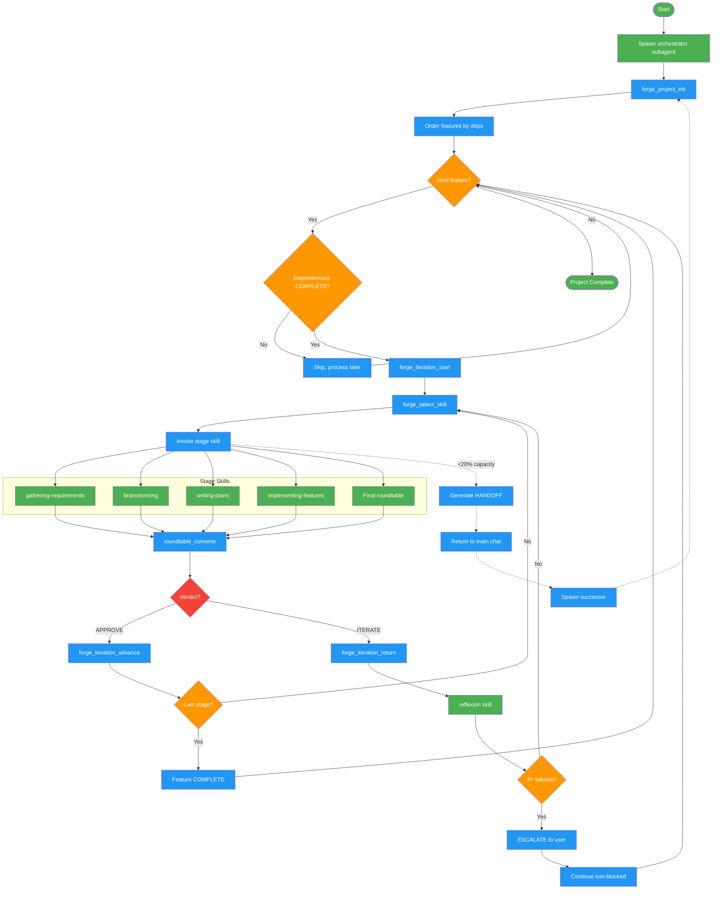

<!-- diagram-meta: {"source": "skills/autonomous-roundtable/SKILL.md", "source_hash": "sha256:20319cd9f4aba1192d9ff136ce0e80bdb55b1fba6ce4af3868fe9f97e820d6e3", "generated_at": "2026-02-19T00:00:00Z", "generator": "generate_diagrams.py"} -->
# Diagram: autonomous-roundtable

Workflow for the autonomous-roundtable skill (Forged system). A meta-orchestrator that decomposes projects into features, processes each through DISCOVER, DESIGN, PLAN, IMPLEMENT, COMPLETE stages with roundtable consensus gating. Runs exclusively as a subagent, with handoff protocol for context overflow.

## Legend

| Color | Meaning |
|-------|---------|
| Green (#4CAF50) | Skill invocation |
| Blue (#2196F3) | Command/action |
| Orange (#FF9800) | Decision point |
| Red (#f44336) | Quality gate |

## Cross-Reference

| Node | Source Reference |
|------|----------------|
| Spawn orchestrator subagent | SKILL.md: MANDATE - "Forge NEVER runs in main chat" |
| forge_project_init | SKILL.md: MCP Tools - Project initialization |
| Order features by deps | SKILL.md: Invariant 2 - "Dependency Order" |
| forge_iteration_start | SKILL.md: MCP Tools - Iteration start |
| forge_select_skill | SKILL.md: MCP Tools - Skill selection, priority rules |
| gathering-requirements | SKILL.md: Stages table - DISCOVER stage |
| brainstorming | SKILL.md: Stages table - DESIGN stage |
| writing-plans | SKILL.md: Stages table - PLAN stage |
| implementing-features | SKILL.md: Stages table - IMPLEMENT stage |
| Final roundtable | SKILL.md: Stages table - COMPLETE stage |
| roundtable_convene | SKILL.md: MCP Tools - Roundtable convene |
| Verdict (APPROVE/ITERATE) | SKILL.md: Forge Loop - roundtable outcomes |
| forge_iteration_advance | SKILL.md: Forge Loop - advance to next stage |
| forge_iteration_return | SKILL.md: ITERATE Handling - return for reflexion |
| reflexion skill | SKILL.md: Invariant 4 - "Feedback to Reflexion" |
| 3+ failures escalation | SKILL.md: ITERATE Handling - "After 3 failures: ESCALATE" |
| HANDOFF | SKILL.md: Context Overflow Protocol - handoff format |
| Spawn successor | SKILL.md: Context Overflow Protocol - main chat spawns successor |
