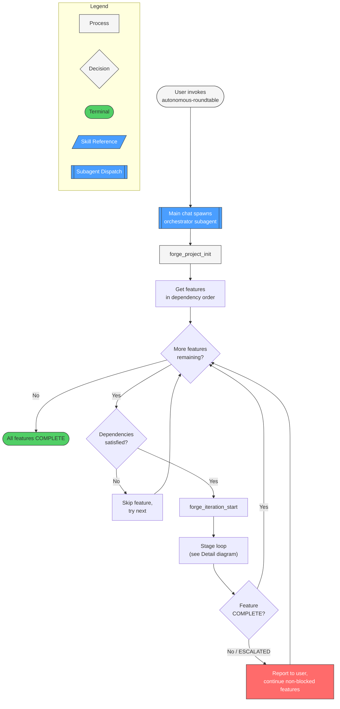
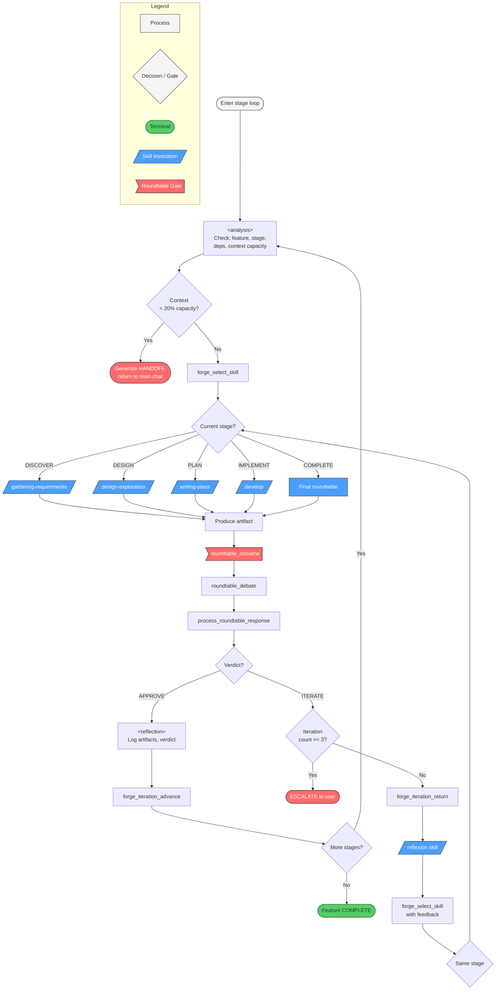
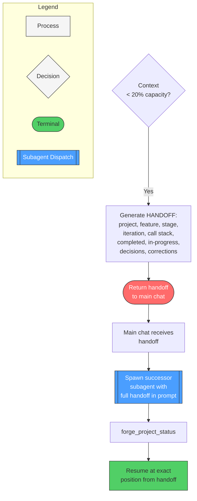

<!-- diagram-meta: {"source": "skills/autonomous-roundtable/SKILL.md","source_hash": "sha256:e7a82214115babbbccb2254eed5545f2719a3f9f194bdd855ea59a2d17bae8aa","generated_at": "2026-03-19T06:00:00Z","generator": "claude-manual","stamped_at": "2026-03-19T06:31:44Z"} -->
# Diagram: autonomous-roundtable

> **Deprecated:** This skill has been absorbed into `develop`. These diagrams capture the original workflow for reference. See [develop diagrams](./develop.md) for the current equivalent.

## Overview: Forge Loop

```mermaid
graph TD
    subgraph Legend
        L1[Process]
        L2{Decision}
        L3([Terminal])
        L4[/Skill Reference/]
        L5[[Subagent Dispatch]]
        style L1 fill:#f5f5f5,stroke:#333
        style L2 fill:#f5f5f5,stroke:#333
        style L3 fill:#51cf66,stroke:#333
        style L4 fill:#4a9eff,stroke:#333,color:#fff
        style L5 fill:#4a9eff,stroke:#333,color:#fff
    end

    START([User invokes<br>autonomous-roundtable]) --> SPAWN[[Main chat spawns<br>orchestrator subagent]]
    SPAWN --> INIT[forge_project_init]
    INIT --> FEATURES[Get features<br>in dependency order]
    FEATURES --> NEXT_FEAT{More features<br>remaining?}

    NEXT_FEAT -->|No| DONE([All features COMPLETE])
    NEXT_FEAT -->|Yes| DEP_CHECK{Dependencies<br>satisfied?}

    DEP_CHECK -->|No| SKIP[Skip feature,<br>try next]
    SKIP --> NEXT_FEAT
    DEP_CHECK -->|Yes| ITER_START[forge_iteration_start]

    ITER_START --> STAGE_LOOP["Stage loop<br>(see Detail diagram)"]
    STAGE_LOOP --> COMPLETE{Feature<br>COMPLETE?}

    COMPLETE -->|Yes| NEXT_FEAT
    COMPLETE -->|No / ESCALATED| ESCALATE[Report to user,<br>continue non-blocked features]
    ESCALATE --> NEXT_FEAT

    style START fill:#f5f5f5,stroke:#333
    style SPAWN fill:#4a9eff,stroke:#333,color:#fff
    style INIT fill:#f5f5f5,stroke:#333
    style DONE fill:#51cf66,stroke:#333
    style ESCALATE fill:#ff6b6b,stroke:#333,color:#fff
```

## Detail: Stage Execution and Roundtable Gating

```mermaid
graph TD
    subgraph Legend
        L1[Process]
        L2{Decision / Gate}
        L3([Terminal])
        L4[/Skill Invocation/]
        LG>Roundtable Gate]
        style L1 fill:#f5f5f5,stroke:#333
        style L2 fill:#f5f5f5,stroke:#333
        style L3 fill:#51cf66,stroke:#333
        style L4 fill:#4a9eff,stroke:#333,color:#fff
        style LG fill:#ff6b6b,stroke:#333,color:#fff
    end

    ENTRY([Enter stage loop]) --> ANALYSIS["&lt;analysis&gt;<br>Check: feature, stage,<br>deps, context capacity"]
    ANALYSIS --> CTX_CHECK{Context<br>< 20% capacity?}

    CTX_CHECK -->|Yes| HANDOFF([Generate HANDOFF,<br>return to main chat])
    CTX_CHECK -->|No| SELECT[forge_select_skill]

    SELECT --> STAGE{Current stage?}
    STAGE -->|DISCOVER| S1[/gathering-requirements/]
    STAGE -->|DESIGN| S2[/design-exploration/]
    STAGE -->|PLAN| S3[/writing-plans/]
    STAGE -->|IMPLEMENT| S4[/develop/]
    STAGE -->|COMPLETE| S5[Final roundtable]

    S1 --> ARTIFACT[Produce artifact]
    S2 --> ARTIFACT
    S3 --> ARTIFACT
    S4 --> ARTIFACT
    S5 --> ARTIFACT

    ARTIFACT --> RT>roundtable_convene]
    RT --> DEBATE[roundtable_debate]
    DEBATE --> PROCESS[process_roundtable_response]
    PROCESS --> VERDICT{Verdict?}

    VERDICT -->|APPROVE| REFLECT["&lt;reflection&gt;<br>Log artifacts, verdict"]
    REFLECT --> ADVANCE[forge_iteration_advance]
    ADVANCE --> NEXT_STAGE{More stages?}
    NEXT_STAGE -->|Yes| ANALYSIS
    NEXT_STAGE -->|No| FEATURE_DONE([Feature COMPLETE])

    VERDICT -->|ITERATE| FAIL_COUNT{Iteration<br>count >= 3?}
    FAIL_COUNT -->|Yes| ESCALATE_OUT([ESCALATE to user])
    FAIL_COUNT -->|No| RETURN[forge_iteration_return]
    RETURN --> REFLEXION[/reflexion skill/]
    REFLEXION --> RESELECT[forge_select_skill<br>with feedback]
    RESELECT --> RETRY_STAGE{Same stage}
    RETRY_STAGE --> STAGE

    style ENTRY fill:#f5f5f5,stroke:#333
    style HANDOFF fill:#ff6b6b,stroke:#333,color:#fff
    style FEATURE_DONE fill:#51cf66,stroke:#333
    style ESCALATE_OUT fill:#ff6b6b,stroke:#333,color:#fff
    style RT fill:#ff6b6b,stroke:#333,color:#fff
    style S1 fill:#4a9eff,stroke:#333,color:#fff
    style S2 fill:#4a9eff,stroke:#333,color:#fff
    style S3 fill:#4a9eff,stroke:#333,color:#fff
    style S4 fill:#4a9eff,stroke:#333,color:#fff
    style S5 fill:#4a9eff,stroke:#333,color:#fff
    style REFLEXION fill:#4a9eff,stroke:#333,color:#fff
```

## Detail: Context Overflow and Handoff

```mermaid
graph TD
    subgraph Legend
        L1[Process]
        L2{Decision}
        L3([Terminal])
        L5[[Subagent Dispatch]]
        style L1 fill:#f5f5f5,stroke:#333
        style L2 fill:#f5f5f5,stroke:#333
        style L3 fill:#51cf66,stroke:#333
        style L5 fill:#4a9eff,stroke:#333,color:#fff
    end

    CHECK{Context<br>< 20% capacity?} -->|Yes| GEN[Generate HANDOFF:<br>project, feature, stage,<br>iteration, call stack,<br>completed, in-progress,<br>decisions, corrections]
    GEN --> RETURN([Return handoff<br>to main chat])
    RETURN --> MAIN[Main chat receives<br>handoff]
    MAIN --> SPAWN[[Spawn successor<br>subagent with<br>full handoff in prompt]]
    SPAWN --> STATUS[forge_project_status]
    STATUS --> RESUME[Resume at exact<br>position from handoff]

    style RETURN fill:#ff6b6b,stroke:#333,color:#fff
    style SPAWN fill:#4a9eff,stroke:#333,color:#fff
    style RESUME fill:#51cf66,stroke:#333
```

## Cross-Reference Table

| Overview Node | Detail Diagram | Description |
|---|---|---|
| "Main chat spawns orchestrator subagent" | Context Overflow and Handoff | Subagent spawning and handoff lifecycle |
| "Stage loop" | Stage Execution and Roundtable Gating | Per-stage skill selection, execution, and roundtable verdict handling |
| "Report to user" | Stage Execution (ESCALATE) | After 3 ITERATE failures on a stage |

## Migration Reference

| Former Capability | New Location | Configuration |
|---|---|---|
| Project decomposition | `develop` COMPLEX tier | Automatic based on complexity classification |
| Roundtable validation | `develop` Phase 0.4 | `dialectic_mode: "roundtable"` |
| Token enforcement | `develop` Phase 0.4 | `token_enforcement: "gate_level"` or `"every_step"` |
| Reflexion on ITERATE | `develop` (built-in) | Automatic when roundtable returns ITERATE verdict |
| Context overflow handoff | `develop` (built-in) | Automatic via compaction and session resume |
