<!-- diagram-meta: {"source": "skills/brainstorming/SKILL.md", "source_hash": "sha256:73d546d341661dfef050ffe28840b76f0cc5bda24d81f01f18a0f063ca53a992", "generated_at": "2026-02-19T00:00:00Z", "generator": "generate_diagrams.py"} -->
# Diagram: brainstorming

Workflow for the brainstorming skill. Supports two modes: Synthesis (autonomous, context pre-collected) and Interactive (discovery-driven collaboration). Both converge on approach selection, design presentation, quality assessment, and documentation. Includes circuit breakers for security-critical or contradictory situations.

```mermaid
flowchart TD
    Start([Start]) --> DetectMode{Mode detection?}

    DetectMode -->|"SYNTHESIS MODE signals"| Synthesis["Synthesis Mode"]
    DetectMode -->|"No signals"| Interactive["Interactive Mode"]

    subgraph SynthesisPath["Synthesis Path"]
        AutoDecide["Autonomous decisions"]
        DocRationale["Document rationale"]
        CircuitBreaker{Circuit breaker?}
        AutoDecide --> DocRationale
        DocRationale --> CircuitBreaker
        CircuitBreaker -->|"Security/contradiction"| PauseReport["Pause and report gaps"]
        CircuitBreaker -->|Clear| SynthApproach["Select approach"]
    end

    subgraph InteractivePath["Interactive Path"]
        CheckProject["Check project state"]
        ExplorePatterns["Explore codebase patterns"]
        AskQuestion["Ask one question"]
        GotAnswer{Sufficient context?}
        CheckProject --> ExplorePatterns
        ExplorePatterns --> AskQuestion
        AskQuestion --> GotAnswer
        GotAnswer -->|No| AskQuestion
        GotAnswer -->|Yes| ProposeApproaches["Propose 2-3 approaches"]
        ProposeApproaches --> UserPicks["User selects approach"]
    end

    Synthesis --> AutoDecide
    Interactive --> CheckProject
    PauseReport --> AutoDecide

    SynthApproach --> DesignPresentation
    UserPicks --> DesignPresentation

    DesignPresentation["Present design sections"]
    DesignPresentation --> Architecture["Architecture"]
    Architecture --> Components["Components"]
    Components --> DataFlow["Data flow"]
    DataFlow --> ErrorHandling["Error handling"]
    ErrorHandling --> Testing["Testing strategy"]

    Testing --> Assessment["/design-assessment"]
    Assessment --> GateScore{Blocking dims >= 3?}

    GateScore -->|No| FixGaps["Report gaps, iterate"]
    GateScore -->|Yes| GateCritical{CRITICAL findings?}
    FixGaps --> DesignPresentation

    GateCritical -->|Yes| FixGaps
    GateCritical -->|No| WriteDoc["Write design document"]
    WriteDoc --> DocPath["Save to ~/.local/spellbook/docs/"]

    DocPath --> ImplReady{Ready for implementation?}
    ImplReady -->|No| Done([Done])
    ImplReady -->|Yes| Worktree["using-git-worktrees"]
    Worktree --> WritePlan["writing-plans"]
    WritePlan --> Done

    style Start fill:#4CAF50,color:#fff
    style Done fill:#4CAF50,color:#fff
    style Synthesis fill:#4CAF50,color:#fff
    style Interactive fill:#4CAF50,color:#fff
    style Worktree fill:#4CAF50,color:#fff
    style WritePlan fill:#4CAF50,color:#fff
    style Assessment fill:#4CAF50,color:#fff
    style AutoDecide fill:#2196F3,color:#fff
    style DocRationale fill:#2196F3,color:#fff
    style PauseReport fill:#2196F3,color:#fff
    style SynthApproach fill:#2196F3,color:#fff
    style CheckProject fill:#2196F3,color:#fff
    style ExplorePatterns fill:#2196F3,color:#fff
    style AskQuestion fill:#2196F3,color:#fff
    style ProposeApproaches fill:#2196F3,color:#fff
    style UserPicks fill:#2196F3,color:#fff
    style DesignPresentation fill:#2196F3,color:#fff
    style Architecture fill:#2196F3,color:#fff
    style Components fill:#2196F3,color:#fff
    style DataFlow fill:#2196F3,color:#fff
    style ErrorHandling fill:#2196F3,color:#fff
    style Testing fill:#2196F3,color:#fff
    style WriteDoc fill:#2196F3,color:#fff
    style DocPath fill:#2196F3,color:#fff
    style FixGaps fill:#2196F3,color:#fff
    style DetectMode fill:#FF9800,color:#fff
    style CircuitBreaker fill:#FF9800,color:#fff
    style GotAnswer fill:#FF9800,color:#fff
    style ImplReady fill:#FF9800,color:#fff
    style GateScore fill:#f44336,color:#fff
    style GateCritical fill:#f44336,color:#fff
```

## Legend

| Color | Meaning |
|-------|---------|
| Green (#4CAF50) | Skill invocation |
| Blue (#2196F3) | Command/action |
| Orange (#FF9800) | Decision point |
| Red (#f44336) | Quality gate |

## Cross-Reference

| Node | Source Reference |
|------|----------------|
| Mode detection | SKILL.md: Mode Detection - synthesis signals vs interactive |
| Synthesis Mode | SKILL.md: Synthesis Mode Protocol - skip discovery |
| Interactive Mode | SKILL.md: Interactive Mode Protocol - one question per turn |
| Circuit breaker | SKILL.md: Synthesis Mode - security-critical, contradictory, or missing context |
| Propose 2-3 approaches | SKILL.md: Invariant 2 - "Explore Before Committing" |
| Ask one question | SKILL.md: Invariant 1 - "One Question Per Turn" |
| Design sections | SKILL.md: Design Presentation - architecture, components, data flow, error handling, testing |
| /design-assessment | SKILL.md: Design Quality Assessment - run assessment command |
| Blocking dims >= 3 | SKILL.md: Quality Gate - completeness, clarity, accuracy >= 3 |
| CRITICAL findings | SKILL.md: Quality Gate - no CRITICAL or HIGH findings |
| Write design document | SKILL.md: After Design Complete - Documentation path |
| using-git-worktrees | SKILL.md: After Design Complete - Implementation isolation |
| writing-plans | SKILL.md: After Design Complete - Implementation plan |
