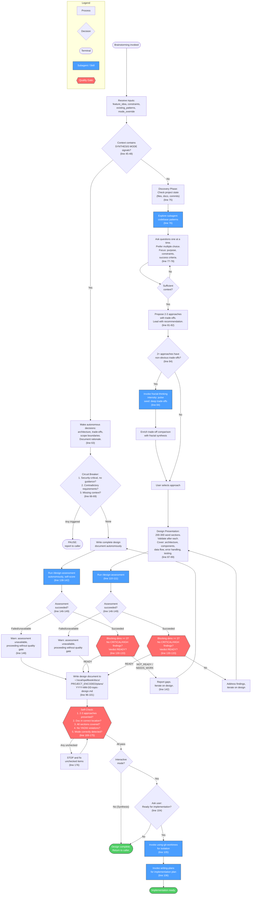

<!-- diagram-meta: {"source": "skills/brainstorming/SKILL.md","generated_at": "2026-03-19T00:00:00Z","generator": "claude","source_hash": "sha256:8b9de7666bffcd4e2b0097af7563ee0db7127d4804872534294b7f7644b3bf26","stamped_at": "2026-03-19T06:31:44Z"} -->
# Diagram: brainstorming

Two-mode design exploration skill. **Synthesis mode** (context pre-collected) skips discovery and designs autonomously. **Interactive mode** discovers requirements through one-question-at-a-time collaboration. Both converge on design documentation, quality assessment, self-check, and optional implementation setup.

## Full Workflow

```mermaid
flowchart TD
    subgraph Legend[" Legend "]
        direction LR
        Lproc[Process]
        Ldec{Decision}
        Lterm([Terminal])
        Lsub["Subagent / Skill"]:::subagent
        Lgate{{"Quality Gate"}}:::gate
    end

    Start([Brainstorming invoked]) --> Input["Receive inputs:<br>feature_idea, constraints,<br>existing_patterns, mode_override"]
    Input --> ModeDetect{"Context contains<br>SYNTHESIS MODE signals?<br>(line 45-48)"}

    %% ===== SYNTHESIS MODE =====
    ModeDetect -->|"Yes"| SynthDecide["Make autonomous decisions:<br>architecture, trade-offs,<br>scope boundaries.<br>Document rationale.<br>(line 63)"]
    SynthDecide --> CircuitBreaker{"Circuit Breaker:<br>1. Security-critical, no guidance?<br>2. Contradictory requirements?<br>3. Missing context?<br>(line 66-69)"}
    CircuitBreaker -->|"Any triggered"| Pause(["PAUSE:<br>report to caller"])
    CircuitBreaker -->|"None"| SynthDesign["Write complete design<br>document autonomously"]

    %% Synthesis assessment loop
    SynthDesign --> SynthAssess["Run /design-assessment<br>autonomously, self-score<br>(line 138-142)"]:::subagent
    SynthAssess --> SynthAvail{"Assessment<br>succeeded?<br>(line 146-149)"}
    SynthAvail -->|"Failed/unavailable"| DegradedWarn1["Warn: assessment unavailable,<br>proceeding without quality gate<br>(line 148)"]
    DegradedWarn1 --> WriteDoc
    SynthAvail -->|"Succeeded"| SynthGate{{"Blocking dims >= 3?<br>No CRITICAL/HIGH findings?<br>Verdict READY?<br>(line 130-133)"}}:::gate
    SynthGate -->|"NOT_READY /<br>NEEDS_WORK"| SynthGaps["Report gaps.<br>Iterate on design.<br>(line 142)"]
    SynthGaps --> SynthDesign
    SynthGate -->|"READY"| WriteDoc

    %% ===== INTERACTIVE MODE =====
    ModeDetect -->|"No"| Discovery["Discovery Phase:<br>Check project state<br>(files, docs, commits)<br>(line 75)"]
    Discovery --> ExploreAgent["Explore subagent:<br>codebase patterns<br>(line 76)"]:::subagent
    ExploreAgent --> AskQuestions["Ask questions one at a time.<br>Prefer multiple choice.<br>Focus: purpose, constraints,<br>success criteria.<br>(line 77-78)"]
    AskQuestions --> SufficientCtx{"Sufficient<br>context?"}
    SufficientCtx -->|"No"| AskQuestions
    SufficientCtx -->|"Yes"| ProposeApproaches["Propose 2-3 approaches<br>with trade-offs.<br>Lead with recommendation.<br>(line 81-82)"]
    ProposeApproaches --> TradeoffCheck{"2+ approaches have<br>non-obvious trade-offs?<br>(line 84)"}
    TradeoffCheck -->|"Yes"| Fractal["Invoke fractal-thinking<br>intensity: pulse<br>seed: deep trade-offs<br>(line 84)"]:::subagent
    Fractal --> EnrichCompare["Enrich trade-off comparison<br>with fractal synthesis"]
    EnrichCompare --> UserSelect["User selects approach"]
    TradeoffCheck -->|"No"| UserSelect

    UserSelect --> DesignPresent["Design Presentation:<br>200-300 word sections.<br>Validate after each.<br>Cover: architecture, components,<br>data flow, error handling, testing.<br>(line 87-89)"]

    %% Interactive assessment loop
    DesignPresent --> IntAssess["Run /design-assessment<br>(line 110-111)"]:::subagent
    IntAssess --> IntAvail{"Assessment<br>succeeded?<br>(line 146-149)"}
    IntAvail -->|"Failed/unavailable"| DegradedWarn2["Warn: assessment unavailable,<br>proceeding without quality gate"]
    DegradedWarn2 --> WriteDoc
    IntAvail -->|"Succeeded"| IntGate{{"Blocking dims >= 3?<br>No CRITICAL/HIGH findings?<br>Verdict READY?<br>(line 130-133)"}}:::gate
    IntGate -->|"No"| IntFix["Address findings,<br>iterate on design"]
    IntFix --> DesignPresent
    IntGate -->|"READY"| WriteDoc

    %% ===== CONVERGENCE =====
    WriteDoc["Write design document to<br>~/.local/spellbook/docs/<br>PROJECT_ENCODED/plans/<br>YYYY-MM-DD-topic-design.md<br>(line 96-101)"]

    WriteDoc --> SelfCheck{{"Self-Check:<br>1. 2-3 approaches presented?<br>2. Doc in correct location?<br>3. All sections covered?<br>4. No YAGNI violations?<br>5. Mode correctly detected?<br>(line 169-175)"}}:::gate
    SelfCheck -->|"Any unchecked"| FixItems["STOP and fix<br>unchecked items<br>(line 176)"]
    FixItems --> SelfCheck
    SelfCheck -->|"All pass"| ModeRouting{"Interactive<br>mode?"}

    ModeRouting -->|"No (Synthesis)"| Complete(["Design complete.<br>Return to caller."]):::success
    ModeRouting -->|"Yes"| AskImpl{"Ask user:<br>Ready for implementation?<br>(line 104)"}
    AskImpl -->|"No"| Complete
    AskImpl -->|"Yes"| Worktree["Invoke using-git-worktrees<br>for isolation<br>(line 105)"]:::subagent
    Worktree --> ImplPlan["Invoke writing-plans<br>for implementation plan<br>(line 106)"]:::subagent
    ImplPlan --> ImplReady(["Implementation ready."]):::success

    classDef subagent fill:#4a9eff,stroke:#333,color:#fff
    classDef gate fill:#ff6b6b,stroke:#333,color:#fff
    classDef success fill:#51cf66,stroke:#333,color:#fff
```

## Legend

| Color | Meaning |
|-------|---------|
| Blue (`#4a9eff`) | Subagent dispatch or skill invocation |
| Red (`#ff6b6b`) | Quality gate (must pass to proceed) |
| Green (`#51cf66`) | Success terminal |
| Default | Process step or decision |

## Cross-Reference

| Node | Source Lines | Description |
|------|-------------|-------------|
| Mode Detection | 39-53 | Checks for SYNTHESIS MODE / AUTONOMOUS / pre-collected context signals |
| Circuit Breakers | 65-70 | Security-critical decisions, contradictory requirements, missing context |
| Explore subagent | 76 | Dispatches explore agent for codebase patterns (saves main context) |
| One question per turn | 77-78 | Invariant 1: single questions get better answers |
| Propose 2-3 approaches | 81-82 | Invariant 2: explore before committing |
| Fractal exploration | 84 | fractal-thinking with intensity `pulse` for non-obvious trade-offs |
| Design Presentation | 86-89 | 200-300 word sections covering architecture, components, data flow, error handling, testing |
| /design-assessment | 110-126 | Quality gate: generate framework, score dimensions, determine verdict |
| Blocking dims >= 3 | 130-133 | Completeness, clarity, accuracy must score >= 3; no CRITICAL/HIGH findings |
| Assessment fallback | 146-149 | If /design-assessment fails: warn and proceed in degraded mode |
| Self-Check | 169-176 | 5-item checklist; STOP and fix if any unchecked |
| Write design doc | 96-101 | Output to `~/.local/spellbook/docs/PROJECT_ENCODED/plans/` |
| using-git-worktrees | 105 | Implementation isolation (interactive mode only) |
| writing-plans | 106 | Implementation plan generation (interactive mode only) |
