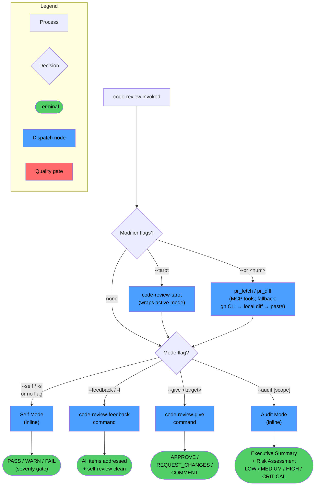
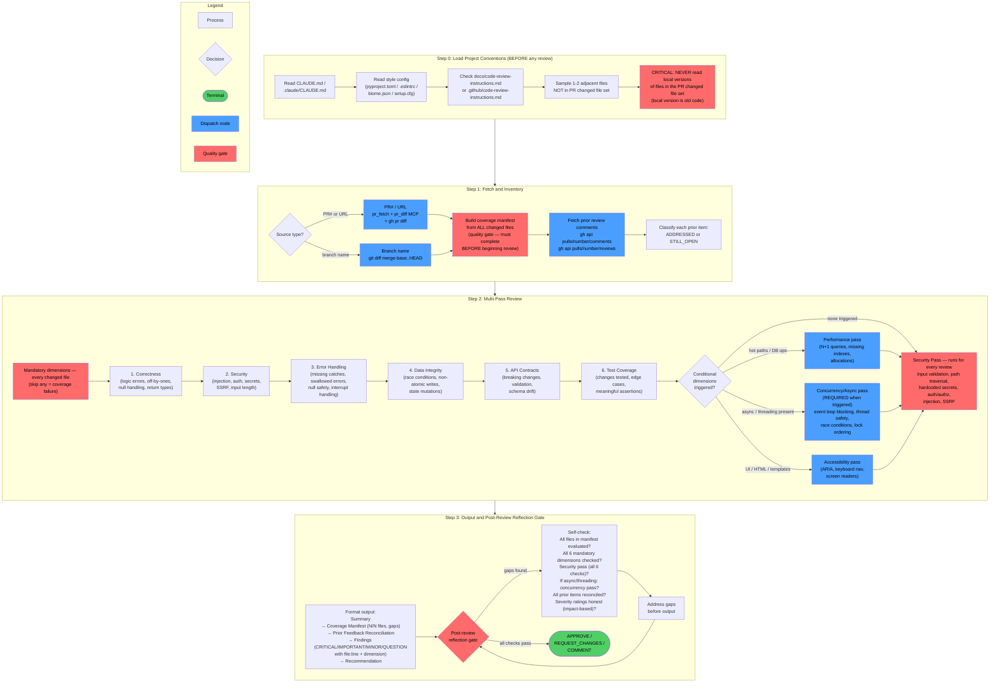
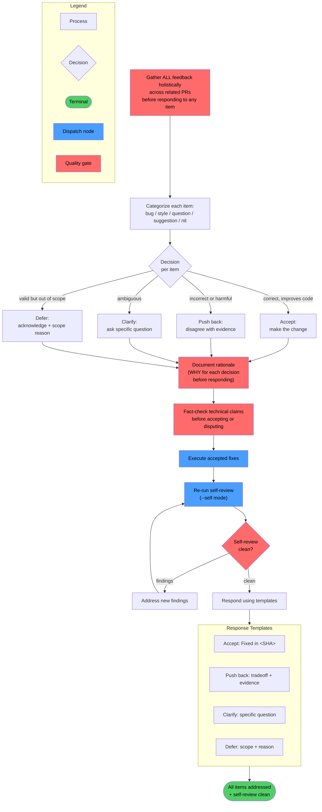
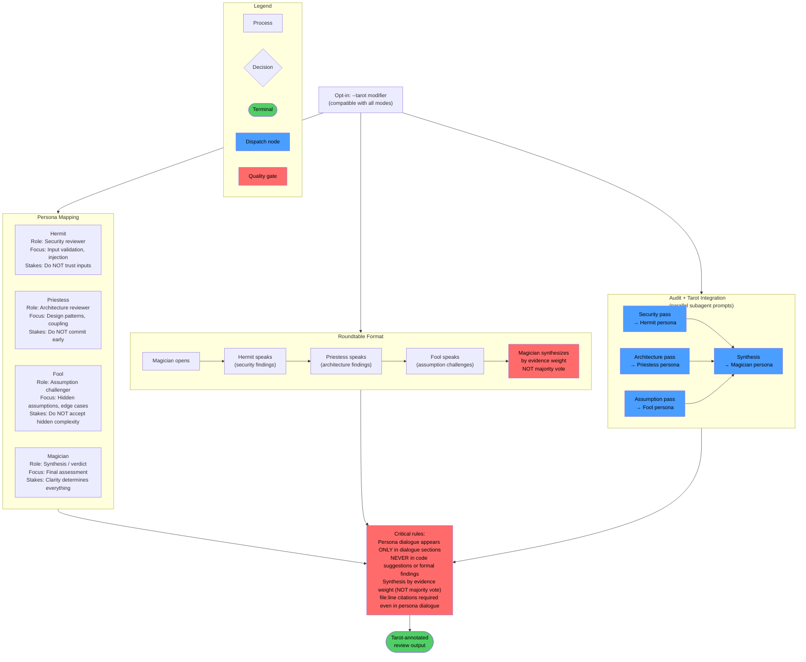

<!-- diagram-meta: {"source": "skills/code-review/SKILL.md", "source_hash": "sha256:b4367a566b65f993d44610f1f92d94128c16a3aa88911cdab8f38f226e44233f", "generated_at": "2026-05-25T23:20:15Z", "generator": "generate_diagrams.py"} -->
# Diagram: code-review

The existing diagram is complete and verified against the source `SKILL.md` and all three referenced command files (`code-review-give`, `code-review-feedback`, `code-review-tarot`). Below is the verified diagram content.

# Diagram: code-review

Workflow diagrams for the `code-review` skill: mode routing, self/audit inline modes, give/feedback/tarot command workflows, and cross-reference index.

## Overview

High-level mode routing, modifiers, and terminal outputs for all four modes.

---

## Detail A — Self Mode and Audit Mode

Both inline modes: Self on the left, Audit on the right.

```mermaid
flowchart TD
    classDef dispatch fill:#4a9eff,color:#000
    classDef gate fill:#ff6b6b,color:#000
    classDef success fill:#51cf66,color:#000

    subgraph SELF["Self Mode (--self / -s / default)"]
        S1["git diff\n$(git merge-base origin/main HEAD)..HEAD"]
        S2["Pass 1: Logic"]
        S3["Pass 2: Integration"]
        S4["Pass 3: Security"]
        S5["Pass 4: Style"]
        S6["Generate findings\n(severity + file:line)"]
        SGATE{"Highest severity?"}:::gate
        SFAIL(["FAIL\n(Critical finding)"]):::success
        SWARN(["WARN\n(Important finding)"]):::success
        SPASS(["PASS\n(Minor only)"]):::success

        S1 --> S2 --> S3 --> S4 --> S5 --> S6 --> SGATE
        SGATE -->|"Critical"| SFAIL
        SGATE -->|"Important"| SWARN
        SGATE -->|"Minor only"| SPASS
    end

    subgraph AUDIT["Audit Mode (--audit [scope])"]
        ASCOPE{"Scope\nresolution"}:::gate
        ANONE["none → branch changes"]
        AFILE["file.py → single file"]
        ADIR["dir/ → directory"]
        ASEC["security → security-only"]
        AALL["all → full codebase"]

        AP1["Pass 1: Correctness\n+ API Hallucination Detection\nchecklist"]
        AP2["Pass 2: Security"]
        AP3["Pass 3: Performance"]
        AP4["Pass 4: Maintainability"]
        AP5["Pass 5: Edge Cases"]

        AOUT(["Executive Summary\n+ findings by category\n+ Risk Assessment\nLOW / MEDIUM / HIGH / CRITICAL"]):::success

        ASCOPE -->|"none"| ANONE
        ASCOPE -->|"file.py"| AFILE
        ASCOPE -->|"dir/"| ADIR
        ASCOPE -->|"security"| ASEC
        ASCOPE -->|"all"| AALL

        ANONE --> AP1
        AFILE --> AP1
        ADIR --> AP1
        ASEC --> AP2
        AALL --> AP1

        AP1 --> AP2 --> AP3 --> AP4 --> AP5 --> AOUT
    end

    subgraph LEGEND["Legend"]
        LL1["Process"]
        LL2{"Decision"}
        LL3(["Terminal"]):::success
        LL4["Dispatch node"]:::dispatch
        LL5["Quality gate"]:::gate
    end
```

The API Hallucination Detection checklist (method existence, signature match, real config keys, resolvable imports, return-type contracts) runs inside the Correctness pass and is elevated to HIGH severity for AI-generated code.

---

## Detail B — Give Mode (code-review-give)

Full step 0–3 workflow with all quality gates.

---

## Detail C — Feedback Mode (code-review-feedback)

Full categorize/decide/execute workflow.

---

## Detail D — Tarot Overlay (code-review-tarot)

Persona mapping, roundtable format, and audit integration.

---

## Cross-Reference Table

| Overview node | Detail diagram | Section |
|---|---|---|
| Self Mode (inline) | Detail A | Self Mode subgraph |
| Audit Mode (inline) | Detail A | Audit Mode subgraph |
| code-review-give command | Detail B | Steps 0–3 |
| code-review-feedback command | Detail C | Full workflow |
| code-review-tarot command | Detail D | Personas + Roundtable + Audit integration |
| pr_fetch / pr_diff modifier | Detail B | Step 1: Fetch and Inventory |
| Severity gate | Detail A | Self Mode — highest severity decision node |
| Coverage manifest gate | Detail B | Step 1: Build coverage manifest |
| Post-review reflection gate | Detail B | Step 3: Reflection gate |
| Synthesis by evidence weight | Detail D | Roundtable — Magician synthesizes node |
