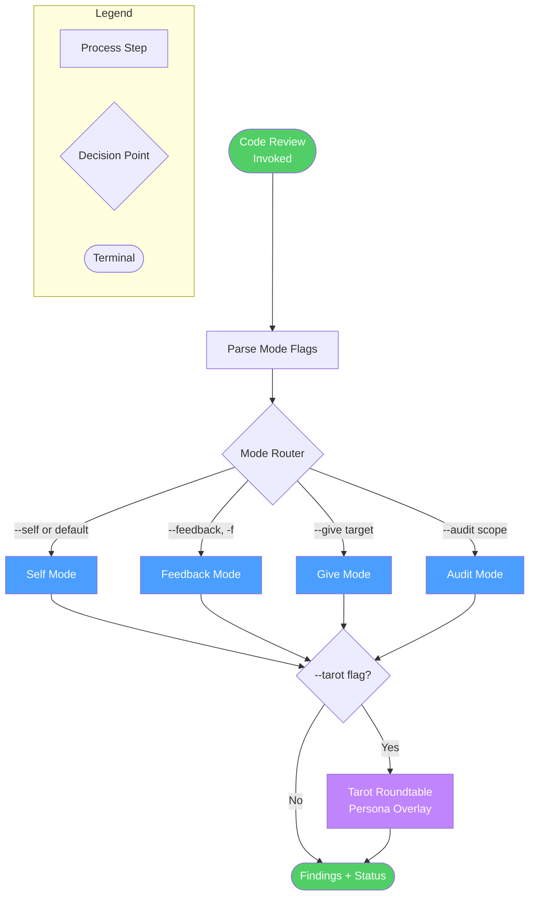
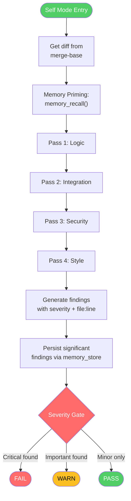
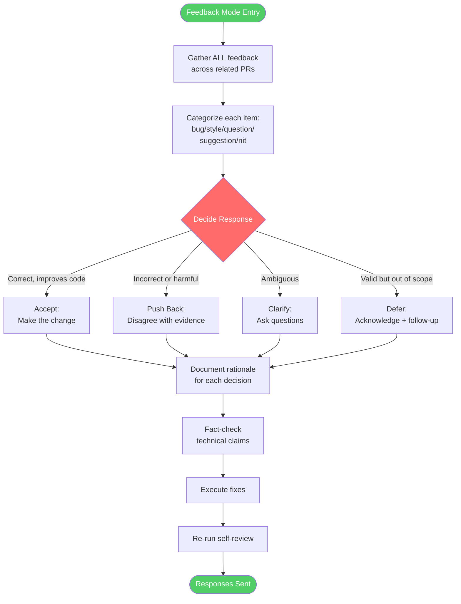
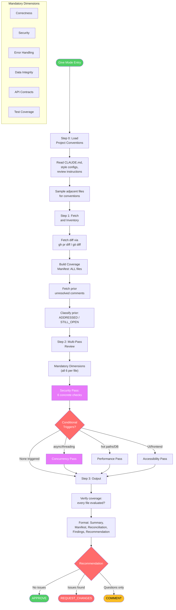
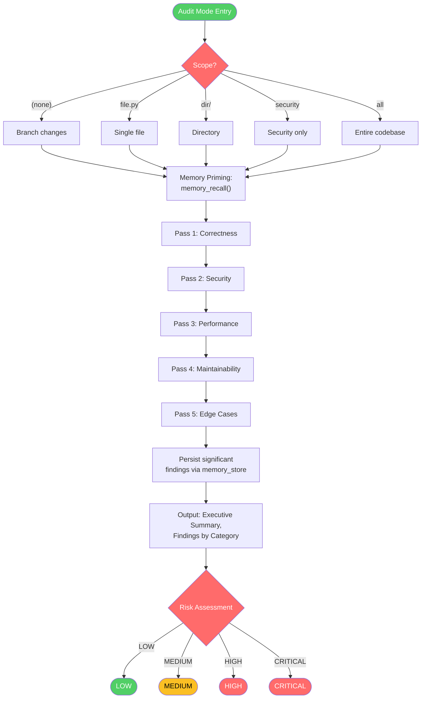
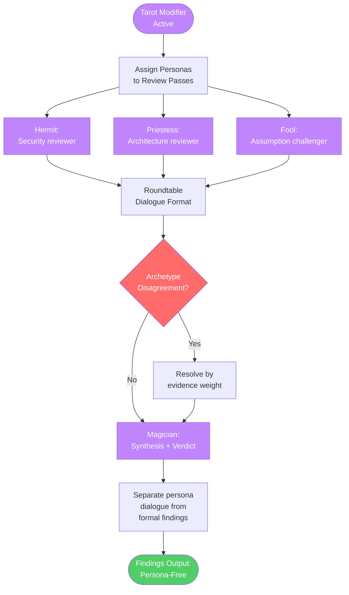
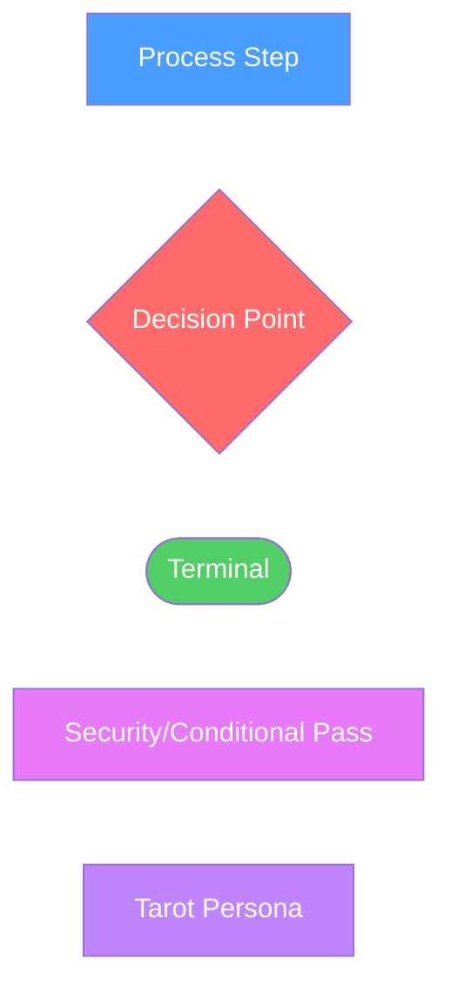

<!-- diagram-meta: {"source": "skills/code-review/SKILL.md", "source_hash": "sha256:f91840caa91900a230dff1fcfe64cc56510bef88d8934391ae7c9ab56a7017e5", "generated_at": "2026-03-10T06:21:33Z", "generator": "generate_diagrams.py"} -->
# Diagram: code-review

## Overview

## Self Mode (`--self`)

## Feedback Mode (`--feedback`)

## Give Mode (`--give`)

## Audit Mode (`--audit`)

## Tarot Integration (`--tarot`)

## Cross-Reference

| Overview Node | Detail Section | Source |
|---|---|---|
| Self Mode | Self Mode (`--self`) | `skills/code-review/SKILL.md:65-91` |
| Feedback Mode | Feedback Mode (`--feedback`) | `commands/code-review-feedback.md` |
| Give Mode | Give Mode (`--give`) | `commands/code-review-give.md` |
| Audit Mode | Audit Mode (`--audit`) | `skills/code-review/SKILL.md:94-105` |
| Tarot Roundtable | Tarot Integration (`--tarot`) | `commands/code-review-tarot.md` |

## Legend

