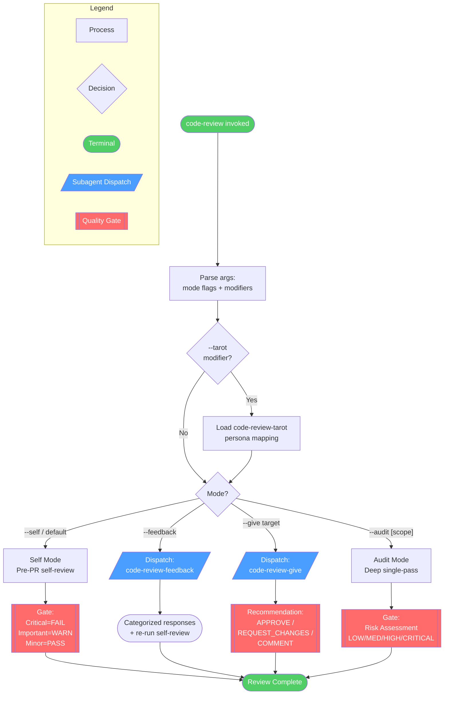
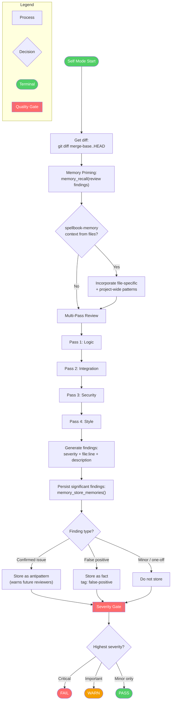
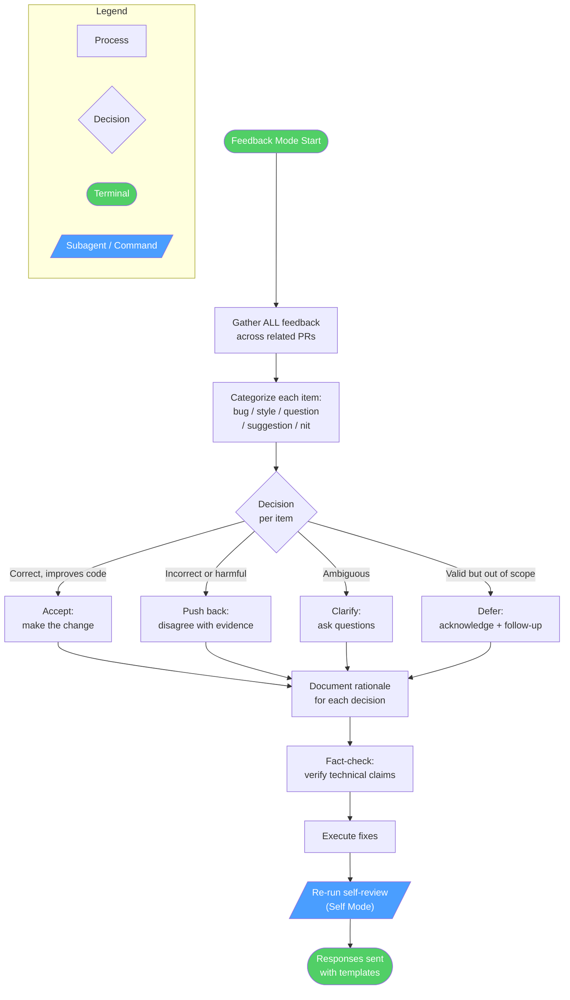
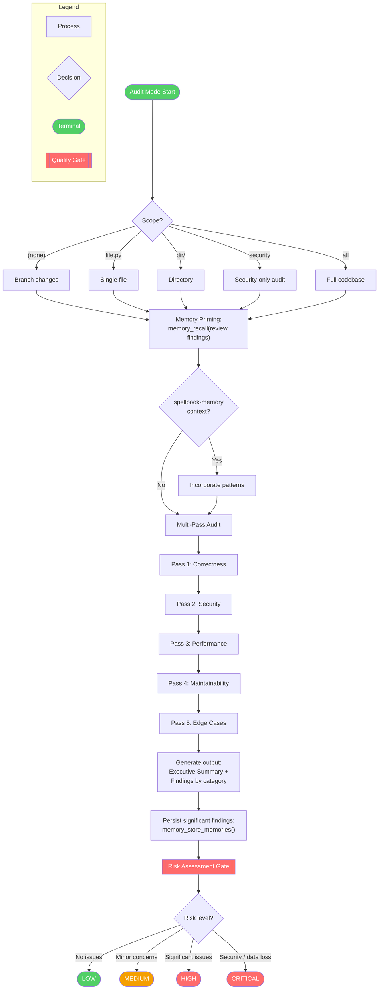
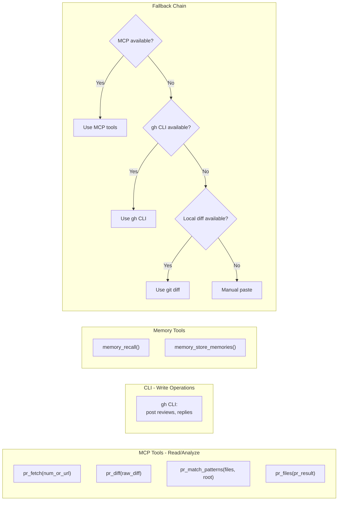

<!-- diagram-meta: {"source": "skills/code-review/SKILL.md","source_hash": "sha256:b4367a566b65f993d44610f1f92d94128c16a3aa88911cdab8f38f226e44233f","generator": "stamp"} -->
# Code Review Skill Diagrams

## Overview: Mode Router and High-Level Flow



## Cross-Reference Table

| Overview Node | Detail Diagram |
|---------------|----------------|
| Self Mode | [Self Mode Detail](#self-mode-detail) |
| Feedback (code-review-feedback) | [Feedback Mode Detail](#feedback-mode-detail) |
| Give (code-review-give) | [Give Mode Detail](#give-mode-detail) |
| Audit Mode | [Audit Mode Detail](#audit-mode-detail) |
| Tarot Integration | [Tarot Modifier Detail](#tarot-modifier-detail) |

---

## Self Mode Detail



---

## Feedback Mode Detail

Source: `commands/code-review-feedback.md`



---

## Give Mode Detail

Source: `commands/code-review-give.md`

```mermaid
flowchart TD
    subgraph Legend
        L1[Process]
        L2{Decision}
        L3([Terminal])
        L5[[Quality Gate]]
    end
    style L5 fill:#ff6b6b,color:#fff
    style L3 fill:#51cf66,color:#fff

    G0([Give Mode Start]) --> G0A["Parse target:<br>PR#, URL, branch"]

    G0A --> G0B["Step 0: Load Project Conventions<br>Read CLAUDE.md, style configs,<br>code-review-instructions.md"]
    G0B --> G0C["Sample adjacent files<br>(NOT in changed file set)"]

    G0C --> G1["Step 1: Fetch and Inventory"]
    G1 --> G1A["Get diff via gh pr diff<br>or git diff"]
    G1A --> G1B["Build Coverage Manifest:<br>ALL changed files"]
    G1B --> G1C["Fetch prior PR feedback<br>via gh api"]
    G1C --> G1D{Prior feedback<br>exists?}
    G1D -->|Yes| G1E[Classify each:<br>ADDRESSED / STILL_OPEN]
    G1D -->|No| G2
    G1E --> G2

    G2["Step 2: Multi-Pass Review"]
    G2 --> MAND["Mandatory Dimensions<br>(all 6 per file)"]

    MAND --> D1["Correctness"]
    MAND --> D2["Security"]
    MAND --> D3["Error handling"]
    MAND --> D4["Data integrity"]
    MAND --> D5["API contracts"]
    MAND --> D6["Test coverage"]

    D1 & D2 & D3 & D4 & D5 & D6 --> COND{Conditional<br>triggers?}

    COND -->|Hot paths / DB ops| PERF[Performance pass]
    COND -->|Async / threading| CONC[Concurrency pass]
    COND -->|UI / frontend| A11Y[Accessibility pass]
    COND -->|None triggered| SEC

    PERF --> SEC
    CONC --> SEC
    A11Y --> SEC

    SEC["Security Pass<br>(always required):<br>Input validation, path traversal,<br>secrets, auth, injection, SSRF"]

    SEC --> CONC_CHECK{Async/threading<br>in diff?}
    CONC_CHECK -->|Yes| CONC_PASS["Concurrency Pass:<br>Event loop blocking,<br>thread safety, races,<br>interrupt handling,<br>lock ordering"]
    CONC_CHECK -->|No| G3

    CONC_PASS --> G3

    G3["Step 3: Output"]
    G3 --> MANIFEST[[Coverage Manifest Check:<br>all files evaluated?]]
    MANIFEST --> GAP{Gaps?}
    GAP -->|Yes| REPORT_GAP[Report coverage gaps]
    GAP -->|No| RECONCILE
    REPORT_GAP --> RECONCILE

    RECONCILE[Prior Feedback<br>Reconciliation]
    RECONCILE --> FINDINGS[Format findings:<br>severity + file:line<br>+ dimension + suggestion]

    FINDINGS --> VERDICT[[Recommendation Gate]]
    VERDICT --> V1{Verdict?}
    V1 -->|No issues / minor| APPROVE([APPROVE])
    V1 -->|Significant issues| REQ_CHANGES([REQUEST_CHANGES])
    V1 -->|Needs discussion| COMMENT([COMMENT])

    style G0 fill:#51cf66,color:#fff
    style MANIFEST fill:#ff6b6b,color:#fff
    style VERDICT fill:#ff6b6b,color:#fff
    style APPROVE fill:#51cf66,color:#fff
    style REQ_CHANGES fill:#ff6b6b,color:#fff
    style COMMENT fill:#f59f00,color:#fff
```



---

## Audit Mode Detail



---

## Tarot Modifier Detail

Source: `commands/code-review-tarot.md`

Applied as an overlay when `--tarot` flag is present on any mode.

```mermaid
flowchart TD
    subgraph Legend
        L1[Process]
        L2{Decision}
        L3([Terminal])
        L4[/"Subagent Dispatch"/]
    end
    style L4 fill:#4a9eff,color:#fff
    style L3 fill:#51cf66,color:#fff

    T0([--tarot flag detected]) --> T1{Which mode?}

    T1 -->|--self| TS[Self Mode +<br>Tarot dialogue wrapper]
    T1 -->|--give| TG[Give Mode +<br>Tarot dialogue wrapper]
    T1 -->|--audit| TA[Audit Mode +<br>Persona-per-pass]

    TA --> TA1[/"Hermit subagent:<br>Security Pass"/]
    TA --> TA2[/"Priestess subagent:<br>Architecture Pass"/]
    TA --> TA3[/"Fool subagent:<br>Assumption Pass"/]

    TA1 & TA2 & TA3 --> TA4[Magician: Synthesize<br>by evidence weight<br>(not majority vote)]

    TS --> DIALOG
    TG --> DIALOG

    DIALOG[Roundtable Dialogue Format]
    DIALOG --> D1["Magician opens:<br>Review convenes"]
    D1 --> D2["Hermit examines:<br>Security findings"]
    D2 --> D3["Priestess studies:<br>Architecture findings"]
    D3 --> D4["Fool challenges:<br>Hidden assumptions"]
    D4 --> D5["Magician synthesizes:<br>Final verdict"]

    TA4 --> SEP
    D5 --> SEP

    SEP[Code Output Separation:<br>Persona in dialogue ONLY,<br>formal findings persona-free]
    SEP --> DONE([Continue to<br>mode-specific output])

    style T0 fill:#51cf66,color:#fff
    style TA1 fill:#4a9eff,color:#fff
    style TA2 fill:#4a9eff,color:#fff
    style TA3 fill:#4a9eff,color:#fff
    style DONE fill:#51cf66,color:#fff
```

---

## MCP Tool Integration


