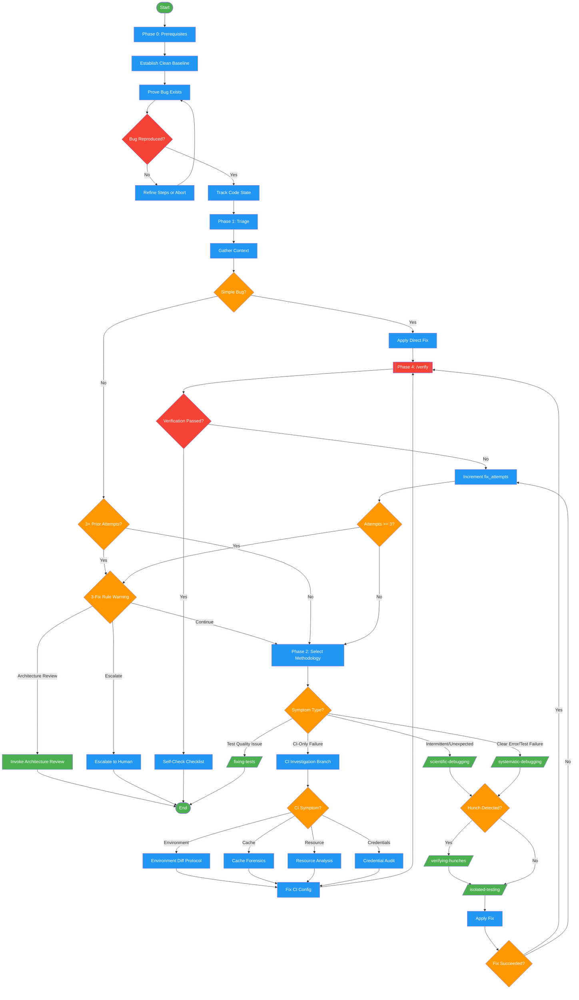

<!-- diagram-meta: {"source": "skills/debugging/SKILL.md", "source_hash": "sha256:9142c384eaa292f6cedd73967ef01ae9e080a818e6e963ff05f8cec3de25b1a3", "generated_at": "2026-02-19T00:00:00Z", "generator": "generate_diagrams.py"} -->
# Diagram: debugging

Multi-phase debugging workflow with mandatory prerequisites, triage-based methodology selection, and a 3-fix rule circuit breaker. Supports scientific debugging, systematic debugging, and CI-specific investigation branches.

## Legend

| Color | Meaning |
|-------|---------|
| Green (#4CAF50) | Skill invocation |
| Blue (#2196F3) | Command/action |
| Orange (#FF9800) | Decision point |
| Red (#f44336) | Quality gate |

## Cross-Reference

| Node | Source Reference |
|------|----------------|
| Phase 0: Prerequisites | Phase 0 (lines 47-148) |
| Establish Clean Baseline | Section 0.1 (lines 55-83) |
| Prove Bug Exists | Section 0.2 (lines 85-128) |
| Bug Reproduced? | Gate at line 88: "HARD GATE: You cannot investigate or fix a bug you haven't reproduced" |
| Track Code State | Section 0.3 (lines 130-148) |
| Phase 1: Triage | Phase 1 (lines 150-273) |
| Gather Context | Section 1.1 (lines 162-199) |
| Simple Bug? | Section 1.2 (lines 201-223) |
| 3+ Prior Attempts? | Section 1.3 (lines 225-249) |
| 3-Fix Rule Warning | 3-Fix Rule (lines 416-430) |
| Phase 2: Select Methodology | Phase 2 (lines 251-273) |
| /scientific-debugging/ | Phase 3 invocation (line 278) |
| /systematic-debugging/ | Phase 3 invocation (line 279) |
| /fixing-tests/ | Phase 2 alternative (lines 262-271) |
| CI Investigation Branch | CI Investigation Branch (lines 329-393) |
| /verifying-hunches/ | Hunch Interception (lines 281-283) |
| /isolated-testing/ | Isolated Testing Mandate (lines 285-298) |
| Phase 4: /verify | Phase 4: Verification (lines 394-412) |
| Verification Passed? | Gate at line 396: "Auto-invoke /verify after EVERY fix claim" |
| Self-Check Checklist | Self-Check (lines 464-482) |
