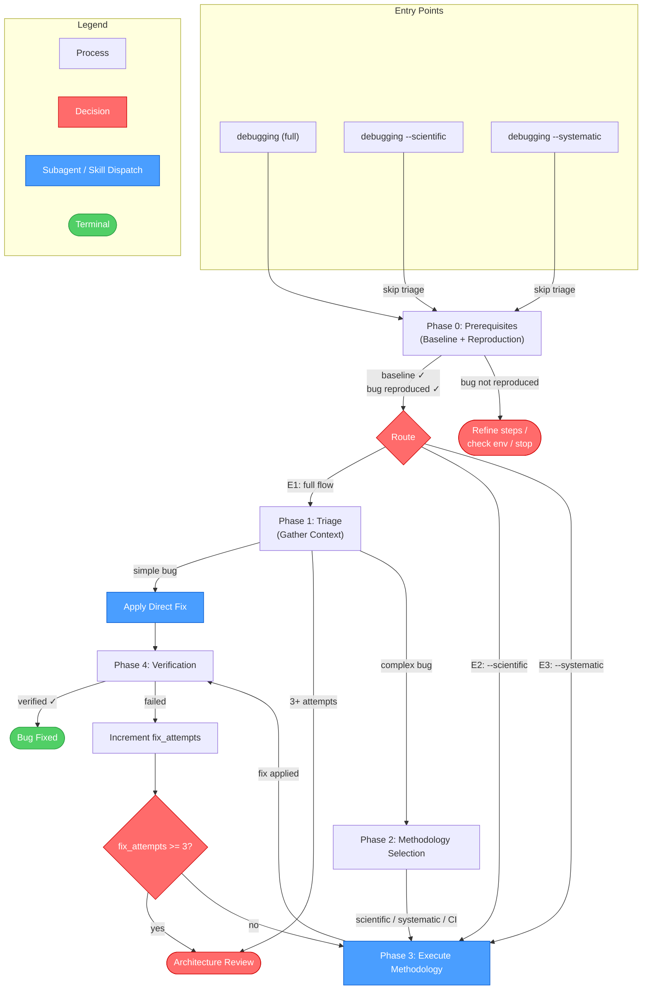
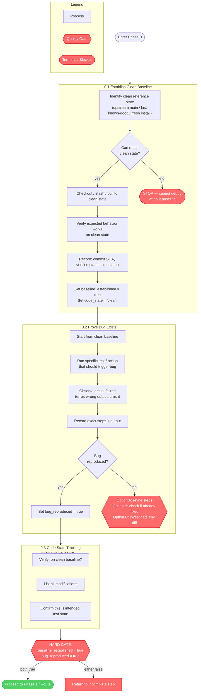
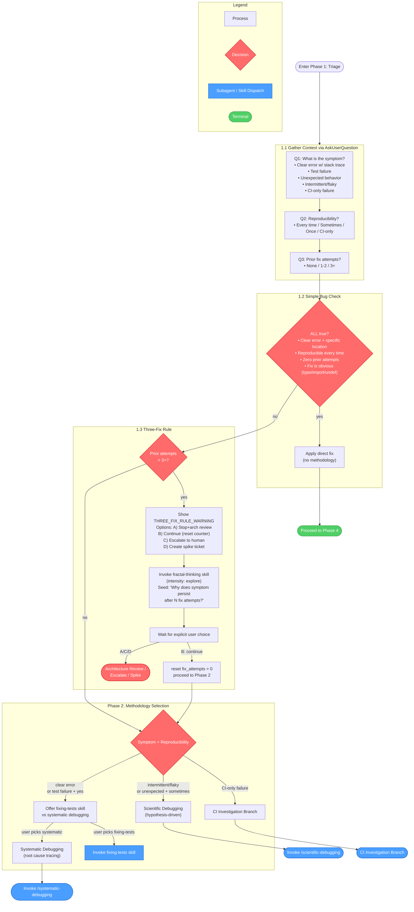
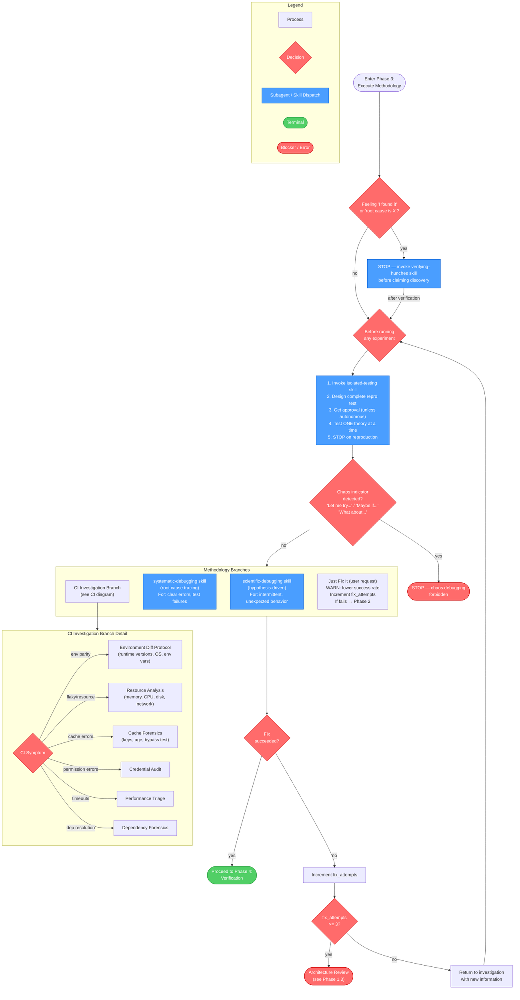
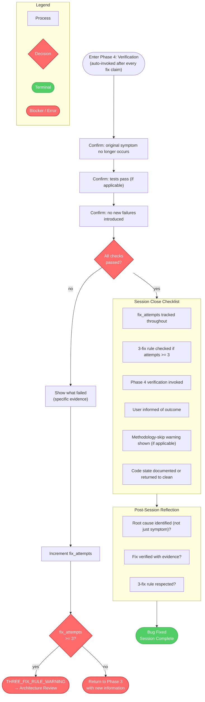

<!-- diagram-meta: {"source": "skills/debugging/SKILL.md", "source_hash": "sha256:b89bf1c3238ff9008327ee0e74d8416523241eca9de1230cc7ceaf3fb5a67aa3", "generated_at": "2026-05-25T23:05:25Z", "generator": "generate_diagrams.py"} -->
# Diagram: debugging

## Overview

High-level flow across all phases of the debugging skill.

```mermaid
flowchart TD
    subgraph ENTRY["Entry Points"]
        E1["debugging (full)"]
        E2["debugging --scientific"]
        E3["debugging --systematic"]
    end

    P0["Phase 0: Prerequisites\n(Baseline + Reproduction)"]
    P1["Phase 1: Triage\n(Gather Context)"]
    P2["Phase 2: Methodology Selection"]
    P3["Phase 3: Execute Methodology"]
    P4["Phase 4: Verification"]

    E1 --> P0
    E2 -->|"skip triage"| P0
    E3 -->|"skip triage"| P0

    P0 -->|"baseline ✓\nbug reproduced ✓"| ROUTE{Route}
    P0 -->|"bug not reproduced"| NOREPRO(["Refine steps /\ncheck env / stop"])

    ROUTE -->|"E1: full flow"| P1
    ROUTE -->|"E2: --scientific"| P3
    ROUTE -->|"E3: --systematic"| P3

    P1 -->|"simple bug"| SIMPLEFIX["Apply Direct Fix"]
    P1 -->|"3+ attempts"| ARCHREVIEW(["Architecture Review"])
    P1 -->|"complex bug"| P2

    P2 -->|"scientific / systematic / CI"| P3

    SIMPLEFIX --> P4
    P3 -->|"fix applied"| P4

    P4 -->|"verified ✓"| SUCCESS(["Bug Fixed"])
    P4 -->|"failed"| INCR["Increment fix_attempts"]
    INCR --> RULE{fix_attempts >= 3?}
    RULE -->|"yes"| ARCHREVIEW
    RULE -->|"no"| P3

    subgraph LEGEND["Legend"]
        L1["Process"]
        L2["Decision"]:::gate
        L3["Subagent / Skill Dispatch"]:::subagent
        L4(["Terminal"]):::success
    end

    classDef gate fill:#ff6b6b,color:#fff,stroke:#cc0000
    classDef subagent fill:#4a9eff,color:#fff,stroke:#0055cc
    classDef success fill:#51cf66,color:#fff,stroke:#2f9e44
    classDef fail fill:#ff6b6b,color:#fff,stroke:#cc0000

    class NOREPRO fail
    class ARCHREVIEW fail
    class SUCCESS success
    class SIMPLEFIX,P3 subagent
    class RULE,ROUTE gate
```

---

## Phase 0 — Prerequisites Detail

```mermaid
flowchart TD
    START(["Enter Phase 0"])

    subgraph P01["0.1 Establish Clean Baseline"]
        B1["Identify clean reference state\n(upstream main / last known-good / fresh install)"]
        B2{"Can reach\nclean state?"}
        B3["Checkout / stash / pull to clean state"]
        B4["Verify expected behavior works\non clean state"]
        B5["Record: commit SHA, verified status, timestamp"]
        B6["Set baseline_established = true\nSet code_state = 'clean'"]

        B1 --> B2
        B2 -->|"no"| BLOCKED(["STOP — cannot debug\nwithout baseline"])
        B2 -->|"yes"| B3
        B3 --> B4
        B4 --> B5
        B5 --> B6
    end

    subgraph P02["0.2 Prove Bug Exists"]
        R1["Start from clean baseline"]
        R2["Run specific test / action\nthat should trigger bug"]
        R3["Observe actual failure\n(error, wrong output, crash)"]
        R4["Record exact steps + output"]
        R5{"Bug\nreproduced?"}
        R6["Set bug_reproduced = true"]
        R7{{"Option A: refine steps\nOption B: check if already fixed\nOption C: investigate env diff"}}

        R1 --> R2 --> R3 --> R4 --> R5
        R5 -->|"yes"| R6
        R5 -->|"no"| R7
    end

    subgraph P03["0.3 Code State Tracking\n(before EVERY test)"]
        CS1["Verify: on clean baseline?"]
        CS2["List all modifications"]
        CS3["Confirm this is intended test state"]
    end

    GATE{{"HARD GATE:\nbaseline_established = true\nbug_reproduced = true"}}

    START --> P01
    B6 --> P02
    R6 --> P03
    P03 --> GATE
    GATE -->|"both true"| PROCEED(["Proceed to Phase 1 / Route"])
    GATE -->|"either false"| RETURN["Return to incomplete step"]

    subgraph LEGEND["Legend"]
        L1["Process"]
        L2{{"Quality Gate"}}:::gate
        L3(["Terminal / Blocker"]):::fail
    end

    classDef gate fill:#ff6b6b,color:#fff,stroke:#cc0000
    classDef fail fill:#ff6b6b,color:#fff,stroke:#cc0000
    classDef success fill:#51cf66,color:#fff,stroke:#2f9e44

    class GATE gate
    class BLOCKED,R7,RETURN fail
    class PROCEED success
```

---

## Phase 1 + 2 — Triage and Methodology Selection Detail

```mermaid
flowchart TD
    START(["Enter Phase 1: Triage"])

    subgraph P11["1.1 Gather Context via AskUserQuestion"]
        Q1["Q1: What is the symptom?\n• Clear error w/ stack trace\n• Test failure\n• Unexpected behavior\n• Intermittent/flaky\n• CI-only failure"]
        Q2["Q2: Reproducibility?\n• Every time / Sometimes / Once / CI-only"]
        Q3["Q3: Prior fix attempts?\n• None / 1-2 / 3+"]
    end

    subgraph P12["1.2 Simple Bug Check"]
        SIMPLE_CHK{"ALL true?\n• Clear error + specific location\n• Reproducible every time\n• Zero prior attempts\n• Fix is obvious (typo/import/undef)"}
        DIRECT["Apply direct fix\n(no methodology)"]
    end

    subgraph P13["1.3 Three-Fix Rule"]
        THREE_CHK{"Prior attempts\n= 3+?"}
        THREE_WARN["Show THREE_FIX_RULE_WARNING\nOptions: A) Stop+arch review\nB) Continue (reset counter)\nC) Escalate to human\nD) Create spike ticket"]
        FRACTAL["Invoke fractal-thinking skill\n(intensity: explore)\nSeed: 'Why does symptom persist\nafter N fix attempts?'"]
        WAIT["Wait for explicit user choice"]
        RESET["reset fix_attempts = 0\nproceed to Phase 2"]

        THREE_CHK -->|"yes"| THREE_WARN
        THREE_WARN --> FRACTAL
        FRACTAL --> WAIT
        WAIT -->|"B: continue"| RESET
        WAIT -->|"A/C/D"| ARCHSTOP(["Architecture Review /\nEscalate / Spike"])
    end

    subgraph P2["Phase 2: Methodology Selection"]
        SEL{"Symptom + Reproducibility"}
        SCIBRANCH["Scientific Debugging\n(hypothesis-driven)"]
        SYSBRANCH["Systematic Debugging\n(root cause tracing)"]
        CIBRANCH["CI Investigation Branch"]
        TESTOPT["Offer fixing-tests skill\nvs systematic debugging"]

        SEL -->|"intermittent/flaky\nor unexpected + sometimes"| SCIBRANCH
        SEL -->|"clear error\nor test failure + yes"| TESTOPT
        SEL -->|"CI-only failure"| CIBRANCH
        TESTOPT -->|"user picks fixing-tests"| FIXTESTS["Invoke fixing-tests skill"]:::subagent
        TESTOPT -->|"user picks systematic"| SYSBRANCH
    end

    START --> P11
    Q1 --> Q2 --> Q3
    Q3 --> SIMPLE_CHK
    SIMPLE_CHK -->|"yes"| DIRECT
    SIMPLE_CHK -->|"no"| THREE_CHK
    THREE_CHK -->|"no"| SEL
    RESET --> SEL
    DIRECT --> P4_OUT(["Proceed to Phase 4"])
    SCIBRANCH --> P3_SCI(["Invoke /scientific-debugging"]):::subagent
    SYSBRANCH --> P3_SYS(["Invoke /systematic-debugging"]):::subagent
    CIBRANCH --> P3_CI(["CI Investigation Branch"]):::subagent

    subgraph LEGEND["Legend"]
        L1["Process"]
        L2{"Decision"}:::gate
        L3["Subagent / Skill Dispatch"]:::subagent
        L4(["Terminal"]):::success
    end

    classDef gate fill:#ff6b6b,color:#fff,stroke:#cc0000
    classDef subagent fill:#4a9eff,color:#fff,stroke:#0055cc
    classDef success fill:#51cf66,color:#fff,stroke:#2f9e44
    classDef fail fill:#ff6b6b,color:#fff,stroke:#cc0000

    class SIMPLE_CHK,THREE_CHK,SEL gate
    class ARCHSTOP fail
    class P4_OUT success
    class FIXTESTS,P3_SCI,P3_SYS,P3_CI subagent
```

---

## Phase 3 — Execute Methodology Detail

```mermaid
flowchart TD
    START(["Enter Phase 3:\nExecute Methodology"])

    HUNCH_GATE{"Feeling 'I found it'\nor 'root cause is X'?"}
    HUNCH_STOP["STOP — invoke verifying-hunches skill\nbefore claiming discovery"]:::subagent

    ISO_GATE{"Before running\nany experiment"}
    ISO["1. Invoke isolated-testing skill\n2. Design complete repro test\n3. Get approval (unless autonomous)\n4. Test ONE theory at a time\n5. STOP on reproduction"]:::subagent

    CHAOS{"Chaos indicator\ndetected?\n'Let me try...' / 'Maybe if...'\n'What about...'"}
    CHAOS_STOP(["STOP — chaos debugging\nforbidden"])

    subgraph METH["Methodology Branches"]
        SCI["scientific-debugging skill\n(hypothesis-driven)\nFor: intermittent, unexpected behavior"]:::subagent
        SYS["systematic-debugging skill\n(root cause tracing)\nFor: clear errors, test failures"]:::subagent
        CI_INV["CI Investigation Branch\n(see CI diagram)"]
        DIRECT_FIX["Just Fix It (user request)\nWARN: lower success rate\nIncrement fix_attempts\nIf fails → Phase 2"]
    end

    FIX_RESULT{"Fix\nsucceeded?"}
    P4(["Proceed to Phase 4:\nVerification"])
    INCR["Increment fix_attempts"]
    THREE{"fix_attempts\n>= 3?"}
    ARCH(["Architecture Review\n(see Phase 1.3)"])
    RETRY["Return to investigation\nwith new information"]

    START --> HUNCH_GATE
    HUNCH_GATE -->|"yes"| HUNCH_STOP
    HUNCH_GATE -->|"no"| ISO_GATE
    HUNCH_STOP -->|"after verification"| ISO_GATE
    ISO_GATE --> ISO
    ISO --> CHAOS
    CHAOS -->|"yes"| CHAOS_STOP
    CHAOS -->|"no"| METH

    METH --> FIX_RESULT
    FIX_RESULT -->|"yes"| P4
    FIX_RESULT -->|"no"| INCR
    INCR --> THREE
    THREE -->|"yes"| ARCH
    THREE -->|"no"| RETRY
    RETRY --> ISO_GATE

    subgraph CI_DETAIL["CI Investigation Branch Detail"]
        CI1{"CI Symptom"}
        CI1 -->|"env parity"| ENV["Environment Diff Protocol\n(runtime versions, OS, env vars)"]
        CI1 -->|"flaky/resource"| RES["Resource Analysis\n(memory, CPU, disk, network)"]
        CI1 -->|"cache errors"| CACHE["Cache Forensics\n(keys, age, bypass test)"]
        CI1 -->|"permission errors"| CREDS["Credential Audit"]
        CI1 -->|"timeouts"| PERF["Performance Triage"]
        CI1 -->|"dep resolution"| DEP["Dependency Forensics"]
    end

    CI_INV --> CI_DETAIL

    subgraph LEGEND["Legend"]
        L1["Process"]
        L2{"Decision"}:::gate
        L3["Subagent / Skill Dispatch"]:::subagent
        L4(["Terminal"]):::success
        L5(["Blocker / Error"]):::fail
    end

    classDef gate fill:#ff6b6b,color:#fff,stroke:#cc0000
    classDef subagent fill:#4a9eff,color:#fff,stroke:#0055cc
    classDef success fill:#51cf66,color:#fff,stroke:#2f9e44
    classDef fail fill:#ff6b6b,color:#fff,stroke:#cc0000

    class HUNCH_GATE,ISO_GATE,CHAOS,FIX_RESULT,THREE,CI1 gate
    class HUNCH_STOP,SCI,SYS,ISO subagent
    class P4 success
    class CHAOS_STOP,ARCH fail
```

---

## Phase 4 — Verification Detail

```mermaid
flowchart TD
    START(["Enter Phase 4: Verification\n(auto-invoked after every fix claim)"])

    V1["Confirm: original symptom no longer occurs"]
    V2["Confirm: tests pass (if applicable)"]
    V3["Confirm: no new failures introduced"]

    VRESULT{"All checks\npassed?"}

    SHOW_FAIL["Show what failed\n(specific evidence)"]
    INCR["Increment fix_attempts"]
    THREE{"fix_attempts\n>= 3?"}
    ARCH(["THREE_FIX_RULE_WARNING\n→ Architecture Review"])
    RETRY(["Return to Phase 3\nwith new information"])

    subgraph SESSION_CLOSE["Session Close Checklist"]
        SC1["fix_attempts tracked throughout"]
        SC2["3-fix rule checked if attempts >= 3"]
        SC3["Phase 4 verification invoked"]
        SC4["User informed of outcome"]
        SC5["Methodology-skip warning shown (if applicable)"]
        SC6["Code state documented or returned to clean"]
    end

    subgraph REFLECTION["Post-Session Reflection"]
        RF1["Root cause identified (not just symptom)?"]
        RF2["Fix verified with evidence?"]
        RF3["3-fix rule respected?"]
    end

    SUCCESS(["Bug Fixed\nSession Complete"])

    START --> V1 --> V2 --> V3 --> VRESULT

    VRESULT -->|"yes"| SESSION_CLOSE
    VRESULT -->|"no"| SHOW_FAIL
    SHOW_FAIL --> INCR
    INCR --> THREE
    THREE -->|"yes"| ARCH
    THREE -->|"no"| RETRY

    SESSION_CLOSE --> REFLECTION
    REFLECTION --> SUCCESS

    subgraph LEGEND["Legend"]
        L1["Process"]
        L2{"Decision"}:::gate
        L4(["Terminal"]):::success
        L5(["Blocker / Error"]):::fail
    end

    classDef gate fill:#ff6b6b,color:#fff,stroke:#cc0000
    classDef success fill:#51cf66,color:#fff,stroke:#2f9e44
    classDef fail fill:#ff6b6b,color:#fff,stroke:#cc0000

    class VRESULT,THREE gate
    class SUCCESS success
    class ARCH,RETRY fail
```

---

## Cross-Reference Table

| Overview Node | Detail Diagram |
|---|---|
| Phase 0: Prerequisites | Phase 0 — Prerequisites Detail |
| Phase 1: Triage | Phase 1 + 2 — Triage and Methodology Selection Detail |
| Phase 2: Methodology Selection | Phase 1 + 2 — Triage and Methodology Selection Detail |
| Phase 3: Execute Methodology | Phase 3 — Execute Methodology Detail |
| CI Investigation Branch | Phase 3 — Execute Methodology Detail (CI_DETAIL subgraph) |
| Phase 4: Verification | Phase 4 — Verification Detail |
