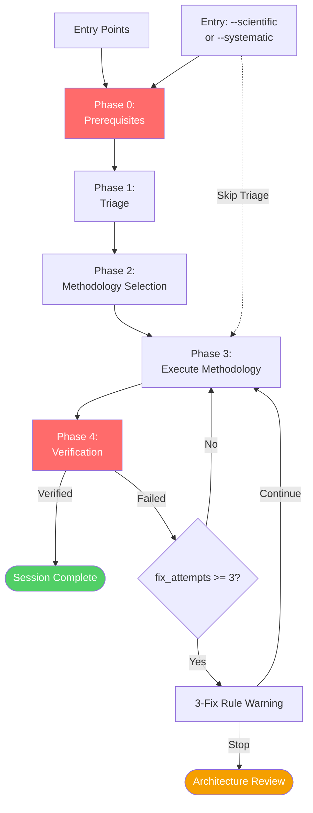
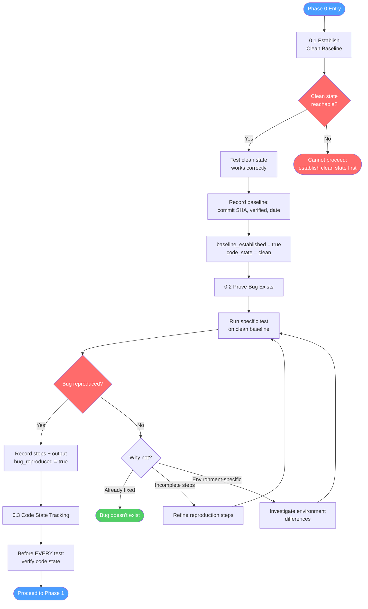
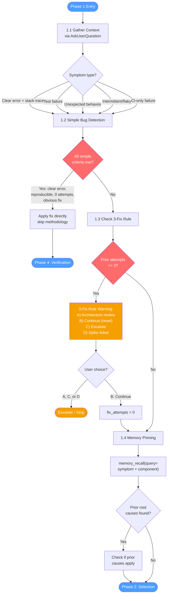
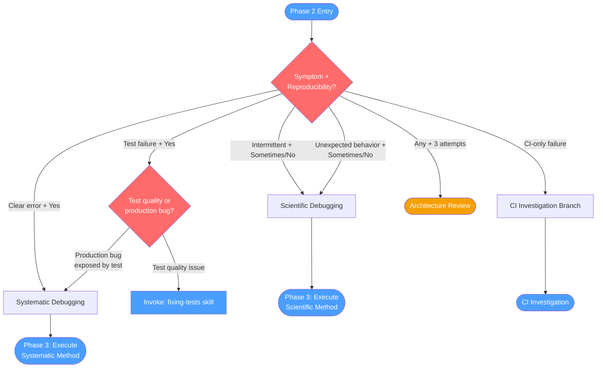
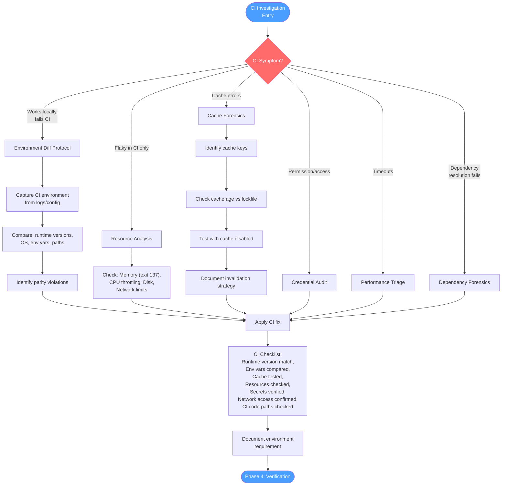
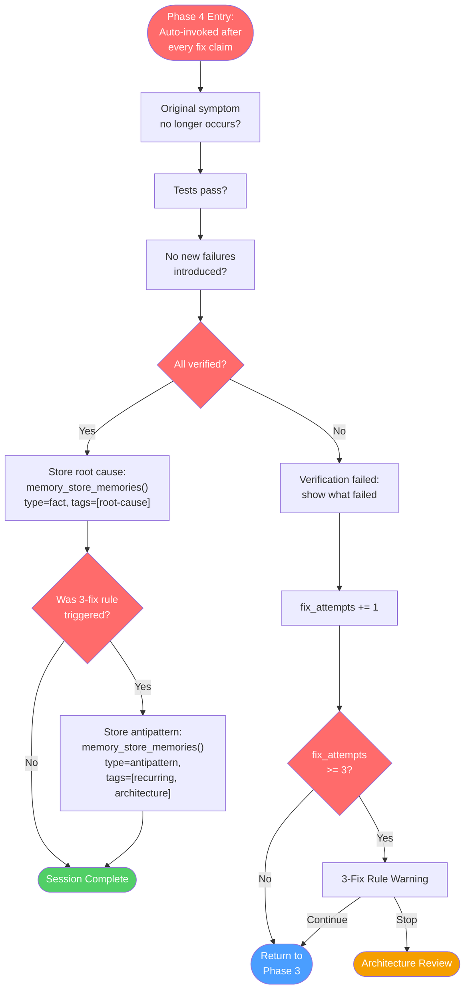
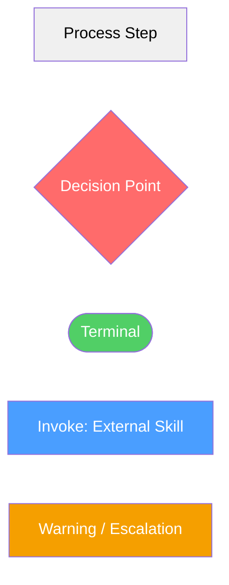

<!-- diagram-meta: {"source": "skills/debugging/SKILL.md", "source_hash": "sha256:964a5fd550f627da4ea517c8d8c2cee10f61c05a25b69af2ceaa62149cb36af5", "generated_at": "2026-03-10T06:23:02Z", "generator": "generate_diagrams.py"} -->
# Diagram: debugging

## Overview

```mermaid
flowchart TD
    ENTRY[Entry Points] --> P0[Phase 0:<br/>Prerequisites]
    P0 --> P1[Phase 1:<br/>Triage]
    P1 --> P2[Phase 2:<br/>Methodology Selection]
    P2 --> P3[Phase 3:<br/>Execute Methodology]
    P3 --> P4[Phase 4:<br/>Verification]
    P4 -->|Verified| DONE([Session Complete])
    P4 -->|Failed| FIX_CHECK{fix_attempts >= 3?}
    FIX_CHECK -->|Yes| THREE_FIX[3-Fix Rule Warning]
    FIX_CHECK -->|No| P3
    THREE_FIX -->|Continue| P3
    THREE_FIX -->|Stop| ARCH([Architecture Review])

    ENTRY_SKIP[Entry: --scientific<br/>or --systematic] --> P0
    ENTRY_SKIP -.->|Skip Triage| P3

    style P0 fill:#ff6b6b,color:#fff
    style P4 fill:#ff6b6b,color:#fff
    style DONE fill:#51cf66,color:#fff
    style ARCH fill:#f59f00,color:#fff
```

## Phase 0: Prerequisites

```mermaid
flowchart TD
    START([Phase 0 Entry]) --> BL[0.1 Establish<br/>Clean Baseline]
    BL --> BL_CHECK{Clean state<br/>reachable?}
    BL_CHECK -->|Yes| BL_TEST[Test clean state<br/>works correctly]
    BL_CHECK -->|No| BL_BLOCK([Cannot proceed:<br/>establish clean state first])
    BL_TEST --> BL_RECORD[Record baseline:<br/>commit SHA, verified, date]
    BL_RECORD --> SET_BL["baseline_established = true<br/>code_state = clean"]

    SET_BL --> REPRO[0.2 Prove Bug Exists]
    REPRO --> REPRO_RUN[Run specific test<br/>on clean baseline]
    REPRO_RUN --> REPRO_CHECK{Bug reproduced?}
    REPRO_CHECK -->|Yes| REPRO_RECORD["Record steps + output<br/>bug_reproduced = true"]
    REPRO_CHECK -->|No| NO_REPRO{Why not?}
    NO_REPRO -->|Already fixed| DONE_NR([Bug doesn't exist])
    NO_REPRO -->|Incomplete steps| REFINE[Refine reproduction steps]
    NO_REPRO -->|Environment-specific| ENV[Investigate environment<br/>differences]
    REFINE --> REPRO_RUN
    ENV --> REPRO_RUN

    REPRO_RECORD --> CST[0.3 Code State Tracking]
    CST --> CST_VERIFY["Before EVERY test:<br/>verify code state"]
    CST_VERIFY --> PHASE1([Proceed to Phase 1])

    style START fill:#4a9eff,color:#fff
    style BL_BLOCK fill:#ff6b6b,color:#fff
    style DONE_NR fill:#51cf66,color:#fff
    style PHASE1 fill:#4a9eff,color:#fff
    style REPRO_CHECK fill:#ff6b6b,color:#fff
    style BL_CHECK fill:#ff6b6b,color:#fff
```

## Phase 1: Triage

```mermaid
flowchart TD
    START([Phase 1 Entry]) --> GATHER[1.1 Gather Context<br/>via AskUserQuestion]
    GATHER --> SYMPTOM{Symptom type?}

    SYMPTOM -->|Clear error + stack trace| SIMPLE_CHK
    SYMPTOM -->|Test failure| SIMPLE_CHK
    SYMPTOM -->|Unexpected behavior| SIMPLE_CHK
    SYMPTOM -->|Intermittent/flaky| SIMPLE_CHK
    SYMPTOM -->|CI-only failure| SIMPLE_CHK

    SIMPLE_CHK[1.2 Simple Bug Detection]
    SIMPLE_CHK --> SIMPLE{All simple<br/>criteria met?}
    SIMPLE -->|Yes: clear error,<br/>reproducible, 0 attempts,<br/>obvious fix| DIRECT_FIX[Apply fix directly<br/>skip methodology]
    DIRECT_FIX --> P4([Phase 4: Verification])

    SIMPLE -->|No| THREE_CHK[1.3 Check 3-Fix Rule]
    THREE_CHK --> THREE{Prior attempts<br/>>= 3?}
    THREE -->|Yes| WARNING["3-Fix Rule Warning:<br/>A) Architecture review<br/>B) Continue (reset)<br/>C) Escalate<br/>D) Spike ticket"]
    WARNING --> WARN_CHOICE{User choice?}
    WARN_CHOICE -->|A, C, or D| ESCALATE([Escalate / Stop])
    WARN_CHOICE -->|B: Continue| RESET["fix_attempts = 0"]

    THREE -->|No| MEMORY[1.4 Memory Priming]
    RESET --> MEMORY

    MEMORY --> MEM_RECALL["memory_recall(query=<br/>symptom + component)"]
    MEM_RECALL --> PRIOR{Prior root<br/>causes found?}
    PRIOR -->|Yes| CHECK_PRIOR[Check if prior<br/>causes apply]
    PRIOR -->|No| PHASE2([Phase 2: Selection])
    CHECK_PRIOR --> PHASE2

    style START fill:#4a9eff,color:#fff
    style SIMPLE fill:#ff6b6b,color:#fff
    style THREE fill:#ff6b6b,color:#fff
    style P4 fill:#4a9eff,color:#fff
    style PHASE2 fill:#4a9eff,color:#fff
    style ESCALATE fill:#f59f00,color:#fff
    style WARNING fill:#f59f00,color:#fff
```

## Phase 2: Methodology Selection

```mermaid
flowchart TD
    START([Phase 2 Entry]) --> ROUTE{Symptom +<br/>Reproducibility?}

    ROUTE -->|Intermittent + Sometimes/No| SCI[Scientific Debugging]
    ROUTE -->|Unexpected behavior +<br/>Sometimes/No| SCI
    ROUTE -->|Clear error + Yes| SYS[Systematic Debugging]
    ROUTE -->|Test failure + Yes| TEST_CHOICE{Test quality or<br/>production bug?}
    ROUTE -->|CI-only failure| CI[CI Investigation Branch]
    ROUTE -->|Any + 3 attempts| ARCH([Architecture Review])

    TEST_CHOICE -->|Test quality issue| FIX_TESTS["Invoke: fixing-tests skill"]
    TEST_CHOICE -->|Production bug<br/>exposed by test| SYS

    SCI --> P3([Phase 3: Execute<br/>Scientific Method])
    SYS --> P3_SYS([Phase 3: Execute<br/>Systematic Method])
    CI --> CI_BRANCH([CI Investigation])

    style START fill:#4a9eff,color:#fff
    style ROUTE fill:#ff6b6b,color:#fff
    style TEST_CHOICE fill:#ff6b6b,color:#fff
    style ARCH fill:#f59f00,color:#fff
    style FIX_TESTS fill:#4a9eff,color:#fff
    style P3 fill:#4a9eff,color:#fff
    style P3_SYS fill:#4a9eff,color:#fff
    style CI_BRANCH fill:#4a9eff,color:#fff
```

## Phase 3: Execute Methodology

```mermaid
flowchart TD
    START([Phase 3 Entry]) --> METHOD{Methodology?}
    METHOD -->|Scientific| SCI["Invoke:<br/>scientific-debugging skill"]
    METHOD -->|Systematic| SYS["Invoke:<br/>systematic-debugging skill"]
    METHOD -->|Just Fix It<br/>(user request)| WARN["WARNING: Lower success<br/>rate, higher rework risk"]
    WARN --> ATTEMPT[Attempt fix directly]

    SCI --> INVESTIGATE[Investigation Loop]
    SYS --> INVESTIGATE

    INVESTIGATE --> HUNCH{Feeling<br/>'I found it'?}
    HUNCH -->|Yes| VERIFY_HUNCH["Invoke:<br/>verifying-hunches skill"]
    HUNCH -->|No| CONTINUE[Continue investigation]
    CONTINUE --> EXPERIMENT

    VERIFY_HUNCH --> CONFIRMED{Hunch<br/>confirmed?}
    CONFIRMED -->|Yes| APPLY_FIX[Apply fix]
    CONFIRMED -->|No| CONTINUE

    EXPERIMENT{Ready to<br/>test theory?} --> ISO["Invoke:<br/>isolated-testing skill"]
    ISO --> ISO_STEPS["1. Design repro test<br/>2. Get approval<br/>3. Test ONE theory<br/>4. Stop on reproduction"]
    ISO_STEPS --> CHAOS{Chaos<br/>detected?}
    CHAOS -->|"'Let me try...'<br/>'Maybe if I...'<br/>Multiple theories"| STOP_CHAOS[STOP: Return to<br/>isolated testing]
    STOP_CHAOS --> ISO
    CHAOS -->|Clean single test| RESULT{Fix attempt<br/>succeeded?}

    APPLY_FIX --> RESULT
    ATTEMPT --> RESULT

    RESULT -->|Yes| P4([Phase 4: Verification])
    RESULT -->|No| INC["fix_attempts += 1"]
    INC --> THREE{fix_attempts<br/>>= 3?}
    THREE -->|Yes| THREE_WARN[3-Fix Rule Warning]
    THREE -->|No| INVESTIGATE

    THREE_WARN -->|Continue| INVESTIGATE
    THREE_WARN -->|Stop| ARCH([Architecture Review])

    style START fill:#4a9eff,color:#fff
    style HUNCH fill:#ff6b6b,color:#fff
    style EXPERIMENT fill:#ff6b6b,color:#fff
    style CHAOS fill:#ff6b6b,color:#fff
    style RESULT fill:#ff6b6b,color:#fff
    style THREE fill:#ff6b6b,color:#fff
    style P4 fill:#4a9eff,color:#fff
    style ARCH fill:#f59f00,color:#fff
    style SCI fill:#4a9eff,color:#fff
    style SYS fill:#4a9eff,color:#fff
    style VERIFY_HUNCH fill:#4a9eff,color:#fff
    style ISO fill:#4a9eff,color:#fff
```

## CI Investigation Branch

```mermaid
flowchart TD
    START([CI Investigation<br/>Entry]) --> CLASSIFY{CI Symptom?}

    CLASSIFY -->|Works locally,<br/>fails CI| ENV[Environment Diff Protocol]
    CLASSIFY -->|Flaky in CI only| RES[Resource Analysis]
    CLASSIFY -->|Cache errors| CACHE[Cache Forensics]
    CLASSIFY -->|Permission/access| CRED[Credential Audit]
    CLASSIFY -->|Timeouts| PERF[Performance Triage]
    CLASSIFY -->|Dependency<br/>resolution fails| DEP[Dependency Forensics]

    ENV --> ENV1[Capture CI environment<br/>from logs/config]
    ENV1 --> ENV2[Compare: runtime versions,<br/>OS, env vars, paths]
    ENV2 --> ENV3[Identify parity violations]
    ENV3 --> FIX_CI

    RES --> RES_TBL["Check: Memory (exit 137),<br/>CPU throttling, Disk,<br/>Network limits"]
    RES_TBL --> FIX_CI

    CACHE --> C1[Identify cache keys]
    C1 --> C2[Check cache age vs lockfile]
    C2 --> C3[Test with cache disabled]
    C3 --> C4[Document invalidation strategy]
    C4 --> FIX_CI

    CRED --> FIX_CI
    PERF --> FIX_CI
    DEP --> FIX_CI

    FIX_CI[Apply CI fix] --> CHECKLIST["CI Checklist:<br/>Runtime version match,<br/>Env vars compared,<br/>Cache tested,<br/>Resources checked,<br/>Secrets verified,<br/>Network access confirmed,<br/>CI code paths checked"]
    CHECKLIST --> DOC[Document environment<br/>requirement]
    DOC --> P4([Phase 4: Verification])

    style START fill:#4a9eff,color:#fff
    style CLASSIFY fill:#ff6b6b,color:#fff
    style P4 fill:#4a9eff,color:#fff
```

## Phase 4: Verification

```mermaid
flowchart TD
    START([Phase 4 Entry:<br/>Auto-invoked after<br/>every fix claim]) --> V1[Original symptom<br/>no longer occurs?]
    V1 --> V2[Tests pass?]
    V2 --> V3[No new failures<br/>introduced?]
    V3 --> RESULT{All verified?}

    RESULT -->|Yes| STORE["Store root cause:<br/>memory_store_memories()<br/>type=fact, tags=[root-cause]"]
    STORE --> RECUR{Was 3-fix rule<br/>triggered?}
    RECUR -->|Yes| ANTI["Store antipattern:<br/>memory_store_memories()<br/>type=antipattern,<br/>tags=[recurring, architecture]"]
    RECUR -->|No| DONE
    ANTI --> DONE([Session Complete])

    RESULT -->|No| FAILED["Verification failed:<br/>show what failed"]
    FAILED --> INC["fix_attempts += 1"]
    INC --> THREE{fix_attempts<br/>>= 3?}
    THREE -->|Yes| WARN[3-Fix Rule Warning]
    THREE -->|No| RETURN([Return to<br/>Phase 3])

    WARN -->|Continue| RETURN
    WARN -->|Stop| ARCH([Architecture Review])

    style START fill:#ff6b6b,color:#fff
    style RESULT fill:#ff6b6b,color:#fff
    style RECUR fill:#ff6b6b,color:#fff
    style THREE fill:#ff6b6b,color:#fff
    style DONE fill:#51cf66,color:#fff
    style RETURN fill:#4a9eff,color:#fff
    style ARCH fill:#f59f00,color:#fff
```

## Cross-Reference

| Overview Node | Detail Section | Source |
|---|---|---|
| Phase 0: Prerequisites | Phase 0: Prerequisites | `skills/debugging/SKILL.md:47-148` |
| Phase 1: Triage | Phase 1: Triage | `skills/debugging/SKILL.md:151-266` |
| Phase 2: Methodology Selection | Phase 2: Methodology Selection | `skills/debugging/SKILL.md:268-290` |
| Phase 3: Execute Methodology | Phase 3: Execute Methodology | `skills/debugging/SKILL.md:292-345` |
| CI Investigation | CI Investigation Branch | `skills/debugging/SKILL.md:347-407` |
| Phase 4: Verification | Phase 4: Verification | `skills/debugging/SKILL.md:409-438` |
| scientific-debugging | External skill | `skills/debugging/SKILL.md:296` |
| systematic-debugging | External skill | `skills/debugging/SKILL.md:297` |
| verifying-hunches | External skill | `skills/debugging/SKILL.md:299` |
| isolated-testing | External skill | `skills/debugging/SKILL.md:303` |
| fixing-tests | External skill | `skills/debugging/SKILL.md:279` |
| fractal-thinking | External skill | `skills/debugging/SKILL.md:254` |

## Legend

```mermaid
flowchart LR
    L1[Process Step]
    L2{Decision Point}
    L3([Terminal])
    L4["Invoke: External Skill"]
    L5[Warning / Escalation]
    style L1 fill:#f0f0f0,color:#000
    style L2 fill:#ff6b6b,color:#fff
    style L3 fill:#51cf66,color:#fff
    style L4 fill:#4a9eff,color:#fff
    style L5 fill:#f59f00,color:#fff
```
