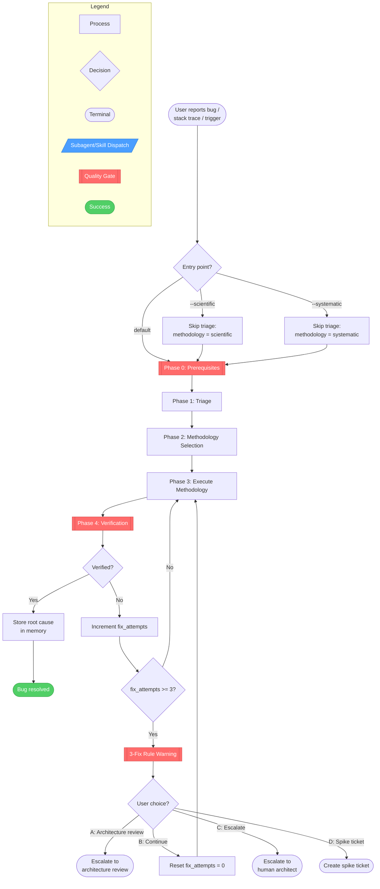
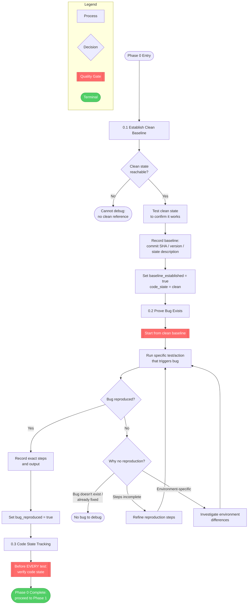
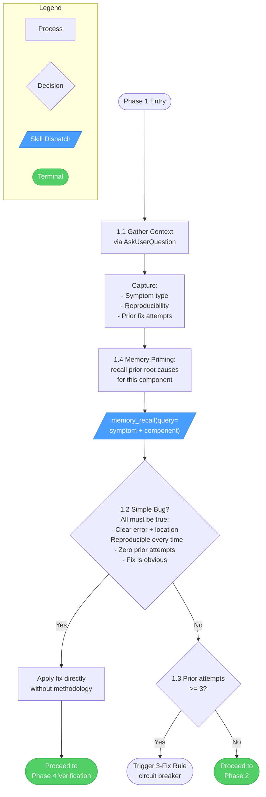
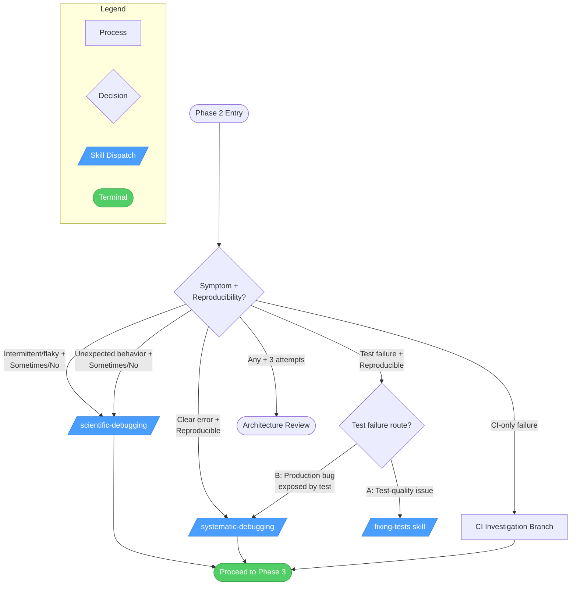
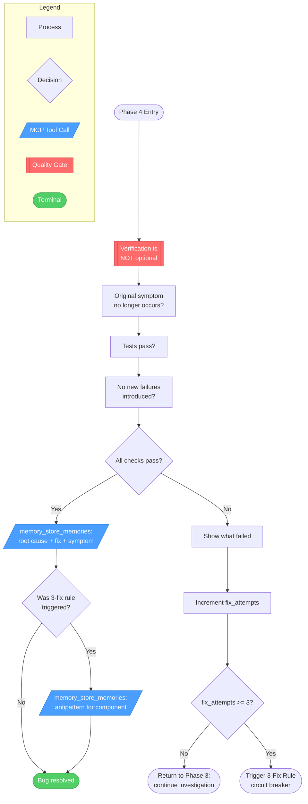
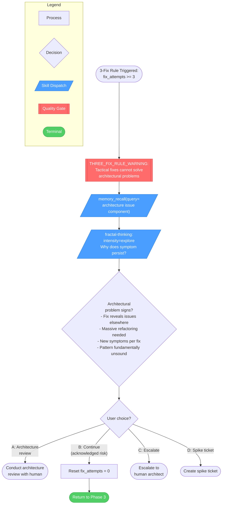
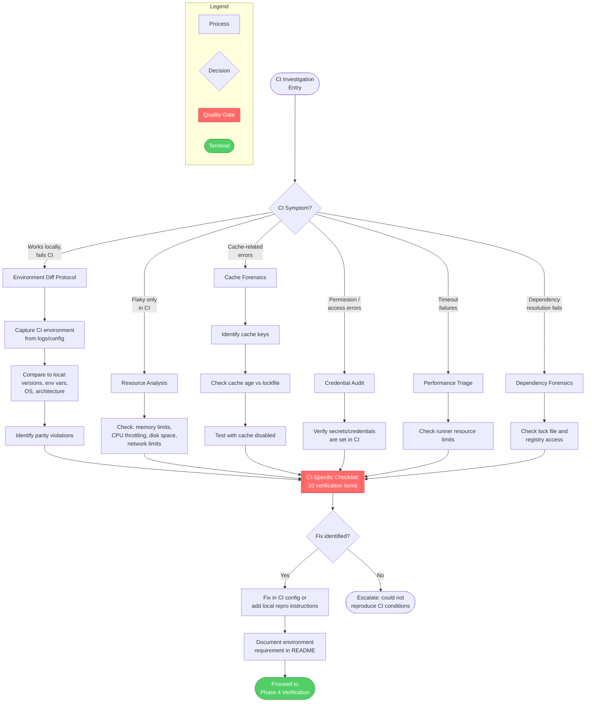

<!-- diagram-meta: {"source": "skills/debugging/SKILL.md","source_hash": "sha256:dbac44f8f9df11b82255e0ab9536d2781168416e196475fadbfe0f2912f8c035","generator": "stamp"} -->
# Debugging Skill Diagrams

## Overview Diagram

High-level flow through the debugging skill's phases, from entry to resolution.

```mermaid
flowchart TD
    subgraph Legend
        L1[Process]
        L2{Decision}
        L3([Terminal])
        L4[/"Subagent/Skill Dispatch"/]:::subagent
        L5[[Quality Gate]]:::gate
        L6([Success]):::success
    end

    Entry([User reports bug /<br>stack trace / trigger]) --> EntryCheck{Entry point?}

    EntryCheck -->|"--scientific"| SkipToSci[Skip triage:<br>methodology = scientific]
    EntryCheck -->|"--systematic"| SkipToSys[Skip triage:<br>methodology = systematic]
    EntryCheck -->|default| Phase0

    SkipToSci --> Phase0
    SkipToSys --> Phase0

    Phase0[[Phase 0: Prerequisites]]:::gate --> Phase1
    Phase1[Phase 1: Triage] --> Phase2
    Phase2[Phase 2: Methodology Selection] --> Phase3
    Phase3[Phase 3: Execute Methodology] --> Phase4
    Phase4[[Phase 4: Verification]]:::gate --> VerifyResult{Verified?}

    VerifyResult -->|Yes| StoreMemory[Store root cause<br>in memory]
    StoreMemory --> Done([Bug resolved]):::success

    VerifyResult -->|No| IncAttempts[Increment fix_attempts]
    IncAttempts --> ThreeCheck{fix_attempts >= 3?}
    ThreeCheck -->|No| Phase3
    ThreeCheck -->|Yes| ThreeFix[[3-Fix Rule Warning]]:::gate
    ThreeFix --> ThreeChoice{User choice?}
    ThreeChoice -->|"A: Architecture review"| ArchReview([Escalate to<br>architecture review])
    ThreeChoice -->|"B: Continue"| ResetContinue[Reset fix_attempts = 0]
    ThreeChoice -->|"C: Escalate"| Escalate([Escalate to<br>human architect])
    ThreeChoice -->|"D: Spike ticket"| Spike([Create spike ticket])
    ResetContinue --> Phase3

    classDef subagent fill:#4a9eff,stroke:#2d7cd6,color:#fff
    classDef gate fill:#ff6b6b,stroke:#d94f4f,color:#fff
    classDef success fill:#51cf66,stroke:#3da84e,color:#fff
```

## Cross-Reference Table

| Overview Node | Detail Diagram |
|---|---|
| Phase 0: Prerequisites | [Phase 0 Detail](#phase-0-prerequisites) |
| Phase 1: Triage | [Phase 1 Detail](#phase-1-triage) |
| Phase 2: Methodology Selection | [Phase 2 Detail](#phase-2-methodology-selection) |
| Phase 3: Execute Methodology | [Phase 3 Detail](#phase-3-execute-methodology) |
| Phase 4: Verification | [Phase 4 Detail](#phase-4-verification) |
| 3-Fix Rule Warning | [3-Fix Rule Detail](#3-fix-rule-circuit-breaker) |

---

## Phase 0: Prerequisites

Mandatory baseline establishment and bug reproduction before any investigation.

```mermaid
flowchart TD
    subgraph Legend
        L1[Process]
        L2{Decision}
        L3[[Quality Gate]]:::gate
        L4([Terminal]):::success
    end

    Start([Phase 0 Entry]) --> Step01[0.1 Establish Clean Baseline]

    Step01 --> BaselineQ{Clean state<br>reachable?}
    BaselineQ -->|No| BlockBaseline([Cannot debug:<br>no clean reference])

    BaselineQ -->|Yes| VerifyClean[Test clean state<br>to confirm it works]
    VerifyClean --> RecordBaseline[Record baseline:<br>commit SHA / version /<br>state description]
    RecordBaseline --> SetBaseline["Set baseline_established = true<br>code_state = clean"]

    SetBaseline --> Step02[0.2 Prove Bug Exists]
    Step02 --> StartClean[[Start from clean baseline]]:::gate
    StartClean --> RunRepro[Run specific test/action<br>that triggers bug]
    RunRepro --> ReproResult{Bug reproduced?}

    ReproResult -->|Yes| RecordRepro[Record exact steps<br>and output]
    RecordRepro --> SetRepro["Set bug_reproduced = true"]
    SetRepro --> Step03[0.3 Code State Tracking]
    Step03 --> CodeStateCheck[[Before EVERY test:<br>verify code state]]:::gate
    CodeStateCheck --> Phase0Done([Phase 0 Complete:<br>proceed to Phase 1]):::success

    ReproResult -->|No| NoRepro{Why no reproduction?}
    NoRepro -->|"Bug doesn't exist /<br>already fixed"| NoBug([No bug to debug])
    NoRepro -->|"Steps incomplete"| RefineSteps[Refine reproduction steps] --> RunRepro
    NoRepro -->|"Environment-specific"| EnvInvestigate[Investigate environment<br>differences] --> RunRepro

    classDef gate fill:#ff6b6b,stroke:#d94f4f,color:#fff
    classDef success fill:#51cf66,stroke:#3da84e,color:#fff
```

---

## Phase 1: Triage

Classify the symptom and determine whether the bug is simple enough for a direct fix or requires structured methodology.

```mermaid
flowchart TD
    subgraph Legend
        L1[Process]
        L2{Decision}
        L3[/"Skill Dispatch"/]:::subagent
        L4([Terminal]):::success
    end

    Start([Phase 1 Entry]) --> Gather[1.1 Gather Context<br>via AskUserQuestion]

    Gather --> SymptomType["Capture:<br>- Symptom type<br>- Reproducibility<br>- Prior fix attempts"]

    SymptomType --> MemoryPrime[1.4 Memory Priming:<br>recall prior root causes<br>for this component]
    MemoryPrime --> MemoryRecall[/"memory_recall(query=<br>symptom + component)"/]:::subagent

    MemoryRecall --> SimpleCheck{1.2 Simple Bug?<br>All must be true:<br>- Clear error + location<br>- Reproducible every time<br>- Zero prior attempts<br>- Fix is obvious}

    SimpleCheck -->|Yes| DirectFix[Apply fix directly<br>without methodology]
    DirectFix --> GoVerify([Proceed to<br>Phase 4 Verification]):::success

    SimpleCheck -->|No| ThreeCheck{1.3 Prior attempts<br>>= 3?}
    ThreeCheck -->|Yes| ThreeFixRule([Trigger 3-Fix Rule<br>circuit breaker])
    ThreeCheck -->|No| GoPhase2([Proceed to<br>Phase 2]):::success

    classDef subagent fill:#4a9eff,stroke:#2d7cd6,color:#fff
    classDef gate fill:#ff6b6b,stroke:#d94f4f,color:#fff
    classDef success fill:#51cf66,stroke:#3da84e,color:#fff
```

---

## Phase 2: Methodology Selection

Route to the appropriate debugging methodology based on symptom type and reproducibility.

```mermaid
flowchart TD
    subgraph Legend
        L1[Process]
        L2{Decision}
        L3[/"Skill Dispatch"/]:::subagent
        L4([Terminal]):::success
    end

    Start([Phase 2 Entry]) --> SymRoute{Symptom +<br>Reproducibility?}

    SymRoute -->|"Intermittent/flaky +<br>Sometimes/No"| Scientific
    SymRoute -->|"Unexpected behavior +<br>Sometimes/No"| Scientific
    SymRoute -->|"Clear error +<br>Reproducible"| Systematic
    SymRoute -->|"Test failure +<br>Reproducible"| TestDecision
    SymRoute -->|"CI-only failure"| CIBranch
    SymRoute -->|"Any + 3 attempts"| ArchReview([Architecture Review])

    TestDecision{Test failure route?} -->|"A: Test-quality issue"| FixingTests[/"fixing-tests skill"/]:::subagent
    TestDecision -->|"B: Production bug<br>exposed by test"| Systematic

    Scientific[/"scientific-debugging"/]:::subagent --> GoPhase3([Proceed to Phase 3]):::success
    Systematic[/"systematic-debugging"/]:::subagent --> GoPhase3
    CIBranch[CI Investigation Branch] --> GoPhase3

    classDef subagent fill:#4a9eff,stroke:#2d7cd6,color:#fff
    classDef success fill:#51cf66,stroke:#3da84e,color:#fff
```

---

## Phase 3: Execute Methodology

Invoke the selected methodology with hunch verification and isolated testing enforced at every step.

```mermaid
flowchart TD
    subgraph Legend
        L1[Process]
        L2{Decision}
        L3[/"Skill Dispatch"/]:::subagent
        L4[[Quality Gate]]:::gate
        L5([Terminal]):::success
    end

    Start([Phase 3 Entry]) --> MethodCheck{Methodology?}

    MethodCheck -->|Scientific| InvokeSci[/"Invoke<br>scientific-debugging"/]:::subagent
    MethodCheck -->|Systematic| InvokeSys[/"Invoke<br>systematic-debugging"/]:::subagent
    MethodCheck -->|"User said<br>just fix it"| JustFix[Attempt direct fix<br>with warning shown]

    InvokeSci --> Investigation
    InvokeSys --> Investigation

    Investigation[Investigation in progress] --> HunchCheck{Feeling<br>"I found it"?}

    HunchCheck -->|Yes| VerifyHunch[/"verifying-hunches skill:<br>test eureka hypothesis"/]:::subagent
    HunchCheck -->|No| ContinueInvestigation[Continue investigation]
    ContinueInvestigation --> Investigation

    VerifyHunch --> HunchResult{Hunch verified?}
    HunchResult -->|No| ContinueInvestigation

    HunchResult -->|Yes| DesignTest[[isolated-testing skill:<br>one theory, one test]]:::gate
    DesignTest --> RunExperiment[Run designed experiment]

    RunExperiment --> FixAttempt{Fix succeeded?}
    JustFix --> FixAttempt

    FixAttempt -->|Yes| GoVerify([Proceed to<br>Phase 4 Verification]):::success
    FixAttempt -->|No| IncAttempts[Increment fix_attempts]
    IncAttempts --> ThreeCheck{fix_attempts >= 3?}
    ThreeCheck -->|No| Investigation
    ThreeCheck -->|Yes| ThreeFix([Trigger 3-Fix Rule<br>circuit breaker])

    classDef subagent fill:#4a9eff,stroke:#2d7cd6,color:#fff
    classDef gate fill:#ff6b6b,stroke:#d94f4f,color:#fff
    classDef success fill:#51cf66,stroke:#3da84e,color:#fff
```

---

## Phase 4: Verification

Mandatory verification after every fix claim. Stores root cause on success; loops back on failure.

```mermaid
flowchart TD
    subgraph Legend
        L1[Process]
        L2{Decision}
        L3[/"MCP Tool Call"/]:::subagent
        L4[[Quality Gate]]:::gate
        L5([Terminal]):::success
    end

    Start([Phase 4 Entry]) --> VerifyGate[[Verification is<br>NOT optional]]:::gate

    VerifyGate --> CheckSymptom[Original symptom<br>no longer occurs?]
    CheckSymptom --> CheckTests[Tests pass?]
    CheckTests --> CheckRegression[No new failures<br>introduced?]

    CheckRegression --> VerifyResult{All checks pass?}

    VerifyResult -->|Yes| StoreRoot[/"memory_store_memories:<br>root cause + fix + symptom"/]:::subagent
    StoreRoot --> WasRecurring{Was 3-fix rule<br>triggered?}
    WasRecurring -->|Yes| StoreAntipattern[/"memory_store_memories:<br>antipattern for component"/]:::subagent
    WasRecurring -->|No| Done
    StoreAntipattern --> Done([Bug resolved]):::success

    VerifyResult -->|No| ShowFailure[Show what failed]
    ShowFailure --> IncAttempts[Increment fix_attempts]
    IncAttempts --> ThreeCheck{fix_attempts >= 3?}
    ThreeCheck -->|No| ReturnDebug([Return to Phase 3:<br>continue investigation])
    ThreeCheck -->|Yes| ThreeFix([Trigger 3-Fix Rule<br>circuit breaker])

    classDef subagent fill:#4a9eff,stroke:#2d7cd6,color:#fff
    classDef gate fill:#ff6b6b,stroke:#d94f4f,color:#fff
    classDef success fill:#51cf66,stroke:#3da84e,color:#fff
```

---

## 3-Fix Rule (Circuit Breaker)

Triggered when fix_attempts reaches 3. Forces architectural reassessment.

```mermaid
flowchart TD
    subgraph Legend
        L1[Process]
        L2{Decision}
        L3[/"Skill Dispatch"/]:::subagent
        L4[[Quality Gate]]:::gate
        L5([Terminal]):::success
    end

    Trigger([3-Fix Rule Triggered:<br>fix_attempts >= 3]) --> Warning[[THREE_FIX_RULE_WARNING:<br>Tactical fixes cannot solve<br>architectural problems]]:::gate

    Warning --> MemCheck[/"memory_recall(query=<br>architecture issue component)"/]:::subagent
    MemCheck --> FractalExplore[/"fractal-thinking:<br>intensity=explore<br>Why does symptom persist?"/]:::subagent

    FractalExplore --> ArchSigns{Architectural<br>problem signs?<br>- Fix reveals issues elsewhere<br>- Massive refactoring needed<br>- New symptoms per fix<br>- Pattern fundamentally unsound}

    ArchSigns --> UserChoice{User choice?}

    UserChoice -->|"A: Architecture<br>review"| ArchReview([Conduct architecture<br>review with human])
    UserChoice -->|"B: Continue<br>(acknowledged risk)"| Reset[Reset fix_attempts = 0]
    UserChoice -->|"C: Escalate"| Escalate([Escalate to<br>human architect])
    UserChoice -->|"D: Spike ticket"| Spike([Create spike ticket])

    Reset --> ReturnPhase3([Return to Phase 3]):::success

    classDef subagent fill:#4a9eff,stroke:#2d7cd6,color:#fff
    classDef gate fill:#ff6b6b,stroke:#d94f4f,color:#fff
    classDef success fill:#51cf66,stroke:#3da84e,color:#fff
```

---

## CI Investigation Branch

Specialized branch for failures that only occur in CI environments.

```mermaid
flowchart TD
    subgraph Legend
        L1[Process]
        L2{Decision}
        L3[[Quality Gate]]:::gate
        L4([Terminal]):::success
    end

    Start([CI Investigation<br>Entry]) --> Classify{CI Symptom?}

    Classify -->|"Works locally,<br>fails CI"| EnvDiff[Environment Diff Protocol]
    Classify -->|"Flaky only<br>in CI"| Resource[Resource Analysis]
    Classify -->|"Cache-related<br>errors"| Cache[Cache Forensics]
    Classify -->|"Permission /<br>access errors"| Creds[Credential Audit]
    Classify -->|"Timeout<br>failures"| Perf[Performance Triage]
    Classify -->|"Dependency<br>resolution fails"| Deps[Dependency Forensics]

    EnvDiff --> CaptureCI[Capture CI environment<br>from logs/config]
    CaptureCI --> CompareLocal[Compare to local:<br>versions, env vars,<br>OS, architecture]
    CompareLocal --> IdentifyParity[Identify parity violations]

    Resource --> CheckConstraints[Check: memory limits,<br>CPU throttling, disk space,<br>network limits]

    Cache --> IdentifyKeys[Identify cache keys]
    IdentifyKeys --> CheckAge[Check cache age vs lockfile]
    CheckAge --> TestBypass[Test with cache disabled]

    Creds --> VerifySecrets[Verify secrets/credentials<br>are set in CI]

    Perf --> CheckLimits[Check runner resource limits]

    Deps --> CheckLockfile[Check lock file and<br>registry access]

    IdentifyParity --> Checklist
    CheckConstraints --> Checklist
    TestBypass --> Checklist
    VerifySecrets --> Checklist
    CheckLimits --> Checklist
    CheckLockfile --> Checklist

    Checklist[[CI-Specific Checklist:<br>10 verification items]]:::gate --> FixApplied{Fix identified?}

    FixApplied -->|Yes| ApplyFix[Fix in CI config or<br>add local repro instructions]
    ApplyFix --> DocRequirement[Document environment<br>requirement in README]
    DocRequirement --> GoVerify([Proceed to<br>Phase 4 Verification]):::success

    FixApplied -->|No| Escalate([Escalate: could not<br>reproduce CI conditions])

    classDef gate fill:#ff6b6b,stroke:#d94f4f,color:#fff
    classDef success fill:#51cf66,stroke:#3da84e,color:#fff
```
