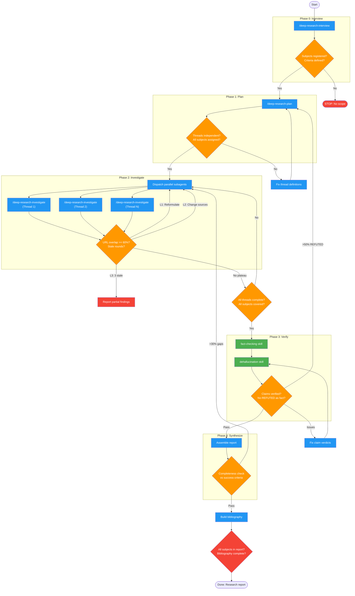

<!-- diagram-meta: {"source": "skills/deep-research/SKILL.md", "source_hash": "sha256:15093b3794f8fce9fce4f00af1012ea21b881f5d6a478878e8bcfdcde915013e", "generated_at": "2026-02-19T00:00:00Z", "generator": "generate_diagrams.py"} -->
# Diagram: deep-research

Multi-threaded research workflow with parallel investigation, fact-checking, and verified synthesis. Phases: Interview, Plan, Investigate (parallel), Verify, Synthesize.

## Legend

| Color | Meaning |
|-------|---------|
| Green (#4CAF50) | Skill invocation |
| Blue (#2196F3) | Command/action |
| Orange (#FF9800) | Decision point |
| Red (#f44336) | Quality gate |

## Cross-Reference

| Node | Source Reference |
|------|----------------|
| /deep-research-interview | Phase 0 (line 63) |
| /deep-research-plan | Phase 1 (line 69) |
| /deep-research-investigate | Phase 2 parallel subagents (lines 77-83) |
| Plateau breaker (L1/L2/L3) | Plateau Breaker registry (line 47) |
| fact-checking skill | Phase 3 verification (line 89) |
| dehallucination skill | Phase 3 verification (line 89) |
| Completeness check | Phase 4 completeness check (line 104) |
| >50% REFUTED circuit breaker | Circuit Breakers table (line 113) |
| >30% gaps loop | Circuit Breakers table (line 115) |
| Subject registry enforcement | Registries section (line 41) |
