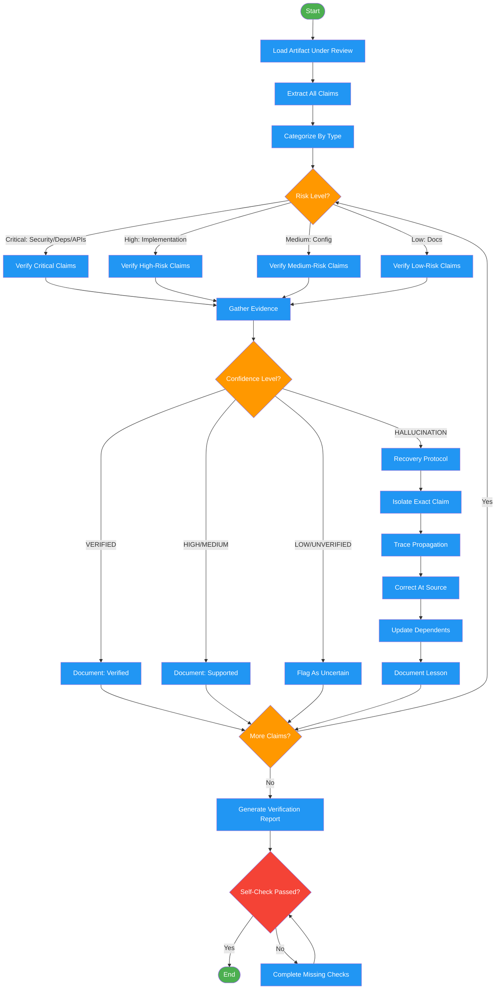

<!-- diagram-meta: {"source": "skills/dehallucination/SKILL.md", "source_hash": "sha256:98a79018f43e59561a6e41ff8a94b3b6262373b9b7ad387d746b7fec9ed06d69", "generated_at": "2026-02-19T00:00:00Z", "generator": "generate_diagrams.py"} -->
# Diagram: dehallucination

Workflow for verifying claims, detecting hallucinations, and enforcing recovery protocols. Used as a quality gate by the Forge pipeline and roundtable feedback.

## Legend

| Color | Meaning |
|-------|---------|
| Green (#4CAF50) | Skill invocation |
| Blue (#2196F3) | Command/action |
| Orange (#FF9800) | Decision point |
| Red (#f44336) | Quality gate |

## Cross-Reference

| Node | Source Reference |
|------|----------------|
| Load Artifact Under Review | Inputs: artifact_path |
| Extract All Claims | Detection Protocol, Step 1: Extract claims |
| Categorize By Type | Hallucination Categories table |
| Risk Level? | Detection Protocol, Step 2: Categorize by risk |
| Verify Critical Claims | Detection Protocol, Step 3: Verify critical first |
| Gather Evidence | Assessment Process, Step 2: Gather evidence |
| Confidence Level? | Confidence Levels table |
| Document: Verified | Assessment Process, Step 4: Document |
| Recovery Protocol | Recovery Protocol section |
| Isolate Exact Claim | Recovery Protocol, Step 1: Isolate |
| Trace Propagation | Recovery Protocol, Step 2: Trace propagation |
| Correct At Source | Recovery Protocol, Step 3: Correct at source |
| Update Dependents | Recovery Protocol, Step 4: Update dependents |
| Document Lesson | Recovery Protocol, Step 5: Document lesson |
| Generate Verification Report | Detection Protocol, Step 4: Report |
| Self-Check Passed? | Self-Check checklist |
