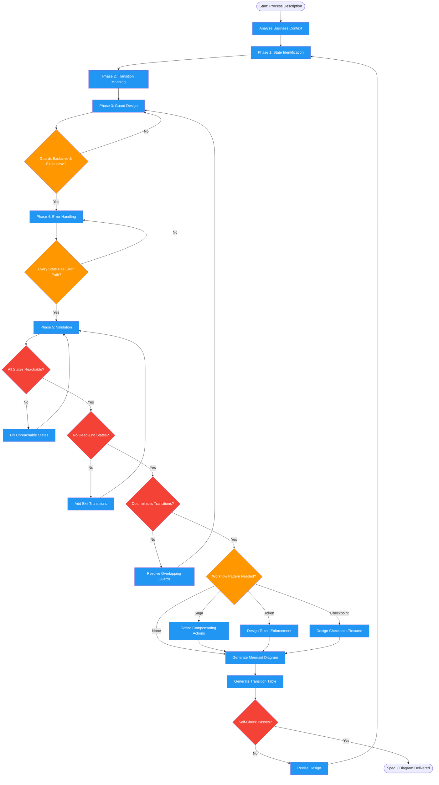

<!-- diagram-meta: {"source": "skills/designing-workflows/SKILL.md", "source_hash": "sha256:e33730f619fddb605b575dc685492ab186840eea2d1df565a2d65ca8a522b232", "generated_at": "2026-02-19T00:00:00Z", "generator": "generate_diagrams.py"} -->
# Diagram: designing-workflows

Designs systems with explicit states, transitions, and multi-step flows. Follows a structured process from state identification through validation, producing Mermaid state diagrams and transition tables. Enforces invariants like named triggers, mutually exclusive guards, and first-class error states.

## Legend

| Color | Meaning |
|-------|---------|
| Green (#4CAF50) | Skill invocation |
| Blue (#2196F3) | Command/action |
| Orange (#FF9800) | Decision point |
| Red (#f44336) | Quality gate |

## Cross-Reference

| Node | Source Reference |
|------|----------------|
| Analyze Business Context | Reasoning Schema analysis tag (line 15) |
| Phase 1: State Identification | Design Process step 1 (line 61) |
| Phase 2: Transition Mapping | Design Process step 2 (line 62) |
| Phase 3: Guard Design | Design Process step 3 (line 63) |
| Guards Exclusive & Exhaustive? | Invariant 3 and Guard rules (lines 23, 55) |
| Phase 4: Error Handling | Design Process step 4 (line 64) |
| Every State Has Error Path? | Invariant 4 (line 24) |
| Phase 5: Validation | Design Process step 5 (line 65) |
| All States Reachable? | Validation: Reachable (line 65) |
| No Dead-End States? | Validation: no dead ends (line 65) |
| Deterministic Transitions? | Validation: deterministic (line 65) |
| Define Compensating Actions | Saga Pattern (lines 87-91) |
| Design Token Enforcement | Token-Based Enforcement (line 93) |
| Design Checkpoint/Resume | Checkpoint/Resume (line 95) |
| Generate Mermaid Diagram | Visualization section (lines 69-80) |
| Generate Transition Table | Outputs: transition_table (line 41) |
| Self-Check Passes? | Self-Check checklist (lines 132-141) |
